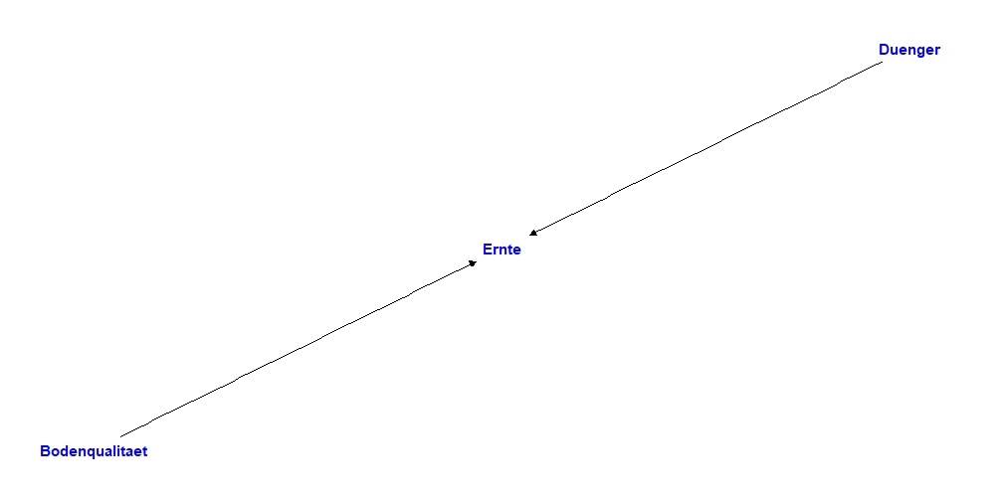
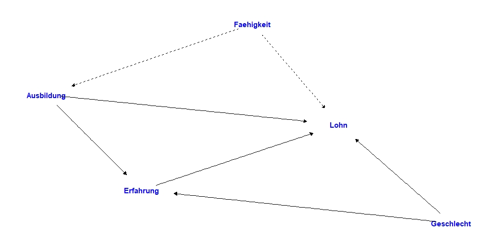

```{r setup, include=FALSE}
pkgs <- list("grid", "plotrix", "RColorBrewer", "gtools", "scatterplot3d", "latex2exp",
             "MASS", "gridExtra", "scales", "AER", "stargazer", "ivreg",
             "tikzDevice", "knitr", "highr","spatstat", "haven")
invisible(lapply(pkgs, library, character.only = T))
```


# Einführung

## Überblick

- **Organisatorisches**
- Ziele der Veranstaltung
- Wiederholung Wahrscheinlichkeitstheorie


## Details zur Veranstaltung

- Kontakt:
\begin{table}
\begin{tabular}{ll}
Yannick Hoga & Karolina Gliszczynska\\
0201 18-34365 & 0201 18-32168\\
\href{mailto:yannick.hoga@vwl.uni-due.de}{yannick.hoga@vwl.uni-due.de} & \href{mailto:karolina.gliszczynska@uni-due.de}{karolina.gliszczynska@uni-due.de}
\end{tabular}
\end{table}
- Folien, Aufgaben und Ankündigungen finden Sie auf
  \begin{center}\href{https://moodle.uni-due.de/user/index.php?id=42261}{https://moodle.uni-due.de/user/index.php?id=42261}\end{center}Das Kurspasswort ist "HANSEN2024".
- Zu Illustrationszwecken nutzen wir die Programmiersprache \R\nbs{}in der Vorlesung und den Übungen.

## Ressourcen
- \hil{Literatur:}
   - Hansen (2022) *Econometrics*. Princeton University Press, 1st ed. <!-- slides mostly based on this ... -->
   - Angrist and Pischke (2015) *Mastering `Metrics: The Path from Cause to Effect*. Princeton University Press, 1st ed.
   - Greene (2019) *Econometric Analysis*. Pearson Education, 8th edition.
- \R\nbs\hil{packages:} `AER`, `ivreg` und viele mehr.
  - Laden Sie die obigen Pakete, können Sie die folgenden Grafiken in \R replizieren.
- \hil{Matrix Reader} ist verfügbar auf *moodle*.
  - Alle Referenzen in den vorliegenden Folien mit "0." davor, verweisen auf den Matrix Reader.
    - Z.B.\ wie in Definition \zref{S-Definiteness} oder Proposition \zref{S-rules2}.


## F \& A

\centerline{Spezielle Fragen?}


## Überblick

- Organisatorisches
- **Ziele der Veranstaltung**
- Wiederholung Wahrscheinlichkeitstheorie


## Was ist Ökonometrie und wofür brauchen wir sie?

- Viele ökonomische Theorien spezifizieren Beziehungen zwischen Variablen. 
- Interessant ist dabei oft eine \alert{quantitative} Aussage. 
  - Newton wäre auch nicht berühmt geworden für die Erkenntnis, \emph{dass} ein Apfel \emph{runter}fällt, wenn man ihn loslässt.
- Einige \alert{Beispiele:}
  - Um wie viel steigern Investitionen in das Humankapital (z.B. der Besuch der Universität) das Einkommen?
  - Wie stark sinkt die Inflation, wenn die Zentralbank den Zinssatz anhebt?
  - Um wie viel verringert sich die Kriminalität, wenn eine zusätzliche Million Euro für Polizisten auf den Straßen ausgegeben werden? \texttt{crime.R}
  - Um wie viel erhöhen sich die Verkäufe, wenn Werbeausgaben erhöht werden?
  - Wie viele zusätzliche Passagiere bringt eine Reduzierung der Zugticketpreise?


## Was ist Ökonometrie und wofür brauchen wir sie?

- Allerdings sollen solche Aussagen typischerweise \hil{ceteris paribus} sein, d.h.\ \alert{alle anderen wichtigen Faktoren gleichhaltend} (z.B. das Fähigkeitsniveau).

- Anders formuliert handelt es sich um \hil{kausale} Fragen, nicht nur Korrelationen. Erstere sind typischerweise interessanter. Siehe auch \href{https://xkcd.com/552/}{hier}.

- Ökonometrie ist die Kunst und Wissenschaft der Quantifizierung (Schätzung) solcher Beziehungen. 
  - Z.B.\nbs{}um \textit{wie viel} erhöht sich das Einkommen \textit{aufgrund} eines zusätzlichen Bildungsjahres?

- Solche Schätzung ist recht einfach in \hil{kontrollierten Experimenten}.
  - Wir können z.B.\ die Einsatzmenge von Düngemitteln auf Äcker \alert{zufällig zuteilen}, um den Effekt des Düngers auf den Ernteertrag zu messen.
  - In diesem Fall müssen andere wichtige Faktoren, wie Qualität des Bodens, \alert{nicht} konstant gehalten werden, weil die Menge an Dünger den einzigen systematischen Unterschied zwischen den Äckern darstellt.
  


## Was ist Ökonometrie und wofür brauchen wir sie?
\framesubtitle{DAG Dünger}

```{r, echo=FALSE, fig.cap="Dünger", out.width = '80%'}

```  

## Was ist Ökonometrie und wofür brauchen wir sie?

- In den meisten interessanteren Szenarien (wie die o.g. Bildungsrenditen) sind solche Experimente aus unterschiedlichen Gründen nicht möglich.
- Stattdessen müssen wir typischerweise mit \hil{Beobachtungsdaten} arbeiten, die bereits bestehen werden und \alert{nicht in einem Experiment gesammelt wurden}.
- Dann müssen wir statistisch alle anderen wichtigen Faktoren konstant halten.
  - Beispielsweise werden fähigere Personen mehr verdienen, sich aber auch \textit{entscheiden} mehr zu lernen. 
  - Höhergebildete haben zudem im Allgemeinen weniger Arbeitsmarkterfahrung, welche ebenfalls das Einkommen beeinflusst.
- Die Arbeitsmarkterfahrung ist recht \alert{leicht zu beobachten}, wohingegen \glqq Fähigkeit\grqq{} \alert{schwer zu erfassen} ist.
- Wir werden sehen, dass das Berücksichtigen von Faktoren wie dem Ersteren \alert{leicht} ist. 
- \alert{Komplizierter} wird es, wenn ein wichtiger Faktor nicht direkt beobachtet werden kann.

## Was ist Ökonometrie und wofür brauchen wir sie?
\framesubtitle{DAG Lohnregression}

- Die \emph{angenommene} Problemstellung als DAG:

```{r, echo=FALSE, fig.cap="Lohnregression", out.width = '80%'}

```  


<!-- Beispiel aus Angrist and Pischke (2015, Chapter 1)-->
## Gesundheitsökonomisches Beispiel 

- Was ist der \alert{kausale Effekt} von Krankenversicherung (Health Insurance, HI) auf die Gesundheit (Health Index) in den USA?
  - Health Index ist Zahl von 5 (exzellent) bis 1 (schlecht).
- Betrachte Daten aus dem \alert{National Health Interview Survey (NHIS)} aus den USA.

\begin{table}[t!]
		\centering
		\begin{tabular}{lrr}
			\toprule
  		         & Some HI & No HI 	\\
\midrule
    &  \multicolumn{2}{c}{A. Gesundheit} \\
Health Index		&	 4,01 & 3,70 \\
\midrule
    &  \multicolumn{2}{c}{B. Charakteristiken} \\
Nonwhite        &	 0,16 & 0,17 \\
Age             &	 43,98 & 41,26 \\
Education       &	 14,31 & 11,56 \\
Family Size     &	 3,50 & 3,98 \\
Employed        &	 0,92 & 0,85 \\
Family Income   &	 106.467 & 45.656 \\
Sample Size     &	 8.114 & 1.281 \\
			\bottomrule
		\end{tabular}
\caption{Gesundheit und demografische Charakteristiken von Versicherten und Unversicherten im NHIS}
\label{tab:NHIS}
\end{table}


## Gesundheitsökonomisches Beispiel 

- Oft: \alert{Unterschied in durchschnittlichem Health Index} ($=4,01-3,70=0,31$) wird (fälschlicherweise) als kausaler Effekt der Versicherung interpretiert.
- Aber: Ein direkter Vergleich der Gesundheit von Versicherten und Unversicherten vergleicht \alert{Äpfel mit Birnen} -- nicht Äpfel mit Äpfeln.
- Grund: Es gibt viele \alert{systematische Unterschiede} beider Gruppen, die für unterschiedlichen Health Index verantwortlich sein könnten:
  - Höhere Bildung ($14,31>11,56$) könnte gesundheitsförderlichen Lebensstil begünstigen.
  - Höheres Einkommen ($106.467>45.656$) kann für gesunderes Essen ausgegeben werden.
- Mit anderen Worten: *ceteris* ist \alert{nicht} *paribus* hier!


## Gesundheitsökonomisches Beispiel 

- Um die Problematik noch genauer zu verstehen, bezeichne mit $Y$ den \alert{Health Index} einer Person und den \alert{Versicherungsstatus} mit 
\[
  D=\begin{cases} 1,& \text{Person ist versichert},\\
  0, &\text{sonst}.
  \end{cases}
\]
- Wir bezeichnen mit $Y(1)$ ($Y(0)$) den Gesundheitszustand, wenn die Person versichert (nicht versichert) ist.
  - Natürlich beobachten wir die Welt nur in \alert{einem Zustand}, also *entweder* $Y(1)$ *oder* $Y(0)$.
- Damit ist $Y(1)-Y(0)$ der \alert{individuelle kausale Effekt} von $D$ auf $Y$.


\xmpl

\begin{itemize}
  
  \item Betrachte 2 (hypothetische) Studierende am MIT in Boston.
  \item Gesunde \alert{Maria} und kränkelnder \alert{Khuzdar} mit $Y_{Maria}(1)=Y_{Maria}(0)=5$ und $Y_{Khuzdar}(1)=4$ und $Y_{Khuzdar}(0)=3$, so dass individuelle kausale Effekte
\begin{align*}
  Y_{Maria}(1)-Y_{Maria}(0)&=0,\\
  Y_{Khuzdar}(1)-Y_{Khuzdar}(0)&=1
\end{align*}
  
\end{itemize}

\endxmpl

## Gesundheitsökonomisches Beispiel 

\xmpl[*]

\begin{table}[t!]
		\centering
		\begin{tabular}{lrr}
			\toprule
  		         & Khuzdar & Maria 	\\
\midrule
Potentielles Ergebnis ohne Versicherung $Y(0)$&	 3 & 5 \\
Potentielles Ergebnis mit Versicherung $Y(1)$ &	 4 & 5 \\
Behandlung $D$                                &	 1 & 0 \\
Health Index $Y$                              &	 4 & 5 \\
Individueller kausaler Effekt $Y(1)-Y(0)$)    &	 1 & 0 \\
			\bottomrule
		\end{tabular}
\caption{Ergebnisse und Behandlung für Khuzdar und Maria}
\label{tab:KM}
\end{table}

\begin{itemize}
  \item \alert{Direkter Vergleich} von Khuzdar und Maria verrät nichts über kausale Effekte:
  \begin{align*}
    Y_{Khuzdar} - Y_{Maria} &= Y_{Khuzdar}(1) - Y_{Maria}(0)\\
    &= \underbrace{Y_{Khuzdar}(1) - Y_{Khuzdar}(0)}_{\text{Individueller kausaler Effekt}} + \underbrace{\big\{Y_{Khuzdar}(0) - Y_{Maria}(0)\big\}}_{\text{Selektionsverzerrung}} \\
    & = 1 -2 = -1.
  \end{align*}
  \item Weil die kerngesunde Maria mit dem kränklichen Khuzdar \alert{nicht vergleichbar} ist ($Y_{Khuzdar}(0) - Y_{Maria}(0)\neq0$), können wir nichts über kausale Effekte lernen!
\end{itemize}


\endxmpl


## Gesundheitsökonomisches Beispiel 

- Mittelt sich \hil{Selektionsverzerrung} möglicherweise weg, wenn wir die ganze Grundgesamtheit betrachten und uns dann für den \alert{durchschnittlichen kausalen Effekt} $\E\big[Y(1)-Y(0)\big]$ interessieren?
- \alert{Nein}, denn wenn wir der Einfachheit halber \alert{konstante kausale Effekte} für alle unterstellen, also
\begin{equation}\label{eq:const kap}
  \kappa = Y(1)-Y(0),
\end{equation}
dann ist ein Mittelwertvergleich (wie in Tabelle\ \ref{tab:NHIS}) auch hier irreführend:
\begin{multline*}
  \underbrace{\E[Y(1)\mid D=1] - \E[Y(0)\mid D=0]}_{\text{Differenz in Gruppenmittelwerten}} \\
  \overset{\eqref{eq:const kap}}{=} \underbrace{\kappa}_{\text{kausaler Effekt}} + \underbrace{\big\{\E[Y(0)\mid D=1] - \E[Y(0)\mid D=0]\big\}}_{\text{Selektionsverzerrung}}.
\end{multline*}
- Im Selektionsverzerrungs-Term fängt $Y(0)$ alle gesundheitsrelevanten Faktoren ein \alert{außer} der Versicherung (z.B.\ Einkommen und Bildung in Tabelle\ \ref{tab:NHIS}).


## Ziel der Veranstaltung

- Sie werden ...
   - ... ein tieferes Verständnis für das (lineare) Regressionsmodell entwickeln,
   - ... die Methodik, Schlussfolgerungen aus selbigem zu ziehen, verstehen.
- So
   - ... können Sie die Validität Ihnen präsentierter ökonometrischer Studien kompetent einschätzen
   - ... und eigene empirische Studien durchführen.
- Endziel meist die Schätzung \hil{kausaler} Effekte aufgrund von \hil{beobachteten Querschnittsdaten}.


## Überblick

- Organisatorisches
- Ziele der Veranstaltung
- **Wiederholung Wahrscheinlichkeitstheorie**


## Wiederholung

- Wir wiederholen hier kurz Grundbegriffe für bedingte Verteilungen, insbesondere \alert{bedingte Erwartungswerte}.
- Bedingte Erwartungswerte werden im Rest der Veranstaltung ein \alert{zentrales Objekt} sein.
  - Warum, sehen wir später...


## Zufallsvariable

- Eine \hil{Zufallsvariable (ZV)} ist ein numerischer Wert mit Zufallselement.
  - Beispiel: Lohn ($wage$), der -- \alert{bevor Sie jemanden gefragt haben} -- zufällig ist.
- \hil{Diskrete} ZVen nehmen endlich viele Werte an.
  - Beispiel: Geschlecht ($gender\in\{0,1\}$)
- \hil{Stetige} ZVen nehmen Werte auf einem Kontinuum an.
  - Beispiel: Lohn ($0\leq wage <\infty$).
- Egal ob diskret oder stetig, die \hil{Verteilung} einer ZV $Y$ ist eindeutig festgelegt durch die \hil{Verteilungsfunktion}
\[
  F(y)=\Pr\{Y\leq y\}.
\]
- Wenn $F(\cdot)$ differenzierbar ist (nur bei \alert{stetigen} ZVen möglich), nennen wir die Ableitung \hil{Dichtefunktion} von $Y$:
\[
  f(y)=(\partial/\partial y) F(y).
\]
- Das Gegenstück für \alert{diskrete} ZVen sind die \hil{Punktwahrscheinlichkeiten} $\Pr\{Y=y_i\}$.


## Zufallsvariable

\xmpl[Löhne aus dem US CPS]

- Betrachte 50.742 Löhne ($wage$) aus dem US \hil{Current Population Survey (CPS)}.
- Wir zeigen (geschätzte) \alert{Dichtefunktion} $f(\cdot)$ der logarithmierten Löhne ($\log(wage)$).

\endxmpl

```{r, wage, echo = F, fig.asp = 0.5}
dat    <- read.table("Resources/cps09mar.txt")
hrwage <- as.matrix( dat[,5] / (dat[,6]*dat[,7]) )
lnwage <- log(hrwage)

den    <- density(hrwage, from=0, to=100, adjust=2)	
den1   <- density(lnwage, bw=0.08, from=0, to=6, adjust=2)		

plot(den1$x, den1$y, type="l", lty=1, xlab="Density of US log wages", ylab="", xaxt="n", yaxt="n",
     xlim=c(0,6),ylim=c(0,0.7), 
     title="", xaxs="i", yaxs="i", bty="n", lwd=1.4)
axis(side=1, seq(0,6,1), lwd=1.4)
```


## Momente

- Die Verteilung ist ein komplexes Objekt, aber \hil{Momente} bieten eine informative Zusammenfassung.
- Der \hil{Erwartungswert} $\E[Y]$ ist das \alert{zentrale Lagemaß}.
  - $\E[Y]=\sum_{i=1}^{\infty}y_i\Pr\{Y=y_i\}$ für \alert{diskrete} $Y$.
  - $\E[Y]=\int_{-\infty}^{\infty}y f(y) \mathrm{d} y$ für \alert{stetige} $Y$.
- Man kann zeigen, dass sich der Erwartungswert der \alert{transformierten Variablen} $g(Y)$ berechnet zu:
  - $\E\big[g(Y)\big]=\sum_{i=1}^{\infty}g(y_i)\Pr\{Y=y_i\}$ für \alert{diskrete} $Y$.
  - $\E\big[g(Y)\big]=\int_{-\infty}^{\infty}g(y) f(y) \mathrm{d} y$ für \alert{stetige} $Y$.
- Die \hil{Varianz} $\Var(Y)=\E(Y-\E[Y])^2$ ist das \alert{zentrale Streuungsmaß}.
- Auch gerne benutzt wird die \hil{Standardabweichung} $\sd(Y)=\sqrt{\Var(Y)}$.


## Momente
\framesubtitle{Rechenregeln}


\thmn\label{eq:mom}
Seien $X$ und $Y$ zwei Zufallsvariablen und $a,b\in\mathbb{R}$. Dann gelten:

- $\E[X+Y]=\E[X]+\E[Y]$.
- $\E[aX+b]=a\E[X]+b$ \qquad\ ("Linearität des Erwartungswertes").
- $\Var(aX+b)=a^2\Var(X)$.
- $\Var(X)=\E[X^2]-\big(\E[X]\big)^2$ \qquad ("Verschiebungssatz").
- Sind $X$ und $Y$ unabhängig, so gilt $\Var(X+Y)=\Var(X)+\Var(Y)$.

\endthmn

## Gemeinsame Verteilung

- Oft ist die \alert{Beziehung} zwischen zwei (oder mehreren) ZVen $X$ und $Y$ von Interesse.
- Dafür führen wir den Begriff der \hil{gemeinsamen Verteilungsfunktion} ein:
\[
  F(x,y) = \Pr\{X\leq x,\ Y\leq y\},\qquad x,y\in\mathbb{R}.
\]
- Anschaulicher ist oft die \hil{gemeinsame Dichtefunktion}
\[
  f(x,y)=\frac{\partial^2 F(x,y)}{\partial x\partial y}
\]
oder, im diskreten Fall, die \hil{gemeinsamen Punktwahrscheinlichkeiten} $\Pr\{X=x_j, Y=y_i\}$.


## Bedingte Verteilung

- Die \hil{bedingte Verteilung} ist oft eine anschauliche Zusammenfassung der gemeinsamen Verteilung.
- Die bedingte Verteilung von $Y$ gegeben $X=x$ (geschrieben $Y\mid X=x$) ist eindeutig festgelegt durch die \hil{bedingte Verteilungsfunktion}
\begin{align*}
  \Pr\{Y\leq y\mid X=x\} :=\begin{cases} \frac{\Pr\{Y\leq y,\ X=X\}}{\Pr\{X=x\}}& \text{für diskretes }X,\\
     \frac{\partial F(x,y)/\partial x}{f_X(x)} &\text{für stetiges }X.
     \end{cases}
\end{align*}
- Die \hil{bedingte Dichte} ist (falls sie existiert) die Ableitung der bedingten Verteilungsfunktion
\[
  f_{Y\mid X=x}(y) = \frac{\partial \Pr\{Y\leq y\mid X=x\}}{\partial y}=\frac{f(x,y)}{f_X(x)}.
\]
- Das Pondon ist die \hil{bedingte Wahrscheinlichkeit} 
\[
  \Pr\{Y=y\mid X=x\}=\frac{\Pr\{X=x,\ Y=y\}}{\Pr\{X=x\}}.
\]
- \alert{Beachte:} Bedingte Verteilungsfunktionen und bedingte Dichten sind ganz übliche \alert{Verteilungsfunktionen} und \alert{Dichten}.


## Bedingte Verteilung 

\xmpl[Löhne aus dem US CPS]

- Betrachte für die US CPS Daten die (geschätzte) \alert{bedingte Dichte} von 
\begin{center}
  $\log(wage)\mid gender,\qquad gender\in\{male,\ female\}.$
\end{center}

\endxmpl

```{r, wage2a, echo = F, fig.asp = 0.5}
f <- (dat[,2]==1)
m <- (dat[,2]==0)

# take log hourly wage for each group
f_lnwage  <- lnwage[f]
m_lnwage  <- lnwage[m]

# (estimated) densities
f_den <- density(f_lnwage,from=0,to=6,adjust=2)		
m_den <- density(m_lnwage,from=0,to=6,adjust=2)		

plot(m_den$x, m_den$y, type="l",lty=1,xlab="",ylab="",xaxt="n", yaxt="n", xlim=c(0,6),ylim=c(0,0.75),title=NULL,xaxs="i",yaxs="i",bty="n",lwd=1.4, col="blue")
lines(f_den,lwd=1.4, col="red")
axis(side=1,seq(0,10,1),lwd=1.4)
text(4.3,0.4,"Men")
text(1.5,0.4,"Women")
```


## Bedingte Momente

- Da bedingte Verteilungen auch wieder ganz übliche Dichten und Verteilungsfunktionen besitzen, können wir auch alle Momente \alert{analog} definieren.
- Der \hil{bedingte Erwartungswert} $\E[Y\mid X=x]$ ist
\begin{align*}
  \E[Y\mid X=x] &= \sum_{i=1}^{\infty}y_i\Pr\{Y=y_i\mid X=x\}\quad\text{für diskrete Verteilung }Y\mid X=x,\\
  \E[Y\mid X=x] &= \int_{-\infty}^{\infty}y f_{Y\mid X=x}(y) \mathrm{d}y\quad\text{für stetige Verteilung }Y\mid X=x.
\end{align*}
- Oft bezeichnen wir auch $\E[Y\mid X]$ als \alert{bedingten Erwartungswert:} Diesen interpretieren wir als eine von $X$ abhängige Zufallsvariable, die für realisiertes $X=x$ den Wert $\E[Y\mid X=x]$ annimmt.


## Bedingte Momente

- Wenn $Y$ transformiert ist, ergeben sich die bedingten Erwartungswerte (analog zum unbedingten Fall) zu:
\begin{align}
  \E\big[g(Y)\mid X=x\big] &= \sum_{i=1}^{\infty}g(y_i)\Pr\{Y=y_i\mid X=x\}\quad\text{für diskrete Verteilung }Y\mid X=x,\notag\\
  \E\big[g(Y)\mid X=x\big] &= \int_{-\infty}^{\infty}g(y) f_{Y\mid X=x}(y) \mathrm{d}y\quad\text{für stetige Verteilung }Y\mid X=x.\label{eq:cE trafo}
\end{align}
- Die \hil{bedingte Varianz} ist definiert als
\[
  \Var(Y\mid X=x) = \E\big[\{Y-\E(Y\mid X=x)\}^2\mid X=x\big].
\]
- Wie oben bezeichnen wir auch die Zufallsvariable $\Var(Y\mid X)$ oft als \alert{bedingte Varianz:} Für realisiertes $X=x$ nimmt sie den Wert $\Var(Y\mid X=x)$ an.


## Bedingte Momente

\xmpl[Löhne aus dem US CPS]

- Männer verdienen im Schnitt mehr als Frauen, denn für den \alert{bedingten Erwartungswert} gilt:
\[
  \E\big[\log(wage)\mid gender\big] = \begin{cases}
    \E\big[\log(wage)\mid female\big]=2.81,& gender = female,\\
    \E\big[\log(wage)\mid male\big]=3.05,& gender = male.
  \end{cases}
\]
- Die Lohnverteilung der Männer ist aber variabler, denn für die \alert{bedingte Varianz} gilt:
\[
  \Var\big(\log(wage)\mid gender\big) = \begin{cases}
    \Var\big(\log(wage)\mid female\big)=0.37,& gender = female,\\
    \Var\big(\log(wage)\mid male\big)=0.50,  & gender = male.
  \end{cases}
\]

\endxmpl


## Bedingte Momente

```{r, wage3, echo = F, fig.asp = 0.5}
wd=1
plot(m_den$x, m_den$y, type="l",lty=1,xlab="",ylab="",xaxt="n", yaxt="n", xlim=c(0,6),ylim=c(0,0.75),title=NULL,xaxs="i",yaxs="i",bty="n",lwd=wd, col="blue")
lines(f_den,lwd=wd, col="red")
axis(side=1,seq(0,10,1),lwd=wd)
text(4.3,0.4,"Men")
text(1.5,0.4,"Women")

abline( v=mean(f_lnwage), col="red", lty="dotted" )
abline( v=mean(m_lnwage), col="blue", lty="dotted" )
```


## Bedingte Momente

\xmpl[Löhne aus dem US CPS]

- Der bedingte Erwartungswert lässt sich auch für \alert{stetige} $X$ illustrieren.
- Wir betrachten die Erwartungswertfunktion $x\mapsto\E[Y\mid X=x]$ konkret für:
\[
  \E\big[\log(wage)\mid experience \big],
\]
wobei \alert{$experience = age - education - 6$} die Arbeitsmarkterfahrung (gemessen in Jahren) approximiert.
- Erinnern Sie sich für die folgende Grafik daran, dass für \alert{stetige $(X,Y)$} mit gemeinsamer Dichte $f(x,y)$ gilt
\[
  f_{Y\mid X=x}(y)=\frac{f(x,y)}{f_X(x)}.
\]
- Das heißt die bedingte Dichte $y\mapsto f_{Y\mid X=x}(y)$ ist ein \alert{Schnitt} durch die gemeinsame Dichte $f(x,y)$ für fixes $x$, geeignet normalisiert (mit $f_X(x)$, s.d.\ sie wieder zu 1 integriert), so dass sie selber wieder eine Dichte ist.

\endxmpl


## Bedingte Momente

```{r, wage4, echo = F, fig.asp=0.5}
wm <- (dat[,11]==1)&(dat[,2]==0)&(dat[,4]==12)
dat1 <- dat[wm,]
y <- as.matrix(log(dat1[,5]/(dat1[,6]*dat1[,7])))
x <- as.matrix(dat1[,1]-dat1[,4]-6)
n <- length(y)

#######################################################
## Joint PDF of LogWage and experience
#######################################################

## bandwidths
hx <- sd(x)/(n^(1/6))
hy <- sd(y)/(n^(1/6))

## evaluation region 
xg <- seq(0,47,.5)
yg <- seq(1.8,3.9,0.05)	
nx <- length(xg)
ny <- length(yg)
fjoint <- matrix(0,nx,ny)

## Joint density
for(i in 1:length(xg)){	
  fi <- dnorm(x - xg[i],sd=hx)
  for(j in 1:length(yg)){
    fj <- dnorm(y - yg[j],sd=hy)
    fjoint[i,j] <- mean(fi*fj)		
  }	
}

########################################################################
## Conditional Mean estimated by Local Linear Nonparametric Estimation
########################################################################

# Reference Rule
x1 <- matrix(1,n,1)
zz <- cbind(x1,x,x^2,x^3,x^4)
beta <- solve((t(zz)%*%zz),(t(zz)%*%y))
xtrim <- (x<=40)*(x>=0)
b <- mean(((beta[3]+x*3*beta[4]+(x^2)*6*beta[5])^2)*xtrim)
e <- y - zz%*%beta
sig <- (sum(e^2))/(n-5)
h <- 0.58*((40*sig/n/b)^.2)

# Local Linear Regression Estimation
mx <- xg
for (j in 1:length(mx)){
  xj <- x-xg[j]
  xx <- cbind(x1,xj)
  xh <- xx*(dnorm(xj/h)%*%cbind(1,1))
  beta <- solve(t(xh)%*%xx,t(xh)%*%y)
  mx[j] <- beta[1]
}

wd <- 1.0

par(mfrow = c(1, 2))
par(mar=c(2,2,2,0))
contour(xg,yg,fjoint,ylim=c(1.8,3.9),xlim=c(0,47),zlim=c(5*10^(-3),max(fjoint)),nlevels=7,drawlabels=FALSE,xlab="Labor Market Experience (Years)",ylab="Log Dollars per Hour",xaxs="i",yaxs="i",yaxt="n",xaxt="n",bty="n",lwd=wd)	
axis(side=1,seq(0,50,5),lwd=wd)
axis(side=2,seq(1.5,4.5,.5),lwd=wd)
lines(xg,mx,lwd=wd)
abline(v=5, col="red", lty="dashed")
abline(v=10, col="blue", lty="dashed")
abline(v=25, col="green", lty="dashed")
legend("bottomright","Conditional Expectation",lty=1,cex=.8,bty="n",lwd=wd)

#######################################################
## Conditional Density estimated by Gaussian Kernel 
#######################################################

## bandwidth 
hx <- sd(x)/(n^(1/6))
hy <- sd(y)/(n^(1/6))

## evaluation points
yg <- seq(0.8,4.8,0.02)

## conditional densities
fx5 <- dnorm(x-5,sd=hx)
fx10 <- dnorm(x-10,sd=hx)
fx25 <- dnorm(x-25,sd=hx)
fy5 <- matrix(nrow=length(yg),ncol=1)
fy10 <- matrix(nrow=length(yg),ncol=1)
fy25 <- matrix(nrow=length(yg),ncol=1)
for (i in 1:length(yg)){
  fy <- dnorm(y-yg[i],sd=hy)
  fy5[i] <- mean(fy*fx5)/mean(fx5)
  fy10[i] <- mean(fy*fx10)/mean(fx10)
  fy25[i] <- mean(fy*fx25)/mean(fx25)
}

wd <- 1.0

leg1 <- expression(X==5)
leg2 <- expression(X==10)
leg3 <- expression(X==25)

par(mar=c(2,1,2,0))
plot(yg,fy5,lty=1,type="l",title=NULL,xaxs="i",yaxs="i",xlab="Log Dollars per Hour",
     ylab="",xlim=c(0.8,4.7),ylim=c(0,1.06),yaxt="n",xaxt="n",bty="n",lwd=wd, col="red")
lines(yg,fy10,lwd=wd, col="blue")
lines(yg,fy25,lwd=wd, col="green")
axis(side=1,seq(1,4.5,0.5),lwd=wd)
text(1.3,.3,leg1, cex=0.6)
text(1.8,.7,leg2, cex=0.6)
text(3.8,.6,leg3, cex=0.6)
arrows(1.5,.27,1.78,0.23,angle=20,length=.1,lwd=wd)
arrows(2.08,.68,2.37,0.64,angle=20,length=.1,lwd=wd)
arrows(3.6,.57,3.4,0.52,angle=20,length=.1,lwd=wd)
```
\begin{center}
Labor market experience (years)\,\,\qquad\qquad Log dollars per hour
\end{center}


\begin{center}
\qquad (a) Gemeinsame Dichte von \qquad\qquad (b) Bedingte Dichte von log 
\end{center}
\vspace{-0.5cm}
\begin{center}
\qquad\,\, log wage und experience \quad\qquad\qquad wage gegeben experience
\end{center}


## Bedingte Momente
\framesubtitle{Rechenregeln}

- Die üblichen Rechenregeln für *un*bedingte Erwartungen aus Theorem \ref{eq:mom} gelten auch für bedingte Erwartungen:

\thmn\label{thm:bed mom}
Seien $X$, $Y$ und $Z$ drei Zufallsvariablen und $a,b\in\mathbb{R}$. Dann gelten:

- $\E[X+Y\mid Z]=\E[X\mid Z]+\E[Y\mid Z]$.
- $\E[aX+b\mid Z]=a\E[X\mid Z]+b$ \qquad\ ("Linearität des bedingten Erwartungswertes").
- $\Var(aX+b\mid Z)=a^2\Var(X\mid Z)$.
- $\Var(X\mid Z)=\E[X^2\mid Z]-(\E[X\mid Z])^2$ \qquad ("Verschiebungssatz").
- Sind $X$ und $Y$ unabhängig, so gilt 
\begin{equation}\label{eq:bE indep}
  \E[Y\mid X] = \E[Y].
\end{equation}

\endthmn


## Eigenschaften der bedingten Erwartung

\thmn[\hil{Gesetz vom iterierten Erwartungswert (GIE)}]
Wenn $\E|Y|<\infty$, dann gilt für jede ZV $X$
\begin{equation}\label{eq:GIE}
  \E\big[\E[Y\mid X]\big]=\E[Y].
\end{equation}
\endthmn

\xmpl[Löhne]

- Nach dem GIE gilt
\begin{align*}
  \E\big[\log(wage)\big] & = \E\big(\E[\log(wage)\mid gender]\big)\\
  &= \E\big[\log(wage)\mid gender=male\big]\Pr\{gender = male\}+\\
  &\hspace{2cm} \E\big[\log(wage)\mid gender=female\big]\Pr\{gender = female\}.
\end{align*}
- D.h.\ der Durchschnittslohn ist eine \alert{gewichtete Summe} der Durchschnittslöhne von Männern und Frauen -- das macht auch Sinn!

\endxmpl

## Eigenschaften der bedingten Erwartung

- Das GIE gilt sogar \alert{allgemeiner:}

\thmn["Der Dümmere gewinnt"]
Wenn $\E|Y|<\infty$, dann gilt für ZVen $X_1$ und $X_2$
\begin{equation}\label{eq:GIE advanced}
  \E\big[\E(Y\mid X_1,X_2)\mid X_1\big]=\E[Y\mid X_1]=\E\big[\E(Y\mid X_1)\mid X_1,X_2\big].
\end{equation}
\endthmn

- Unter gewissen Bedingungen kann man aus der bedingten Erwartung \alert{Faktoren herausziehen:}

\thmn
Wenn $\E|Y|<\infty$, dann gilt jede ZV $X$ und für beliebige Funktionen $h(\cdot)$
\begin{equation}\label{eq:pull out}
  \E\big[h(X)Y\mid X\big]=h(X)\E[Y\mid X].
\end{equation}
\endthmn


# Regression, Projektion und Kausalität

##

\centerline{\textbf{Regression, Projektion und Kausalität}}
\centerline{(Hansen, 2022, Kapitel 2)}


## Überblick

- **Bedingte Erwartung**
- Lineare Projektion
- Kausalität
- Zusammenfassung


## Bedingte Erwartung und Prognose

- Wir wollen das \hil{bedingte Erwartungswertmodell} einführen.
- Dazu betrachten wir folgendes \alert{Problem:} Gegeben $X$, was ist die optimale Funktion $g(X)$, um $Y$ vorherzusagen?
  - Dies ist eine klassische Aufgabe aus dem \hil{Supervised Learning} als Teilbereich des \hil{Machine Learning}.
  
\bigskip

- \alert{Achtung:} Für den Rest der Vorlesung schreiben wir Vektoren / Matrizen fett (z.B.\ $\mA$ anstatt $A$ für eine Matrix) und Skalare normal (also $y$ anstatt $\vy$ für eine Zahl), \ldots
- \ldots \alert{außer} bei unseren Prädiktoren / Regressoren $X$ (und manchmal auch $Z$).
- \alert{Zwei Gründe:}
  1. Einzelner Regressor, wie $X=1$ auch möglich (aber sehr selten).
  2. $\mX$ brauchen wir als Schreibweise, wenn wir Matrixnotation für das lineare Regressionsmodell einführen; siehe \eqref{eq:Matrixnotation}.

  
## Optimale Vorhersage

- Welches $g$ optimal ist, hängt von unserer \hil{Verlustfunktion} $L$ ab.
- Wir benutzen den \hil{quadratischen Fehler}
\[
  L\big(Y, g(X)\big) = \big(Y - g(X)\big)^2.
\]
  - Viele andere denkbar, z.B.\ \hil{absoluter Fehler} $L\big(Y, g(X)\big) = |Y - g(X)|$, ...
  - ... aber quadratischer Fehler liefert oft geschlossene Lösungen (z.B.\ für Schätzer).
- Der \emph{zufällige} Verlust soll im Durchschnitt klein sein.
- Also sollte gute Vorhersage geringes \hil{Risiko} 
\[
  R\big(Y, g(X)\big)=\E\big[L\big(Y, g(X)\big)\big]
\]
liefern.
- Hier: Risiko ist der \hil{mittlere quadratische Fehler (MQF)}
\[
  R\big(Y, g(X)\big)=\E\big[\big(Y - g(X)\big)^2\big].
\]


## Optimales $g$?

- \alert{Aufgabe} somit: Finde $g$, welches MQF minimiert.\medskip

\thmn[Hansen (2022, Theorem 2.7)]\label{thm:Opt Cond Exp}
Wenn $\E[Y^2]<\infty$, dann wird der MQF minimiert durch die \hil{bedingte Erwartungswertfunktion} 
\[
  m(X)=\E[Y\mid X].
\]
Wir sagen $m(X)$ ist der \hil{beste Prädiktor (BP)} von $Y$ gegeben $X$.
\endthmn

\medskip
- Das führt uns zum \alert{bedingten Erwartungswertmodell}
\begin{equation}\label{eq:bE}
  Y= m(X)+[Y-m(X)] = m(X) + \epsilon
\end{equation}
mit $\epsilon=Y-m(X)$ dem \hil{Regressionsfehler}.
  - Dieses Modell existiert \emph{für alle} $(Y,X)$ (sofern $\E[Y\mid X]$ existiert).
- Die \alert{definierende} Eigenschaft des Regressionsfehlers ist, dass
\begin{equation}\label{eq:error lbE}
  \E[\epsilon\mid X]\overset{\eqref{eq:bE}}{=}\E[Y-m(X)\mid X]\overset{\eqref{eq:pull out}}{=}\E[Y\mid X]-m(X)=0.
\end{equation}


## Eigenschaften des Regressionsfehlers

- Aus der obigen definierenden Eigenschaft folgen:
- Der Regressionsfehler hat \alert{Erwartungswert Null}, da
\begin{equation}\label{eq:mean zero}
  \E[\epsilon] \overset{\eqref{eq:GIE}}{=} \E\big[\E(\epsilon\mid X)\big]\overset{\eqref{eq:error lbE}}{=}\E[0]=0.
\end{equation}
- Der Regressionsfehler ist \alert{unkorreliert} mit jeder Funktion von $X$, da
\begin{equation}\label{eq:uncorr}
  \E[h(X)\epsilon] \overset{\eqref{eq:GIE}}{=} \E\big[\E(h(X)\epsilon\mid X)\big]\overset{\eqref{eq:pull out}}{=} \E\big[h(X)\E(\epsilon\mid X)\big]\overset{\eqref{eq:error lbE}}{=}0
\end{equation}
und somit
\[
   \Cov(h(X), \epsilon)=\underbrace{\E\big[h(X)\epsilon\big]}_{\overset{\eqref{eq:uncorr}}{=}0} - \E\big[h(X)\big]\underbrace{\E\big[\epsilon\big]}_{\overset{\eqref{eq:mean zero}}{=}0}=0.
\]


##

\begin{proof}[Beweis von Theorem \ref{thm:Opt Cond Exp}]
Für beliebiges $g$ ergibt sich der MQF zu
\begin{align*}
  \E&\Big[\big\{Y-g(X)\big\}^2\Big] \\
  &= \E\Big[\big\{Y-m(X) + m(X) - g(X)\big\}^2\Big]\\
  &= \E\Big[\big\{Y-m(X)\big\}^2\Big] + 2\E\Big[\big\{Y-m(X)\big\}\big\{m(X)-g(X)\big\}\Big] +\E\Big[\big\{m(X)-g(X)\big\}^2\Big]\\ 
  &= \E\Big[\big\{Y-m(X)\big\}^2\Big] +\E\Big[\big\{m(X)-g(X)\big\}^2\Big]\\
  &\geq \E\Big[\big\{Y-m(X)\big\}^2\Big],
\end{align*}
wobei wir ausgenutzt haben, dass
\[
  2\E\Big[\big\{Y-m(X)\big\}\big\{m(X)-g(X)\big\}\Big]\overset{\text{Def. }\epsilon}{=}2\E\Big[\epsilon\big\{m(X)-g(X)\big\}\Big]\overset{\eqref{eq:uncorr}}{=}0.
\]
\end{proof}


## Bedingtes Erwartungswertmodell

- Ein (prominenter) \alert{Spezialfall} des bedingten Erwartungswertmodells ergibt sich, wenn 
\[
  m(x)=\E[Y\mid X=x]=x^\prime\vbeta=x_1\beta_1 + \ldots + x_k\beta_k
\]
für einen Parametervektor $\vbeta=(\beta_1,\ldots,\beta_k)^\prime$.\bigskip

\defn[Lineares bedingtes Erwartungswertmodell]
Das Modell
\begin{align}
  Y &= X^\prime\vbeta + \epsilon,\label{eq:Regressionsfehler}\\
  \E[\epsilon\mid X] &=0,\notag
\end{align}
heißt \hil{lineares bedingtes Erwartungswertmodell}.
\enddefn

## Beispiel
\framesubtitle{Linearität entsteht oft ganz  natürlich...}

\xmpl[Bivariate Normalverteilung]\label{ex:Biv Norm}
\begin{itemize}
\item Sei 
\[
  \begin{pmatrix}Y\\X \end{pmatrix}\sim N\Bigg(\begin{pmatrix}\mu_Y\\ \mu_X \end{pmatrix}, \begin{pmatrix}\sigma_Y^2 & \rho\sigma_Y\sigma_X\\ \rho\sigma_Y\sigma_X & \sigma_X^2 \end{pmatrix}\Bigg),
\]
wobei $\rho$ die Korrelation zwischen $X$ und $Y$ bezeichnet.
\item Dann gilt
\[
  \E[Y\mid X] = \mu_Y + \rho\frac{\sigma_Y}{\sigma_X}(X-\mu_X).
\]
\item Also ist der bedingte Erwartungswert eine \alert{lineare Funktion} in $x$.
\end{itemize}
\endxmpl


## Verschiedene Perspektiven

- Standard Ökonometrie Lehrbücher: Nehmen an, dass 
\[
  Y=m(X)+\epsilon,\qquad \E[\epsilon\mid X]=0,
\]
der wahre \hil{datengenerierende Prozess (DGP)} ist.

- Hier: \alert{DGP egal}; suchen nur Funktion $m(X)$, um $Y$ so genau wie möglich vorherzusagen (gemessen in MQF).


## Überblick

- Bedingte Erwartung
- **Lineare Projektion**
- Kausalität
- Zusammenfassung


## Lineare Projektion

- I.A.\ ist der \alert{global} beste Prädiktor $m(X)=\E[Y\mid X]$ eine \alert{komplexe Funktion von $X$}, die \emph{in praxi} unbekannt ist.
- Deshalb machen wir unsere Vorhersageaufgabe nun \alert{einfacher}.
- Minimiere den MQF nur unter allen \alert{linearen} Funktionen $g(X)=X^\prime\vb$.
- Die \alert{Lösung} ist der \hil{lineare Projektionskoeffizient}
\[
  \vbeta=\argmin_{\vb\in\mathbb{R}^{k}}\E\big[(Y-X^\prime\vb)^2\big].
\]
- Um das Problem sauber zu lösen, brauchen wir einige \alert{Annahmen:}

\ass\label{ass:1}
\begin{enumerate}
  \item $\E[Y^2]<\infty$, 
  \item $\E[X_i^2]<\infty$ für alle $i$, wobei $X=(X_1,\ldots,X_k)^\prime$,
  \item $\E[XX^\prime]$ ist positiv definit (p.d.).
\end{enumerate}
\endass


## Lineare Projektionskoeffizienten

- Unter Annahme \ref{ass:1} gilt für den \alert{linearen Projektionskoeffizienten}, dass
\begin{equation}\label{eq:proj coeff}
  \vbeta=\big(\E[XX^\prime]\big)^{-1}\E[X Y].
\end{equation}
- \alert{Warum?} Der MQF ist
\begin{align}
  \E\big[(Y-X^\prime\vb)^2\big] &= \E[Y^2] - 2\big(\E[X Y]\big)^\prime\vb + \vb^\prime\E[XX^\prime]\vb\label{eq:MQF calc}\\
  &=:a-2\va^\prime\vb+\vb^\prime\mA\vb\notag\\
  &=(a-\va^\prime\mA^{-1}\va) + (\vb-\mA^{-1}\va)^\prime\mA(\vb-\mA^{-1}\va)=:S(\vb).\notag
\end{align}
  - Beachte: $\mA^{-1}$ existiert, weil $\E[XX^\prime]$ p.d. (siehe Prop.\ \zref{S-prop:pd and det} und Def.\ \zref{S-matrixproperties}.\zref{S-it:9.3})
- \alert{Erster Term} hängt nicht von $\vb$ ab.
- \alert{Zweiter Term} ist $>0$, wenn $\vb\neq\mA^{-1}\va$, und $=0$, wenn $\vb=\mA^{-1}\va$ (beides weil $\mA$ p.d.)
- Damit ist $\vbeta=\mA^{-1}\va=\big(\E[XX^\prime]\big)^{-1}\E[X Y]$ sogar der \alert{eindeutige} Minimierer.


## BLP und Projektionsfehler

- Mit obigem $\vbeta$ ist der \hil{beste lineare Prädiktor (BLP)} von $Y$ gegeben $X$
\begin{equation}\label{eq:BLP eq}
  \mathcal{P}(Y\mid X)=X^\prime\vbeta=X^\prime \big(\E[XX^\prime]\big)^{-1}\E[X Y].
\end{equation}
- Der \hil{Projektionsfehler} ist
\[
  e=Y-X^\prime\vbeta.
\]
  - Dieser ist gleich dem Regressionsfehler $\epsilon$ aus \eqref{eq:Regressionsfehler} \alert{dann und nur dann, wenn} die bedingte Erwartung linear in $X$ ist.
- Die \alert{definierende} Eigenschaft des Projektionsfehlers ist, dass
\begin{eqnarray*}
  \E[X e] &=& \E\big[X(Y-X^\prime\vbeta)\big]\\
            &\overset{\eqref{eq:proj coeff}}{=}& \E[X Y] - \E[XX^\prime]\big(\E[XX^\prime]\big)^{-1}\E[X Y]=\vzero.
\end{eqnarray*}
- Wenn $X$ eine Konstante enthält, folgt somit $\E[e]=0$ und daher $\Cov(X_i,e)=\E[X_i e]=0$, d.h.\ der Projektionsfehler und die Regressoren sind \alert{unkorreliert}.


## Lineares Projektionsmodell

\defn[Lineares Projektionsmodell]
Das Modell
\begin{align*}
  Y &= X^\prime\vbeta + e,\\
  \E[X e ] &=\vzero,\\
  \vbeta&=\big(\E[XX^\prime]\big)^{-1}\E[X Y],
\end{align*}
heißt \hil{lineares Projektionsmodell}.
\enddefn

- Das lineare Projektionsmodell \alert{existiert sehr allgemein}, nämlich unter Annahme \ref{ass:1} -- insbesondere keine Annahme über linearen bedingten EW (wie im linearen bedingten Erwartungswertmodell).
- Aber \alert{Obacht:} I.A. ist $X^\prime\vbeta$ "nur" der BLP und
  - \emph{nicht} der bedingte Erwartungswert (also der global beste Prädiktor), 
  - noch beschreibt es einen strukturellen (kausalen) ökonomischen Zusammenhang.


## Beispiel

\xmpl[Vergleich: Projektion \& bedingter EW]
\begin{itemize}
\item Betrachte $Y=X+X^2$ mit $X\sim N(0,1)$.
\item Dann gilt 
\[
  m(X)=X+X^2
\]
und somit $\epsilon=0$ im \alert{linearen bedingten Erwartungswertmodell}.
\item Im \alert{linearen Projektionsmodell} $Y=\beta_0+\beta_1X + e$ gilt
\[
  \mathcal{P}(Y\mid X)=X+1,
\]
da $X$ und $X^2$ wegen der Normalverteilungsannahme unkorreliert sind.
\begin{itemize}
  \item Die lineare Projektion $\mathcal{P}(Y\mid X)=X+1$ ist also etwas gänzlich anderes als der lineare bedingte Erwartungswert $m(X)=X+X^2$!
\end{itemize}
\item Daher: $e=X^2-1$ ist der Projektionsfehler.
\end{itemize}
\endxmpl

## Beispiel

```{r, ProjExp, echo = F, fig.asp = 0.7}
set.seed(123)
X <- rnorm(100)
Y <- X + X^2
plot(X, Y)
lines(sort(X),sort(X) + sort(X)^2, col="red")
lines(sort(X), sort(X) + 1, col="blue")

text(1.5, 2, labels = "$\\mathcal{P}(Y\\mid X)$", pos=4)
text(1.2, 5, labels = "$m(X)$", pos=4)
```


## Weitere Interpretation des BLP

- I.A. ist der bedingte Erwartungswert $\E[Y\mid X]$ \alert{NICHT linear}.
- Was ist aber die \alert{beste lineare Approximation} von $\E[Y\mid X]$?
- \alert{Antwort:} $X^\prime\vbeta$ ist nicht nur der BLP von $Y$, sondern auch der BLP von $\E[Y\mid X]$!
- \alert{Begründung:} Der MQF ist (ähnlich wie in \eqref{eq:MQF calc})
\begin{equation*}
\E\big[(m(X)-X^\prime\vb)^2\big] = \E[m^2(X)] - 2\big(\E[X m(X)]\big)^\prime\vb + \vb^\prime\E[XX^\prime]\vb.
\end{equation*}
- Daher mit dem GIE:
\begin{eqnarray*}
  \vbeta &\overset{\text{w.o.}}{=}&\big(\E[XX^\prime]\big)^{-1}\E[X m(X)]\\
  &\overset{\eqref{eq:bE}}{=}& \big(\E[XX^\prime]\big)^{-1}\E\big[X (Y-\epsilon)\big]\\
  &=& \big(\E[XX^\prime]\big)^{-1}\big(\E[XY] -  \E[X\epsilon]\big)\\
  &\overset{\eqref{eq:uncorr}}{=}& \big(\E[XX^\prime]\big)^{-1}\E[X Y].
\end{eqnarray*}
- Also: $X^\prime\vbeta$ ist \alert{sowohl} der BLP von $Y$ \alert{als auch} der von $m(X)$!


## Überblick

- Bedingte Erwartung
- Lineare Projektion
- **Kausalität**
- Zusammenfassung


## Potential Outcomes Framework

 
\xmpl[Lohnregression]
\begin{itemize}
  \item \alert{Endziel} häufig: Was ist der kausale Effekt?
  \item Z.B.: Was ist der kausale Effekt des \alert{Studiums} auf den \alert{Lohn}?
  \item Wir vergleichen Ihren Lohn in einer Welt, in der Sie studiert haben (bezeichnet $Y(1)$) 
  \item ... mit dem Lohn in einer Welt, in der Sie nicht studiert haben (bezeichnet $Y(0)$).
  \item Die Differenz $Y(1)-Y(0)$ ist dann der individuelle kausale Effekt des Studiums.
\end{itemize}
\endxmpl

- \alert{Probleme:}
  1. Kausaler Effekt ist individuenspezifisch.
  2. Kausaler Effekt nicht beobachtbar.
- Also führen wir nun das \hil{Potential Outcomes Framework} von @Rub74 ein...

## Potential Outcomes Framework

- Im einfachsten Fall unterstellt das Potential Outcomes Framework für den \hil{Outcome}
\begin{equation}\label{eq:R easy}
  Y=h(D,u),
\end{equation}
wobei $D$ das binäre \hil{Treatment} ist, $u$ ein individuenspezifischer Zufallsfaktor (ersetzt vorherige $e$ und $\epsilon$), und $h$ eine Funktion.
- $Y(1)=h(1,u)$ und $Y(0)=h(0,u)$ sind die \hil{Potential Outcomes}, die zum Treatment ($D=1$) bzw. Nicht-Treatment ($D=0$) gehören.

\defn[Kausaler Effekt]
Im Modell \eqref{eq:R easy} ist der \hil{individuelle kausale Effekt} von $D$ auf $Y$
\[
  Y(1)-Y(0),
\]
also die Veränderung in $Y$ aufgrund des Treatments während $u$ konstant bleibt.\medskip

Auf Englisch bezeichnen wir diesen als \hil{individual treatment effect}.
\enddefn


## Potential Outcomes Framework

- Mit Heraklit ("Man kann nicht zweimal in denselben Fluss steigen.") beobachten wir aber immer nur \alert{einen} Zustand der Welt (entweder $D=1$ oder $D=0$).
- Also können wir \alert{nichts} über den kausalen Effekt $Y(1)-Y(0)$ lernen -- m.a.W.\ er ist nicht \hil{operational}, d.h.\ er kann nicht aus der Population heraus geschätzt werden.
- Wenn wir mehrere Leute beobachten, besteht aber Hoffnung etwas über den \alert{durchschnittlichen} kausalen Effekt zu lernen:\bigskip

\defn[ATE]
Im Modell \eqref{eq:R easy} ist der \hil{durchschnittliche kausale Effekt} von $D$ auf $Y$
\[
  ATE=\E\big[Y(1)-Y(0)\big].
\]
Auf Englisch bezeichnen wir diesen als \hil{average treatment effect (ATE)}.
\enddefn

- Während es hoffnungslos ist $Y(1)-Y(0)$ zu schätzen, können wir über den $ATE$ \alert{unter bestimmten Voraussetzungen} etwas aus Daten lernen...


## Schätzung des ATE

- Unter folgender Annahme können wir den ATE schätzen:

\ass[\hil{Unabhängigkeitsannahme (UA)}]
Das Treatment $D$ ist statistisch \alert{unabhängig} von $u$.
\endass

- Denn dann gilt:
\begin{align*}
\E\big[Y(1)\mid D=1\big] &\overset{\eqref{eq:R easy}}{=} \E\big[h(1,u)\mid D=1\big]\overset{\eqref{eq:bE indep}}{=}\E\big[h(1,u)\big]\overset{\eqref{eq:R easy}}{=}\E\big[Y(1)\big],\\
\E\big[Y(0)\mid D=0\big] &\overset{\eqref{eq:R easy}}{=} \E\big[h(0,u)\mid D=0\big]\overset{\eqref{eq:bE indep}}{=}\E\big[h(0,u)\big]\overset{\eqref{eq:R easy}}{=}\E\big[Y(0)\big].
\end{align*}
- Der ATE wird dann \alert{operational}, weil er als Differenz der erwarteten Outcomes der Behandelten und Unbehandelten berechnet werden kann:
\[
  ATE=\E\big[Y(1)\mid D=1\big]-\E\big[Y(0)\mid D=0\big].
\]
- Daher \alert{ideal:} Lotterie, die Leute zufällig (also unabhängig von ihren unbeobachteten Faktoren in $u$) in \hil{Behandlungsgruppe} ($D=1$) und \hil{Kontrollgruppe} ($D=0$) zuteilt.


## Schätzung des ATE

\xmpl[Lohnregression]
\begin{itemize}
  \item<1-> Inspiriert durch obige Ausführungen \alert{behaupten} wir, dass der durchschnittliche kausale Effekt eines Studiums ($D$) auf den Lohn $Y$ geschätzt werden kann als Durchschnittsverdienst der Studierten minus dem der Nicht-Studierten:
  \[
    \frac{1}{\#\{i\colon D_i=1\}}\sum_{i\colon D_i=1}Y_i - \frac{1}{\#\{i\colon D_i=0\}}\sum_{i\colon D_i=0}Y_i.
  \]
  \item<1-> \alert{Frage:} Kann dies als durchschnittlicher kausaler Effekt (ATE) interpretiert werden?
  \item<1-> \alert{Tipp:} Ist die Zuteilung des Treatments (Studium: Ja ($D=1$) / Nein ($D=0$)) unabhängig von den unbeobachteten individuellen Faktoren in $u$?
  \item<2-> \alert{Wohl kaum:} Ob ich ein Studium anfange, hängt z.B.\ von meinen angeborenen Fähigkeiten ab -- nicht von einer Lotterie.
  \item<3-> Die Lotterieannahme scheint außerhalb von Laborexperimenten \alert{zu stark}.
  \item<3-> Daher brauchen wir \alert{schwächere Annahmen}, die uns trotzdem erlauben, etwas über kausale Effekte (also ATEs) zu lernen...
\end{itemize}
\endxmpl


## Erweiterung unseres Frameworks

- Dazu \alert{erweitern} wir das Potential Outcomes Framework und nehmen an:
\begin{equation}\label{eq:R ext}
  Y=h(D,X,u),
\end{equation}
wobei $X$ nun zusätzlich beobachtbare \hil{Kovariate} sind (können viele sein).

\defn
Im Modell \eqref{eq:R ext} ist der \hil{individuelle kausale Effekt} von $D$ auf $Y$
\[
  \boxed{\ h(1,X,u)-h(0,X,u),\ }
\]
also die Veränderung in $Y$ aufgrund des Treatments während $u$ und $X$ konstant bleiben.\medskip

Der \hil{bedingte durchnittliche kausale Effekt} von $D$ auf $Y$ gegeben $X=x$ ist
\[
  \boxed{\ ATE(x)=\E\big[h(1,X,u)-h(0,X,u)\mid X=x\big].\ }
\]
\enddefn

- $ATE(x)$ ist also der $ATE$ für die \alert{Subpopulation mit Charakteristiken $X=x$}.

## Bedingte Unabhängigkeitsannahme

- Idealerweise sollte uns eine Regression von $Y$ auf $(D,X)$ den kausalen Effekt der Behandlung verraten, was sie unter folgender Bedingung auch tut:

\ass[\hil{Bedingte Unabhängigkeitsannahme (BUA)}]
Bedingt auf $X$ sind $D$ und $u$ statistisch unabhängig.
\endass

- BUA ist schwächer als Unabhängigkeit von $(u,X)$ und $D$ (wie vorher gefordert): Behandlung $D$ muss jetzt nur noch \alert{nach Bedingung auf $X$} unabhängig von $u$ sein.

\xmpl[Lohnregression]
\begin{itemize}
  \item Angenommen die Entscheidung studieren zu gehen, hängt \alert{nur} von ihren Fähigkeiten ab, die wir als einzelnes beobachtbares $X$ annehmen wollen.
  \item Dann ist die Behandlung $D$ (Studium: Ja / Nein) \alert{nicht unabhängig} von $(u,X)$.
  \item Aber \alert{gegeben ihre individuellen Fähigkeiten $X$} ist die Entscheidung studieren zu gehen nicht mehr abhängig von ihren weiteren (unbeobachtbaren) Eigenschaften in $u$.
\end{itemize}
\endxmpl


## Verbindung $ATE(x)$ und BEF $m(d,x)$


- \alert{Schlüssel} ist, dass BUA impliziert $f(u,d\mid x)=f(u\mid x)f(d\mid x)$, also
\begin{equation}\label{eq:dens under BUA}
  f(u\mid x) = \frac{f(u,d\mid x)}{f(d\mid x)}=\frac{f(u,d,x)}{f(x)}\cdot\frac{f(x)}{f(d,x)}=f(u\mid d,x).
\end{equation}
- Daher gilt für die \alert{BEF} $m(D,X)=\E[Y\mid D,X]$:
\begin{eqnarray*}
  m(d,x) &\overset{\text{Def.}}{=}& \E\big[Y\mid D=d, X=x\big] \\
  &\overset{\eqref{eq:R ext}}{=} & \E\big[h(d,x,u)\mid D=d, X=x\big]\\
  &\overset{\eqref{eq:cE trafo}}{=}& \int h(d,x,u)f(u\mid d,x)\mathrm{d}u \overset{\eqref{eq:dens under BUA}}{=} \int h(d,x,u)f(u\mid x)\mathrm{d}u.
\end{eqnarray*}
- Mit dieser Formel ergibt sich
\begin{eqnarray*}
  \nabla m(d,x) &:=& m(1,x)-m(0,x)\\
  &=&  \int \big[ h(1,x,u)-h(0,x,u) \big]f(u\mid x)\mathrm{d}u\\
  &\overset{\eqref{eq:cE trafo}}{=}& \E\big[h(1,X,u)-h(0,X,u)\mid X=x\big]\\
  &\overset{\text{Def.}}{=}& ATE(x).
\end{eqnarray*}

## Verbindung $ATE(x)$ und BEF $m(d,x)$

- Dieses Resultat ist so \alert{zentral}, dass wir es als Theorem formulieren:

\thmn[Hansen (2022, Theorem 2.12)]\label{thm:BEF CE}
Im DGP \eqref{eq:R ext} impliziert die BUA, dass die Regressionsableitung nach der Behandlung der bedingte ATE ist:
\[
  \boxed{\ \nabla m(d,x)=ATE(x).\ }
\]
\endthmn

- \alert{Faszinierend:} Wenn die unbeobachteten Faktoren $u$ unabhängig von der Behandlung $D$ sind, nachdem man auf geeignete Regressoren $X$ bedingt hat, dann ist die \alert{Ableitung der BEF} gleich dem \alert{bedingten kausalen Effekt}.
- M.a.W.: Unter der BUA können wir von der rein mechanischen BEF (die sich nur um beste Vorhersagen kümmert) auf die zugrundeliegende ökonomischen Wirkung $ATE(x)$ schließen!
- Beachte: Wenn wir auf eine geeignete Menge (beobachtbarer) Kovariate $X$ bedingen, ist die BUA gar nicht mehr so restriktiv.
- Theorem\ \ref{thm:BEF CE} gibt der BEF ihre \alert{zentrale ökonomische Bedeutung}!


## Verbindung $ATE(x)$ und BEF $m(d,x)$
\framesubtitle{Stetige Behandlung}

- Es ändert sich nichts Wesentliches an Theorem\ \ref{thm:BEF CE}, wenn wir anstatt binärer Behandlungen \alert{stetige} $D$ betrachten.
- Wir müssen lediglich 
  - $\nabla m(d,x)$ umdefinieren zur \alert{"normalen" partiellen Ableitung}
\[
  \nabla m(d,x)=\frac{\partial}{\partial d}m(d,x),
\]
  - den durchschnittlichen Behandlungseffekt umdefinieren zu
\begin{equation}\label{eq:ATE dx}
  ATE(d,x)=\E\Big[\frac{\partial}{\partial d}h(d,x,u)\,\Big\vert\, D=d,\, X=x\Big].
\end{equation}

\thmn[Hansen (2022, Theorem 2.12 mit stetigem $D$)]\label{thm:BEF CE cts D}
Im DGP \eqref{eq:R ext} \alert{mit stetigem $D$} impliziert die BUA, dass die Regressionsableitung nach der Behandlung gleich dem bedingten ATE ist:
\[
  \boxed{\ \nabla m(d,x)=ATE(d,x).\ }
\]
\endthmn  
  
## Verbindung $ATE(x)$ und BEF $m(d,x)$
\framesubtitle{Der additiv separable Fall}
  
- Oft wird in Anwendungen heroisch folgender \hil{additiv separable} DGP angenommen:
\[
  Y=h(D,X,u)=m(D,X)+u,\qquad \E[u\mid D,X]=0.
\]
- Dann gilt (genau wie unter BUA):
\begin{eqnarray*}
  ATE(d,x) & \overset{\eqref{eq:ATE dx}}{=} & \E\Big[\frac{\partial}{\partial d}\big\{m(d,x)+u\big\}\mid D=d,X=x\Big]\\
   &\overset{\text{Thm. }\ref{thm:bed mom}}{=}& \E\Big[\frac{\partial}{\partial d}m(d,x)\mid D=d,X=x\Big] + \E\Big[\frac{\partial}{\partial d}u\mid D=d,X=x\Big]\\
  &\overset{\eqref{eq:pull out}}{=} & \frac{\partial}{\partial d}m(d,x) + \frac{\partial}{\partial d}\underbrace{\E[u\mid D=d,X=x]}_{=0}\\
  &=&\nabla m(d,x).
\end{eqnarray*}
- \alert{Tradeoff:} Haben das nützliche Resultat $ATE(d,x)=\nabla m(d,x)$ erhalten 
  - durch \alert{stärkere} Annahme, dass DGP additiv separabel ($h(D,X,u)=m(D,X)+u$) und
  - durch \alert{schwächere} Annahme, dass $\E[u\mid D,X]=0$ (anstatt BUA).


## Verbindung $ATE(x)$ und Regressionskoeffizienten
\framesubtitle{Lineares Modell}

- \alert{Überragende Bedeutung} von Regressionskoeffizienten in linearen Modellen kommt von 

\thmn\label{thm:reg coeff caus eff}
Wenn die Daten aus dem (additiv separablen) \hil{linearen Regressionsmodell}
\[
  Y=h(D,X,u)=D\alpha+X^\prime\vbeta+u,\qquad \E[u\mid D,X]=0,
\]
generiert sind, dann ist der ATE von $D$ auf $Y$ gleich dem \hil{Regressionskoeffizienten:}
\[
  \boxed{\ ATE(d,x)=\alpha.\ }
\]
\endthmn

\begin{proof}
Aus vorheriger Folie:
\begin{align*}
  ATE(d,x)&=\nabla m(d,x)=\frac{\partial}{\partial d}m(d,x)\\
  &=\frac{\partial}{\partial d}\big[d\alpha+x^\prime\vbeta\big]=\alpha.
\end{align*}
\end{proof}


## Beispiel: BEF und ATE
\framesubtitle{BUA ist keine Selbstverständlichkeit}

\xmpl[Cobb--Douglas Produktionsfunktion]
\begin{itemize}
  \item Wir modellieren die Produktion $Y$ einer Fabrik mit der \hil{Cobb--Douglas Produktionsfunktion} $Y=AK^{\alpha}L^{\beta}$, wobei 
  \begin{itemize}
    \item $K=$ \alert{Kapital}, $L=$ \alert{Arbeit}, $A=$ \alert{Technologielevel}.
  \end{itemize}
  \item Logarithmieren liefert den \alert{wahren linearen DGP}
\begin{equation}\label{eq:CD DGP}
  y=\alpha k + \beta l + u,
\end{equation}
  wobei $y=\log Y,\ u=\log A,\ k=\log K,\ l=\log L$.
  \item Nehme an, dass $\alpha=\beta=1/2$ und
  \[
    \begin{pmatrix}k\\ l\\ u\end{pmatrix}=N\Bigg( \begin{pmatrix}1\\ 1\\ 1\end{pmatrix}, \begin{pmatrix}1 & 0 & 0.5\\ 0 & 1 & 0\\ 0.5 & 0 & 1\end{pmatrix}\Bigg).
  \]
  \item Beachte: \alert{Korrelation zwischen $u$ und $k$}, da größere Fabriken auch mehr Roboter haben für bessere Automation.
\end{itemize}
\endxmpl

## Beispiel: BEF und ATE

\xmpl[*]
\begin{itemize}
  \item<1-> \alert{Frage:} Was ist der kausale Effekt von zusätzlichem $k$ auf die log-Produktion $y$?
  \item<2-> \alert{Antwort:} Wahre DGP in \eqref{eq:CD DGP} besagt: $ATE(k,l)=\E\big[\frac{\partial}{\partial k }\{\alpha k + \beta l + u\}\mid k,l\big]=\alpha=1/2$!
  \item<3-> \alert{Frage:} Was ist die partielle Ableitung der BEF?
  \item<4-> \alert{Antwort:} Benutze Beispiel\ \ref{ex:Biv Norm} und Unabhängigkeit von $u$ und $l$:
  \begin{align*}
    m(k,l)= \E[y\mid k,l] &= \alpha k + \beta l + \E[u\mid k,l]\\
    &= \alpha k + \beta l + \E[u\mid k]\\
    &= \alpha k + \beta l + \mu_u + \rho\frac{\sigma_u}{\sigma_k}(k-\mu_k)\\
    &= 0.5 + k + 0.5 l
  \end{align*}
  und daher $\nabla m(k,l)=(\partial/\partial k)m(k,l)=1$.
  \item<5-> \alert{Frage:} Ist $ATE(k,l)=0.5\neq1=\nabla m(k,l)$ ein Widerspruch zu Theorem\ \ref{thm:BEF CE}?
  \item<6-> \alert{Antwort:} Nein, denn BUA gilt ja nicht: Gegeben $l$ sind $u$ und $k$ nicht unabhängig!
\end{itemize}
\endxmpl


## Überblick

- Bedingte Erwartung
- Lineare Projektion
- Kausalität
- **Zusammenfassung**


## Zusammenhänge in Kürze
\framesubtitle{BEF und BLP}

- Der bedingte Erwartungswert $m(X)=\E[Y\mid X]$ ist der \alert{beste Prädiktor} von $Y$ gegeben $X$.
- Daher ist das bedingte Erwartungswertmodell von \alert{Interesse:}
\[
  Y=m(X)+\epsilon,\qquad\E[\epsilon\mid X]=0.
\]
- Ein wichtiger Spezialfall ist das \alert{lineare bedingte Erwartungswertmodell}
\[
  Y=X^\prime\vbeta+\epsilon,\qquad\E[\epsilon\mid X]=0.
\]
- Selbst wenn der bedingte Erwartungswert \alert{nicht} linear in $X$ ist, können wir ein lineares Modell (fast) \alert{immer} aufschreiben:
\[
  Y=X^\prime\vbeta+e,\qquad\E[X e]=\vzero,\qquad \vbeta=\big(\E[XX^\prime]\big)^{-1}\E[X Y].
\]
- $X^\prime\vbeta$ besitzt dann nicht mehr die Interpretation des BPs, sondern die des \alert{BLPs} von $Y$ gegeben $X$.


## Zusammenhänge in Kürze
\framesubtitle{BEF und ATE}

- Im DGP $Y=h(D,X,u)$ gilt \alert{unter der BUA}, dass die Ableitung der BEF etwas über kausale Effekte verrät, nämlich $\nabla m(d,x)=ATE(d,x)$.
- Wenn wir ein \alert{lineares bedingter Erwartungswertmodell}
\begin{equation}\label{eq:true lin DGP}
  Y=D\alpha + X^\prime\vbeta+u,\qquad \E[u\mid D,X]=0
\end{equation}
als \alert{DGP} unterstellen, gilt (sogar ohne BUA), dass die Regressionskoeffizienten dem kausalen Effekt entsprechen, d.h.\ $ATE(d,x)=\alpha$.
- Ob die BUA oder (im separabel additiven Fall) $\E[u\mid D,X]=0$ gilt und somit Effekte als kausal interpretiert werden können, darüber müssen Sie \alert{sehr gut nachdenken}.
- Wenn sie ein Modell der Form $Y=X^\prime\vbeta+e$ schätzen \alert{und weder der bedingte Erwartungswert linear ist, noch die BUA gilt}, dann schätzen Sie aber immer noch den BLP $X^\prime\vbeta$ -- diese Interpretation ist immer gültig!


## Warnung

\xmpl[Von Regen und Regenschirmen]
\begin{itemize}
\item \alert{Obacht:} \eqref{eq:true lin DGP} kann gelten, aber solange es nicht der DGP ist, können wir \alert{nichts} über Kausalität lernen!
\item Betrachten Sie die Indikatorvariablen $Y=\mathrm{I}_{\{Regen\}}$ und $X=\mathrm{I}_{\{Regenschirm\}}$.
\item Die Verteilung von $(X,Y)$ ist festgelegt durch
\begin{center}
\begin{tabular}{l|cc|c}
\diaghead{\theadfont Diag ColumnmnHead}%
{$Y$}{$X$}&
\thead{$0$}&\thead{$1$}&\thead{$\Sigma$}\\
\hline
 $0$ & $p_{00}$ 	& $p_{01}$ & $1-p_Y$ \\
 $1$ & $p_{10}$ 	& $p_{11}$ & $p_Y$ \\
\hline
 $\Sigma$ & $1-p_X$ & $p_X$ & $1$ 
\end{tabular}
\end{center}
\item Zeigen Sie als Hausaufgabe, dass $\E[Y\mid X] = \frac{p_{10}}{1-p_X}+\frac{p_{11} - p_X p_Y}{p_X(1-p_X)}X$ und somit
\[
  Y=\frac{p_{10}}{1-p_X}+\frac{p_{11} - p_X p_Y}{p_X(1-p_X)}X + \epsilon,\qquad \E[\epsilon\mid X]=0.
\]
\item Das ist \alert{nicht} der DGP, deshalb $\epsilon$ anstatt $u$ (und $X$ anstatt $D$).
\end{itemize}
\endxmpl


## Drei Interpretationen

Ein lineares Modell der Form
\[
  Y=X^\prime\vbeta+\varepsilon
\]
kann auf \alert{drei Arten} interpretiert werden (von allgemein zu speziell):

\begin{enumerate}
  \item[1.] \alert{BLP Interpretation:} Wenn $\E[Y\mid X]$ nicht notwendigerweise linear ist, dann haben wir $\varepsilon=e$ und $\vbeta=\big(\E[XX^\prime]\big)^{-1}\E[X Y]$. 
  \begin{itemize}
  \item Wir schätzen nur den \alert{BLP} von $Y$ gegeben $X$.
  \end{itemize}
    \item[2.] \alert{BP Interpretation:} Wenn $\E[\varepsilon\mid X]=0$, dann haben wir $\varepsilon=\epsilon$ und $\E[Y\mid X]=X^\prime\vbeta$. 
  \begin{itemize}
  \item Wir schätzen den bedingten Erwartungswert von $Y$ gegeben $X$, also den \alert{BP}.
  \end{itemize}
    \item[3.] \alert{Kausale Interpretation:} Wenn das lineare Modell den wahren DGP beschreibt \textbf{und} $\E[\varepsilon\mid X]=0$, dann haben wir $\varepsilon=u$. 
  \begin{itemize}
  \item Wir schätzen den \alert{ATE} von $X$ auf $Y$ (über die Regressionskoeffizienten).
  \end{itemize}
\end{enumerate}

Im Folgenden: (a) Keine unterschiedliche Notation für die Fehler -- benennen alles mit $e$! 
(b) Keine unterschiedliche Notation für $X$ und $D$ -- alles wird in $X$ subsumiert.

# Lineare Regression

##

\centerline{\textbf{Lineare Regression}}
\centerline{(Hansen, 2022, Kapitel 3)}


## Das lineare Modell

- Wir betrachten im Folgenden das lineare Projektionsmodell
\begin{equation}\label{eq:LPM}
 \boxed{\ Y=X^\prime\vbeta+e,\qquad \E[X e]=\vzero.\ }
\end{equation}
- Erinnern Sie sich: Dies ist das \alert{allgemeinste lineare} Modell:
  - Im \alert{linearen bedingten Erwartungswertmodell} gelten $Y=X^\prime\vbeta+\epsilon$ und $\E[\epsilon\mid X]=0$, womit \eqref{eq:LPM} für $e=\epsilon$ gilt.
  - Wenn $Y=X^\prime\vbeta+u$ der \alert{wahre DGP} ist und $\E[u\mid X]=0$ (oder eine entsprechende Version der BUA), gilt auch wieder \eqref{eq:LPM} mit $e=u$.
- Erinnerung: Unter Annahme\ \ref{ass:1} gilt 
\[
  \vbeta\overset{\eqref{eq:proj coeff}}{=}\big(\E[XX^\prime]\big)^{-1}\E[X Y].
\]


## Überblick

- **KQ Schätzer**
- Residuen, angepasste Werte, Projektions- und Residuenmachermatrix
- Frisch--Waugh--Lovell Theorem
- Anpassungsmaße


## KQ Schätzer

-  Um $\vbeta$ aus Daten zu schätzen, nehmen wir Folgendes für die Stichprobe an:

\ass\label{ass:id}
Die Variablen $(Y_1,X_1),\ldots,(Y_n,X_n)$ sind identisch verteilte Ziehungen aus einer gemeinsamen Verteilung $F$.
\endass

- Ein natürlicher Schätzer für $\vbeta=\big(\E[XX^\prime]\big)^{-1}\E[X Y]$ ist dann
\begin{equation}\label{eq:beta hat ausf}
  \widehat{\vbeta}=\Bigg(\frac{1}{n}\sum_{i=1}^{n}X_iX_i^\prime\Bigg)^{-1}\Bigg(\frac{1}{n}\sum_{i=1}^{n}X_i Y_i\Bigg).
\end{equation}
- $\widehat{\vbeta}$ heißt \hil{Kleinster Quadrate (KQ) Schätzer}, weil er folgendes Minimierungsproblem löst:
\[
  \min_{\vb\in\mathbb{R}^{k}}\frac{1}{n}\sum_{i=1}^{n}(Y_i-X_i^\prime\vb)^2.
\]

## KQ Schätzer

- Warum? Weil $\widehat{\vbeta}$ die \hil{Bedingung 1.\ Ordnung} erfüllt:
\[
  \vzero=\frac{\partial}{\partial\vbeta}\Bigg[\frac{1}{n}\sum_{i=1}^{n}(Y_i-X_i^\prime\vbeta)^2\Bigg] = -\frac{2}{n}\sum_{i=1}^{n}X_i Y_i+\frac{2}{n}\sum_{i=1}^{n}X_iX_i^\prime\vbeta.
\]
- Auch die \hil{Bedingung 2.\ Ordnung} ist erfüllt, wenn $\sum_{i=1}^{n}X_iX_i^\prime$ \hil{positiv definit} ist:
\[
  \frac{\partial^2}{\partial\vbeta \partial\vbeta^\prime}\Bigg[\frac{1}{n}\sum_{i=1}^{n}(Y_i-X_i^\prime\vbeta)^2\Bigg]=\frac{2}{n}\sum_{i=1}^{n}X_iX_i^\prime.
\]

\thmn\label{thm:KQ}
Wenn $\sum_{i=1}^{n}X_iX_i^\prime$ positiv definit ist, dann ist der KQ Schätzer \alert{eindeutig} und gleich
\[
  \widehat{\vbeta}=\Bigg(\sum_{i=1}^{n}X_i X_i^\prime\Bigg)^{-1}\Bigg(\sum_{i=1}^{n}X_i Y_i\Bigg).
\]
\endthmn


## Visualisierung KQ Schätzer

```{r, KQIllu1, echo = F, fig.height=0.6, fig.width=0.6, fig.asp=1}
set.seed(27)

beta <- 1.5
beta.tilde <- 2

n <- 20
X <- 2*runif(n)
u <- rnorm(n)
Y <- X*beta + u

# Plot 1
plot(X,Y, ylim = c(-2,5), xlim = c(-2,5))
```

## Visualisierung KQ Schätzer

```{r, KQIllu2, echo = F, fig.height=0.6, fig.width=0.6, fig.asp=1}
# Plot 2
plot(X,Y, ylim = c(-2,5), xlim = c(-2,5))
abline(0,beta.tilde,col="black",lwd=1.5, lty= 2)

text(x = 2.6, y = 4.5, "$X\\widetilde{\\mathbf{\\beta}}$")
```


## Visualisierung KQ Schätzer

```{r, KQIllu3, echo = F, fig.height=0.6, fig.width=0.6, fig.asp=1}
# Plot 3
plot(X,Y, ylim = c(-2,5), xlim = c(-2,5))
abline(0,beta.tilde,col="black",lwd=1.5, lty= 2)

text(x = 2.6, y = 4.5, "$X\\widetilde{\\mathbf{\\beta}}$")

for(j in 16)
{
  segments(X[j],Y[j],X[j],beta.tilde*X[j],col="black",lty=2, lwd = 1.5)
}

text(x = 1.8, y = 1, "$\\widetilde{e}_i$")
```


## Visualisierung KQ Schätzer

```{r, KQIllu4, echo = F, fig.height=0.6, fig.width=0.6, fig.asp=1}
# Plot 4
plot(X,Y, ylim = c(-2,5), xlim = c(-2,5))
abline(0,beta.tilde,col="black",lwd=1.5, lty= 2)

for(j in 16)
{
  segments(X[j],Y[j],X[j],beta.tilde*X[j],col="black",lty=2, lwd = 1.5)
  segments(X[j],Y[j],X[j]+Y[j]-beta.tilde*X[j],Y[j],col="black",lty=2, lwd = 1.5)
  segments(X[j]+Y[j]-beta.tilde*X[j],Y[j],X[j]+Y[j]-beta.tilde*X[j],beta.tilde*X[j],col="black",lty=2, lwd = 1.5)
  segments(X[j]+Y[j]-beta.tilde*X[j],beta.tilde*X[j],X[j],beta.tilde*X[j],col="black",lty=2, lwd = 1.5)
}

text(x = 2.6, y = 4.5, "$X\\widetilde{\\mathbf{\\beta}}$")
text(x = 1.9, y = 1, "$\\widetilde{e}_i^2$")
```


## Visualisierung KQ Schätzer

```{r, KQIllu5, echo = F, fig.height=0.6, fig.width=0.6, fig.asp=1}
# Plot 5
plot(X,Y, ylim = c(-2,5), xlim = c(-2,5))

ls.line <- lm(Y~X-1)
abline(ls.line,col="black",lwd=1.5, lty = 1)
text(x = 2.85, y = 4, "$X\\widehat{\\mathbf{\\beta}}$")


for (j in 16)
{
  segments(X[j],Y[j],X[j],ls.line$coefficients[1]*X[j],col="black",lty=1,lwd=1.5)
  segments(X[j],Y[j],X[j]+Y[j]-ls.line$coefficients[1]*X[j],Y[j],col="black",lty=1,lwd=1.5)
  segments(X[j]+Y[j]-ls.line$coefficients[1]*X[j],Y[j],X[j]+Y[j]-ls.line$coefficients[1]*X[j],ls.line$coefficients[1]*X[j],col="black",lty=1,lwd=1.5)
  segments(X[j]+Y[j]-ls.line$coefficients[1]*X[j],ls.line$coefficients[1]*X[j],X[j],ls.line$coefficients[1]*X[j],col="black",lty=1,lwd=1.5)
}

text(x = 1.8, y = 1, "$\\widehat{e}_i^2$")
```


## Visualisierung KQ Schätzer

```{r, KQIllu6, echo = F, fig.height=0.6, fig.width=0.6, fig.asp=1}
plot(X,Y, ylim = c(-2,5), xlim = c(-2,5))
abline(ls.line,col="black",lwd=1.5, lty = 1)
abline(0,beta.tilde,col="black",lwd=1.5, lty= 2)
text(x = 2.85, y = 3.8, "$X\\widehat{\\mathbf{\\beta}}$")
text(x = 2.6, y = 4.5, "$X\\widetilde{\\mathbf{\\beta}}$")

for (j in 16)
{
  segments(X[j],Y[j],X[j],ls.line$coefficients[1]*X[j],col="black",lty=1,lwd=1.5)
  segments(X[j],Y[j],X[j]+Y[j]-ls.line$coefficients[1]*X[j],Y[j],col="black",lty=1,lwd=1.5)
  segments(X[j]+Y[j]-ls.line$coefficients[1]*X[j],Y[j],X[j]+Y[j]-ls.line$coefficients[1]*X[j],ls.line$coefficients[1]*X[j],col="black",lty=1,lwd=1.5)
  segments(X[j]+Y[j]-ls.line$coefficients[1]*X[j],ls.line$coefficients[1]*X[j],X[j],ls.line$coefficients[1]*X[j],col="black",lty=1,lwd=1.5)
  
  segments(X[j],Y[j],X[j],beta.tilde*X[j],col="black",lty=2, lwd = 1.5)
  segments(X[j],Y[j],X[j]+Y[j]-beta.tilde*X[j],Y[j],col="black",lty=2, lwd = 1.5)
  segments(X[j]+Y[j]-beta.tilde*X[j],Y[j],X[j]+Y[j]-beta.tilde*X[j],beta.tilde*X[j],col="black",lty=2, lwd = 1.5)
  segments(X[j]+Y[j]-beta.tilde*X[j],beta.tilde*X[j],X[j],beta.tilde*X[j],col="black",lty=2, lwd = 1.5)
}
```


## KQ Schätzer in \R

\xmpl[Card (1995)]\label{ex:Card}

- Betrachten Sie die Lohnregression von @Car95 
   \[
   \log(wage) = \beta_0+\beta_1\cdot educ + e.
   \]
  - Hier: $\log(wage)=$ \alert{logarithmiertes Gehalt}, $educ=$ \alert{Jahre in Ausbildung}.
- Die folgende Grafik zeigt die geschätzte Regressionsgerade
\[
  \widehat{\log(wage)}=\widehat{\beta}_0 + \widehat{\beta}_1\cdot educ = 5.57 + 0.052\cdot educ.
\]
  - Leute mit 1 zusätzlichem Jahr in Ausbildung verdienen im Schnitt 5.2\% mehr Geld. 
- \alert{Bemerke:} Obiges lineare Projektionsmodell kann auch als \alert{lineares bedingtes Erwartungswertmodell} interpretiert werden (so dass $e=\epsilon$).
- \alert{Aber:} Jahre in Ausbildung sind sicher nicht unabhängig von weiteren unbeobachtbaren Faktoren in $e$ (z.B.\ Fähigkeit), also $\E[e\mid educ]=0$ verletzt, und Interpretation als wahrer DGP ungültig (so dass $e\neq u$).

\endxmpl


## KQ Schätzer in \R

```{r, KQinR1, echo = T, eval = T, fig.asp=0.6}
card <- read_dta("Resources/Card1995/Card1995.dta")    # Daten auf moodle oder Buch HP
ols  <- lm(lwage76 ~ ed76, data=card)                  # KQ Schätzung
summary(ols)
```


## KQ Schätzer in \R

```{r, KQinR2, echo = T, eval = T, fig.asp=0.6}
plot(lwage76 ~ ed76, data = card)                      # plotte Resultate
abline(ols, col="blue")                                # mit Regressionsgerade als Vergleich
```


## Matrixnotation

- \alert{Matrixnotation} erlaubt uns oft eine übersichtlichere Schreibweise:
\begin{equation}\label{eq:Matrixnotation}
  \underset{(n\times1)}{\mY}=\underset{(n\times k)}{\mX}\underset{(k\times1)}{\vbeta}+\underset{(n\times1)}{\ve},
\end{equation}
wobei
\begin{equation*}
  \mY = \begin{pmatrix}Y_1\\ \vdots\\ Y_n \end{pmatrix},\qquad \mX=\begin{pmatrix}X_1^\prime\\ \vdots\\ X_n^\prime \end{pmatrix},\qquad\vbeta=\begin{pmatrix}\beta_1\\ \vdots\\ \beta_k \end{pmatrix},\qquad \ve=\begin{pmatrix}e_1\\ \vdots\\ e_n \end{pmatrix}.
\end{equation*}
- Insbesondere lassen sich auch \alert{Summen} einfacher darstellen:
\[
  \sum_{i=1}^{n}X_i X_i^\prime=\mX^\prime\mX,\qquad\sum_{i=1}^{n}X_i Y_i=\mX^\prime\mY.
\]
- Damit
\begin{equation}\label{eq:beta hat mat}
  \boxed{\ \widehat{\vbeta}=(\mX^\prime\mX)^{-1}\mX^\prime\mY.\ }
\end{equation}


## Positive Definitheit

- Die Annahme aus Theorem\ \ref{thm:KQ}, dass $\mX^\prime\mX$ positiv definit ist, lässt sich weiter \alert{veranschaulichen}.
- Weil $\mX^\prime\mX$ symmetrisch ist, implizieren Propositionen\ \zref{S-relprop3}.\zref{S-it:27.5}/\zref{S-it:27.6}, \zref{S-rules3}.\zref{S-it:21.6}, \zref{S-rules2}.\zref{S-it:20.8}/\zref{S-it:20.9}
\begin{equation}\label{eq:equiv pd rk}
\mX^\prime\mX\ \text{positiv definit}\qquad \Longleftrightarrow\qquad \mX\ \text{hat vollen Rang}. 
\end{equation}
- Vollen Rang zu haben heißt, dass die Spalten von $\mX=(\vx_1\,|\, \ldots\,|\,  \vx_k)=$ linear unabhängig sind (siehe Definition\ \zref{S-linindep}), d.h.
\[
  \sum_{i=1}^{k}c_i\vx_i=\vzero\qquad\Longrightarrow\qquad c_1=\ldots=c_k=0.
\]
- M.a.W.\ hat $\mX$ nicht vollen Rang (und $\mX^\prime\mX$ ist damit nicht positiv definit), wenn man einen Regressor als Linearkombination der anderen schreiben kann, wie in
\[
  \vx_j=-\sum_{i\neq j}\frac{c_i}{c_j}\vx_i.
\]
- In diesem Fall liegt \hil{Multikollinearität} vor.


## Positive Definitheit

\xmpl
\begin{itemize}
\item Betrachte das volle \hil{Dummy-Variablen} Modell:
\[
  \log(wage)=\beta_1+\beta_2\cdot man + \beta_3\cdot woman + e.
\]
\item Hier liegt \alert{Multikollinearität} vor, da $man + woman = 1$.
\item \alert{Lösung:} Lasse Konstante oder einen der Dummies weg.

\item \alert{Obacht:} Je nachdem was Sie machen, ändert sich Interpretation der Koeffizienten.

\begin{itemize}

\item Weglassen von Konstante führt zu
  \[
    \E\big[\log(wage)\mid woman=1\big]=\beta_3,
  \]
  so dass $\beta_3=$ Durchschnittslohn von Frauen.
\item Weglassen von $man$ führt zu
\[
  \E\big[\log(wage)\mid woman=1\big]=\beta_1 + \beta_3,
\]
so dass $\beta_1+\beta_3=$ Durchschnittslohn von Frauen.
\end{itemize}
\end{itemize}
\endxmpl


## Überblick

- KQ Schätzer
- **Residuen, angepasste Werte, Projektions- und Residuenmachermatrix**
- Frisch--Waugh--Lovell Theorem
- Anpassungsmaße


## Terminologie

- Wir führen weitere wichtige \alert{Grundbegriffe} ein, die im Zusammenhang mit dem linearen Projektionsmodell immer wieder auftauchen.

\defn\label{defn:Aw and Resids}
Die \hil{angepassten Werte} und \hil{Residuen} sind
  \begin{align*}
    \widehat{\mY} &= \mX\widehat{\vbeta},\\
    \widehat{\ve} &= \mY- \widehat{\mY}.
  \end{align*}
Die \hil{Projektionsmatrix} und \hil{Residuenmachermatrix} sind
  \begin{align*}
    \mP &:= \mP_{\mX}:=\mX(\mX^\prime\mX)^{-1}\mX^\prime,\\
    \mM &:= \mM_{\mX}:=\mI-\mP.
  \end{align*}
\enddefn

- $\mP$ heißt Projektionsmatrix und $\mM$ Residuenmachermatrix, weil
\begin{align}
  \widehat{\mY} &= \mX\widehat{\vbeta} = \mX(\mX^\prime\mX)^{-1}\mX^\prime\mY=\mP\mY,\notag\\
  \widehat{\ve} &= \mY- \widehat{\mY} = (\mI-\mP)\mY=\mM\mY.\label{eq:e hat why}
\end{align}


## Visualisierung in \R
\framesubtitle{Lineare Projektion von Baumvolumen auf Umfang und Höhe}

```{r, RegPlane, echo = F, fig.asp = 0.75}
data(trees)
s3d <- scatterplot3d(trees,
                     angle=67, scale.y=0.7, pch=20, main="Residuen und angepasste Werte")
# Now adding a regression plane to the "scatterplot3d"
attach(trees)
my.lm <- lm(Volume ~ Girth + Height)
s3d$plane3d(my.lm, lty = "dotted")
orig     <- s3d$xyz.convert(Girth, Height, Volume)
plane    <- s3d$xyz.convert(Girth, Height, fitted(my.lm))
i.negpos <- 1 + (resid(my.lm) > 0)
segments(orig$x, orig$y, plane$x, plane$y,
         col = c("blue", "red")[i.negpos], lty = (2:1)[i.negpos])
```   


## Projektionsmatrix

\thmn[Eigenschaften von $\mP$ (Hansen, 2022, Theorem 3.3)]\label{thm:Eig P}
Wenn $\mX^\prime\mX$ p.d.\ ist, dann gilt
\begin{enumerate}
  \item\label{it:P1} $\mP\mX=\mX$.
  \item\label{it:P2} $\mP$ ist \hil{symmetrisch}, d.h.\ $\mP=\mP^\prime$.
  \item\label{it:P3} $\mP$ ist \hil{idempotent}, d.h.\ $\mP=\mP\mP$.
  \item\label{it:P4} $\tr(\mP)=k$.
  \item\label{it:P5} Die Eigenwerte von $\mP$ sind $0$ und $1$.
  \item\label{it:P6} $\mP$ hat $k$ Eigenwerte gleich $1$ und $n-k$ gleich $0$.
  \item\label{it:P7} $\rk(\mP)=k$.
\end{enumerate}
\endthmn

## Projektionsmatrix


\begin{block}{Beweis von Theorem \ref{thm:Eig P}}
\begin{enumerate}
  \item Per Definition gilt $\mP\mX=\mX(\mX^\prime\mX)^{-1}\mX^\prime\mX=\mX$.
  \item Symmetrie gilt, da
\begin{eqnarray*}
  \mP^\prime &=& \big[\mX(\mX^\prime\mX)^{-1}\mX^\prime\big]^\prime\\
  &\overset{\text{Prop. }\zref{S-rules2}.\zref{S-it:20.4}}{=}& (\mX^\prime)^\prime\big((\mX^\prime\mX)^{-1}\big)^\prime\mX^\prime\\
  &\overset{\text{Prop. }\zref{S-rules3}.\zref{S-it:21.3}}{=}& \mX\big((\mX^\prime\mX)^\prime\big)^{-1}\mX^\prime\\
  &\overset{\text{Prop. }\zref{S-rules2}.\zref{S-it:20.4}}{=}& \mX(\mX^\prime\mX)^{-1}\mX^\prime=\mP.
\end{eqnarray*}

\item $\mP\mP=\mP\mX(\mX^\prime\mX)^{-1}\mX^\prime\overset{\ref{it:P1}}{=}\mX(\mX^\prime\mX)^{-1}\mX^\prime=\mP$.

\item $\tr(\mP)=\tr\big(\mX(\mX^\prime\mX)^{-1}\mX^\prime\big)\overset{\text{Prop.}}{\underset{\zref{S-rules2}.\zref{S-it:20.6}}{=}}\tr\big((\mX^\prime\mX)^{-1}\mX^\prime\mX\big)=\tr(\mI)=k$.

\item Folgt aus Proposition\ \zref{S-relprop3}.\zref{S-it:27.3} und Idempotenz von $\mP$ (siehe \ref{it:P3}).

\item -- \textcolor{dueblue}{7.} selber machen.
\end{enumerate}

\end{block}


## Projektionsmatrix

\xmpl[Transformierte Regressoren]
\begin{itemize}
  \item Wir \alert{transformieren} die Regressoren $\mX$ mit invertierbarer $(k\times k)$-Matrix $\mA$ zu $\mX\mA$.
    \begin{itemize}
      \item Z.B.\ ändern der Einheit von Metern zu Zentimetern, Celsius zu Fahrenheit etc.
    \end{itemize}
  \item \alert{Frage:} Was passiert mit den angepassten Werten und Residuen?
  \item \alert{Antwort:} Nichts, denn die Projektionsmatrix bleibt dieselbe:
  \begin{eqnarray*}
    \mP_{\mX\mA} &=& \mX\mA\big((\mX\mA)^\prime\mX\mA\big)^{-1}(\mX\mA)^\prime\\
    &\overset{\text{Prop. }\zref{S-rules2}.\zref{S-it:20.4}}{=} & \mX\mA(\mA^\prime\mX^\prime\mX\mA)^{-1}\mA^\prime\mX^\prime\\
    &\overset{\text{Prop. }\zref{S-rules2}.\zref{S-it:20.5}}{=} & \mX\mA\mA^{-1}(\mX^\prime\mX)^{-1}(\mA^\prime)^{-1}\mA^\prime\mX^\prime \\
    &=&\mP.
  \end{eqnarray*}
  \item \alert{Nebenbemerkung:} $\widehat{\vbeta}$ ändert sich natürlich...
\end{itemize}
\endxmpl


## Projektionsmatrix


\xmpl[*]
\begin{itemize}
  \item Es gilt:
  \begin{eqnarray*}
  \widehat{\vbeta}_{\mX\mA} &=& (\mA^\prime\mX^\prime\mX\mA)^{-1}\mA^\prime\mX^\prime\mY\\
  &\overset{\text{Prop. }\zref{S-rules2}.\zref{S-it:20.5}}{=} & \mA^{-1}(\mX^\prime\mX)^{-1}(\mA^\prime)^{-1}\mA^\prime\mX^\prime\mY\\
  &=& \mA^{-1}(\mX^\prime\mX)^{-1}\mX^\prime\mY\\
  &=& \mA^{-1}\widehat{\vbeta}.
  \end{eqnarray*}
  \item Wäre also 
  \[
    \mA=\begin{pmatrix}1/12 & 0 \\ 0 & 100\end{pmatrix},\quad\text{so dass}\quad \mA^{-1}=\begin{pmatrix}12 & 0 \\ 0 & 1/100\end{pmatrix},
  \]
  wird der Effekt der Änderung in den Regressoren intuitiv angepasst.
\end{itemize}
\endxmpl


## Residuenmachermatrix

- Viele der Eigenschaften von $\mP$ aus Theorem \ref{thm:Eig P} gelten ähnlich auch für $\mM$:

\thmn[Eigenschaften von $\mM$]\label{thm:Eig M}
Wenn $\mX^\prime\mX$ p.d.\ ist, dann gilt
\begin{enumerate}
  \item\label{it:M1} $\mM\mX=\vzero$.
  \item\label{it:M2} $\mM$ ist symmetrisch.
  \item\label{it:M3} $\mM$ ist idempotent.
  \item\label{it:M4} $\tr(\mM)=n-k$.
  \item\label{it:M5} Die Eigenwerte von $\mM$ sind $0$ und $1$.
  \item\label{it:M6} $\mM$ hat $n-k$ Eigenwerte gleich $1$ und $k$ gleich $0$.
  \item\label{it:M7} $\rk(\mM)=n-k$.
\end{enumerate}
\endthmn


## Angepasste Werte und Residuen

\thmn[Orthogonalität]\label{thm:ortho}
Wenn $\mX^\prime\mX$ p.d.\ ist, dann gelten
\begin{align}
  \mX^\prime\widehat{\ve}&=\vzeros,\label{eq:X e.hat}\\
  \widehat{\mY}^\prime\widehat{\ve}&=0.\label{eq:Y.hat e.hat}
\end{align}
\endthmn

- \eqref{eq:X e.hat} bedeutet: Regressoren und Residuen sind \hil{orthogonal} zueinander.
  - Wenn $\mX$ eine Konstante beinhaltet, folgt insbesondere $0=\sum_{i=1}^{n}\widehat{e}_i$, d.h.\ das Stichprobenmittel der $\widehat{\ve}$ ist Null.
- \eqref{eq:Y.hat e.hat} bedeutet: Angepasste Werte und Residuen sind orthogonal zueinander.
  - Letzteres impliziert, dass KQ $\mY$ in \alert{zwei orthogonale Komponenten zerlegt:}
\begin{equation}\label{eq:Zerl fit resid}
  \mY=\mP\mY + \mM\mY = \widehat{\mY} + \widehat{\ve}.
\end{equation}


## Angepasste Werte und Residuen


```{r, Illu, echo = F, fig.asp = 0.75}
#Make a blank canvas
plot(0, type = "n", main="Projektion von $Y$ auf $X_1$ und $X_2$" ,xlim = c(-2, 22), ylim = c(-2, 22), xlab = "", ylab = "", xaxt = 'n', yaxt = 'n', axes = FALSE)

# Shade the area between the two lower arrows
polygon(x = c(2, 10, 15), y = c(3, 9, 0), col = rgb(0.1, 0.1, 0.1, alpha = 0.1),border = NA)


# Draw the arrows
arrows(x0 = 2, y0 = 3, x1 = 8, y1 = 21, length = 0.1, angle = 20, col = "black", lwd = 2)
arrows(x0 = 2, y0 = 3, x1 = 10, y1 = 9, length = 0.1, angle = 20, col = "black", lwd = 2)
arrows(x0 = 2, y0 = 3, x1 = 15, y1 = 0, length = 0.1, angle = 20, col = "black", lwd = 2)

# Draw the dotted segments
segments(x0 = 8, y0 = 21, x1 = 8, y1 = 4, col = "black", lty = "dotted", lwd = 2)
segments(x0 = 2, y0 = 3, x1 = 8.1, y1 = 4, col = "black", lty = "dotted", lwd = 2)

# Draw the perpendicular sign
segments(x0 = 7.5, y0 = 4.4, x1 = 8, y1 = 4.5, col = "black", lwd = 2)
segments(x0 = 7.5, y0 = 4.4, x1 = 7.5, y1 = 4, col = "black", lwd = 2)

# Add the texts to the plot
# t1=TeX(r"(Y)")
# t2=TeX(r"(\hat{\theta})")
# t3=expression("X"[2])
# t4=TeX(r"(\hat{Y})")
# t5=expression("X"[1])
text(8, 21, "$Y$", pos = 3, col = "black", cex = 1)
text(8.5, 13, "$\\hat{e}$", pos = 3, col = "black", cex = 1)
text(10.2, 9, "$X_2$", pos = 3, col = "black", cex = 1)
text(8, 2, "$\\hat{Y}$", pos = 3, col = "black", cex = 1)
text(16, -1, "$X_1$", pos = 3, col = "black", cex = 1)
``` 

## Angepasste Werte und Residuen

\begin{block}{Beweis von Theorem \ref{thm:ortho}}
\eqref{eq:X e.hat} folgt direkt aus
\begin{eqnarray*}
  \mX^\prime\widehat{\ve}&=&\mX^\prime\mM\mY\\
  &\overset{\text{Thm.\ \ref{thm:Eig M}.\ref{it:M2}}}{=}&\mX^\prime\mM^\prime\mY\\
  &\overset{\text{Prop. }\zref{S-rules2}.\zref{S-it:20.4}}{=}&(\mM\mX)^\prime\mY\\
  &\overset{\text{Thm.\ \ref{thm:Eig M}.\ref{it:M1}}}{=}&\vzero.
\end{eqnarray*}
\eqref{eq:Y.hat e.hat} folgt direkt aus
\begin{eqnarray*}
  \widehat{\mY}^\prime\widehat{\ve} &=& (\mP\mY)^\prime(\mM\mY)\\
  &=&\mY^\prime\mathcolor{red}{\mP\mM}\mY\\
  &=&\mY^\prime\mathcolor{red}{\mP(\mI-\mP)}\mY\\
   &=&\mY^\prime\mathcolor{red}{(\mP-\mP\mP)}\mY\\
   &\overset{\text{Thm.\ \ref{thm:Eig P}.\ref{it:P3}}}{=}&\mY^\prime\mathcolor{red}{(\mP-\mP)}\mY\\
  &=&\vzero.
\end{eqnarray*}
\end{block}


## Überblick

- KQ Schätzer
- Residuen, angepasste Werte, Projektions- und Residuenmachermatrix
- **Frisch--Waugh--Lovell Theorem**
- Anpassungsmaße


## FWL Theorem

- Eine weitere nützliche \alert{Interpretation} der geschätzten Regressionskoeffizienten liefert das so genannte \hil{Frisch--Waugh--Lovell (FWL) Theorem}.
- Um dies zu formulieren, \alert{partitioniere} $\mX=(\mX_1\mid \mX_2)$ und schreibe das lineare Modell zu
\begin{equation}\label{eq:part LM}
  \mY=\underset{(n\times k_1)}{\mX_1}\vbeta_1+\underset{(n\times k_2)}{\mX_2}\vbeta_2+\ve.
\end{equation}

\thmn[FWL Theorem]\label{thm:FWL}
Der Schätzer $\widehat{\vbeta}_2$ und die Residuen $\widehat{\ve}$ können entweder durch KQ Schätzung von \eqref{eq:part LM} berechnet werden oder -- \alert{äquivalent} -- durch folgenden Algorithmus:
\begin{enumerate}
  \item\label{eq:FWL1} Regressiere $\mY$ auf $\mX_1$, erhalte die Residuen $\widetilde{\mY}=\mM_{\mX_1}\mY$.
  \item\label{eq:FWL2} Regressiere $\mX_2$ auf $\mX_1$, erhalte die Residuen $\widetilde{\mX}_2=\mM_{\mX_1}\mX_2$.
  \item\label{eq:FWL3} Regressiere $\widetilde{\mY}$ auf $\widetilde{\mX}_2$, erhalte den KQ Schätzer $\widehat{\vbeta}_2$ und die Residuen $\widehat{\ve}$.
\end{enumerate}
\endthmn

- \alert{Intuition:} $\widehat{\vbeta}_2$ schätzt Effekt von $\mX_2$ auf $\mY$ nachdem aus beiden der (lineare) Effekt von $\mX_1$ \alert{herausgerechnet} wurde.


## FWL Theorem

\begin{block}{Beweis von Theorem \ref{thm:FWL} (1/3)}
Der KQ Schätzer aus dem Algorithmus ergibt sich nach Standard KQ Formel zu
\begin{align}
  \widehat{\vbeta}_2 &= (\widetilde{\mX}_2^\prime \widetilde{\mX}_2)^{-1} \widetilde{\mX}_2^\prime\widetilde{\mY}\\
  &= (\underbrace{\mX_2^\prime\mM_{\mX_1}^\prime}_{"\mX^\prime"}\underbrace{\mM_{\mX_1}\mX_2}_{"\mX"})^{-1}\underbrace{\mX_2^\prime\mM_{\mX_1}^\prime}_{"\mX^\prime"}\underbrace{\mM_{\mX_1}\mY}_{"\mY"}\notag\\
  &= (\mX_2^\prime\mM_{\mX_1}\mX_2)^{-1}\mX_2^\prime\mM_{\mX_1}\mY,\label{eq:(2.15)}
\end{align}
wobei der letzte Schritt aus Theorem \ref{thm:Eig M}.\ref{it:M2} und \ref{thm:Eig M}.\ref{it:M3} folgt.\medskip

Wir zeigen jetzt, dass der \alert{Standard KQ Schätzer} genau \eqref{eq:(2.15)} erfüllt. Mit \eqref{eq:e hat why} folgt
\begin{align}
  \mY &= \mX\widehat{\vbeta}+\mM\mY\notag\\
    &= \mX_1\widehat{\vbeta}_1 + \mX_2\widehat{\vbeta}_2+\mM\mY.\label{eq:h0}
\end{align}
Durchmultiplizieren von \eqref{eq:h0} mit $\mX_2^\prime\mM_{\mX_1}$ ergibt (ausnutzend, dass $\mM_{\mX_1}\mX_1=\vzero$)
\begin{equation}\label{eq:(2.17)}
\mX_2^\prime\mM_{\mX_1}\mY = \mX_2^\prime\mM_{\mX_1}\mX_2\widehat{\vbeta}_2 + \mX_2^\prime\mM_{\mX_1}\mM\mY.
\end{equation}
\end{block}

## FWL Theorem

\begin{block}{Beweis von Theorem \ref{thm:FWL} (2/3)}
Zeigen nun: Letzter Term in \eqref{eq:(2.17)} ist gleich Null, d.h.\ $\mX_2^\prime\mM_{\mX_1}\mM\mY=\vzero$.\medskip

Schreibe dafür $\mP\mX=\mX$ (Theorem \ref{thm:Eig P}.\ref{it:P1}) partitioniert als $\mP(\mX_1\mid\mX_2)=(\mX_1\mid\mX_2)$, um zu erkennen, dass $\mathcolor{red}{\mP\mX_1}=\mathcolor{red}{\mX_1}$. Damit:
\[
  \mP\mP_{\mX_1}=\mathcolor{red}{\mP\mX_1}(\mX_1^\prime\mX_1)^{-1}\mX_1^\prime = \mathcolor{red}{\mX_1}(\mX_1^\prime\mX_1)^{-1}\mX_1^\prime=\mP_{\mX_1}.
\]
Wegen Symmetrie von $\mP$ und $\mP_{\mX_1}$ (Theorem\nbs{}\ref{thm:Eig P}.\ref{it:P2}) daher $\mP_{\mX_1}\mP=\mP_{\mX_1}$, womit
\begin{align}
\mM_{\mX_1}\mM &= (\mI-\mP_{\mX_1})(\mI-\mP)\notag\\
&= \mI-\mP-\mP_{\mX_1}+\mP_{\mX_1}\mP\notag\\
&= \mI-\mP-\mP_{\mX_1}+\mP_{\mX_1}\notag\\
&=\mI-\mP\notag\\
&=\mM.\label{eq:help MM}
\end{align}
Damit und weil $\mM\mX_2=\vzero$ (aus Theorem \ref{thm:Eig M}.\ref{it:M1}):
\begin{equation}\label{eq:(2.18)}
  \mX_2^\prime\mM_{\mX_1}\mM\overset{\eqref{eq:help MM}}{=}\mX_2^\prime\mM\overset{\text{Prop. }\zref{S-rules2}.\zref{S-it:20.4}}{=}(\mM^\prime\mX_2)^\prime\overset{\text{Thm. \ref{thm:Eig M}.\ref{it:M2}}}{=}(\mM\mX_2)^\prime=\vzero.
\end{equation}

\end{block}


## FWL Theorem

\begin{block}{Beweis von Theorem \ref{thm:FWL} (3/3)}
Einsetzen von \eqref{eq:(2.18)} in \eqref{eq:(2.17)} ergibt:
\[
  \mX_2^\prime\mM_{\mX_1}\mY=\mX_2^\prime\mM_{\mX_1}\mX_2\widehat{\vbeta}_2.
\]
Auflösen nach $\widehat{\vbeta}_2$ liefert den Schätzer in \eqref{eq:(2.15)} und wir sind fertig.\medskip

Jetzt zu den \alert{Residuen:} Durchmultiplizieren von \eqref{eq:h0} mit $\mM_{\mX_1}$ liefert (da $\mM_{\mX_1}\mM=\mM$)
\begin{align*}
  \mM_{\mX_1}\mY &= \mM_{\mX_1}\mX_2\widehat{\vbeta}_1 + \mM\mY\\
  \Longleftrightarrow\qquad \widetilde{\mY} &= \widetilde{\mX}_2\widehat{\vbeta}_2 + \mM\mY.
\end{align*}
Da (nach obigem) $\widehat{\vbeta}_2$ der Schätzer einer Regression von $\widetilde{\mY}$ auf $\widetilde{\mX}_2$ ist, sind $\mM\mY$ genau die Regressionsresiduen (wegen \eqref{eq:Zerl fit resid}). Aber es gilt ja genau $\widehat{\ve}=\mM\mY$ nach \eqref{eq:e hat why}!

\end{block}


## Anwendung des FWL Theorems

\xmpl[Regression mit Konstante]\label{ex:FWL}
\begin{itemize}
  \item Nehme $\mX_1=\viota=(1,\ldots,1)^\prime$. Folgende Regressionen ergeben nach dem FWL Theorem identische Schätzungen $\widehat{\vbeta}_2$ für den Effekt von $\mX_2$:
  \begin{enumerate}
    \item Regressiere $\mY$ auf $\viota$ (d.h.\ eine Konstante) und $\mX_2$.
    \item Regressiere $\mY-\overline{\mY}$ auf $\mX_2-\overline{\mX}_2$, wobei letzteres die Spalten von $\mX_2$ zentriert um deren jeweilge Spaltenmittelwerte.
  \end{enumerate}
  \item Gilt, weil
  \[
    \mM_{\viota} = \mI-\viota(\viota^\prime\viota)^{-1}\viota^\prime=\mI-\frac{\viota\viota^\prime}{n}.
  \]
  \item Daher sind die Residuen aus Schritt \ref{eq:FWL1} des FWL Theorems
  \[
    \widetilde{\mY}=\mM_{\viota}\mY=\mY-\viota \frac{1}{n}\viota^\prime \mY=\mY-\viota\overline{Y}=:\mY-\overline{\mY}
  \]
  die \hil{mittelwertbereinigten} Variablen.
  
  \item Ähnliches gilt für Residuen $\widetilde{\mX}_2=\mM_{\iota}\mX_2=\mX_2-\overline{\mX}_2$ aus Schritt \ref{eq:FWL2} des FWL Theorems.
\end{itemize}
\endxmpl


## Überblick

- KQ Schätzer
- Residuen, angepasste Werte, Projektions- und Residuenmachermatrix
- Frisch--Waugh--Lovell Theorem
- **Anpassungsmaße**

## TSS, ESS und SSR

- \eqref{eq:Y.hat e.hat} (also $\widehat{\mY}^\prime\widehat{\ve}=0$) erlaubt uns die \hil{Total Sum of Squares} $\text{TSS}=\mY^\prime\mY$ zu zerlegen in
\begin{align*}
  \mY^\prime\mY &= (\widehat{\mY} + \widehat{\ve})^\prime(\widehat{\mY} + \widehat{\ve})\\
  &= \widehat{\mY}^\prime\widehat{\mY} + 2\widehat{\mY}^\prime\widehat{\ve}+\widehat{\ve}^\prime\widehat{\ve}\\
  &= \widehat{\mY}^\prime\widehat{\mY} + \widehat{\ve}^\prime\widehat{\ve}\\
  &=: \text{ESS} + \text{SSR},
\end{align*}
wobei ESS die \hil{Explained Sum of Squares} sind und SSR die \hil{Sum of Squared Residuals}.
- Das ist eine \alert{fundamentale Eigenschaft} der KQ Schätzung: KQ zerlegt Varianz von $\mY$ 
  1. in einen Teil, den wir \alert{erklären} können, und 
  2. in einen Teil, den wir \alert{nicht erklären} können.


## Unzentriertes $R^2$

- Die obige Zerlegung $\text{TSS}=\text{ESS} + \text{SSR}$ motiviert das \hil{unzentrierte $R^2$} als \alert{Maß für die Anpassungsgüte:}

\defn[\hil{Unzentriertes $R^2$}]
\[
  R_u^2=\frac{\text{ESS}}{\text{TSS}}=\frac{\text{TSS}-\text{SSR}}{\text{TSS}}=1-\frac{\text{SSR}}{\text{TSS}}=1-\frac{\widehat{\ve}^\prime\widehat{\ve}}{\mY^\prime\mY}.
\]
\enddefn

- Wir interpretieren $R_u^2$ als den Teil der Variation in den Daten, der durch das Modell erklärt wird.
  - $R_u^2=1$, wenn die Regressionslinie perfekt passt.
  - $R_u^2=0$, wenn $\widehat{\vbeta}=\vzero$ (siehe \eqref{eq:Zerl fit resid} mit dann $\mY=\mX\widehat{\vbeta} + \widehat{\ve}=\widehat{\ve}$).


## Zentriertes $R^2$

- Das unzentrierte $R^2$ wird \alert{selten benutzt}, da Lineartransformationen von $\mY$ das $R_u^2$ ändern.
- Dieser Nachteil wir vermieden durch das \hil{zentrierte $R^2$}:

\defn[\hil{Zentriertes $R^2$}]
\begin{eqnarray*}
  R^2 &=&1-\frac{\widehat{\ve}^\prime\widehat{\ve}}{\mY^\prime\mM_{\viota}\mY}\\
      &\overset{\text{Bsp.}\ \ref{ex:FWL}}{=}&1-\frac{\widehat{\ve}^\prime\widehat{\ve}}{(\mY-\overline{\mY})^\prime(\mY-\overline{\mY})}.
\end{eqnarray*}
\enddefn

- \alert{Interpretation:} Modellanpassung wird verglichen mit Referenzmodell, welches nur Konstante enthält (so dass $\widehat{\mY}^{\text{ref}}=\overline{\mY}$ und somit $\widehat{\ve}^{\text{ref}}=\mY-\overline{\mY}$ wie in Beispiel\ \ref{ex:FWL}).
- \alert{Obacht:} Wenn angepasstes Modell keine Konstante enthält, ist $R^2<0$ möglich -- etwas unnatürlich für ein *Anpassungs*maß.


# Eigenschaften von KQ in kleinen Stichproben

##

\centerline{\textbf{Eigenschaften von KQ in kleinen Stichproben}}
\centerline{(Hansen, 2022, Kapitel 4)}

## Modell

- In diesem Kapitel betrachten wir das \alert{lineare bedingte Erwartungswertmodell}
\begin{equation}\label{eq:lbE}
  \boxed{\ Y=X^\prime\vbeta+e,\qquad\E[e\mid X]=0.\ }
\end{equation}
- Streng genommen sollten wir also $Y=X^\prime\vbeta+\epsilon$, $\E[\epsilon\mid X]=0$ schreiben, aber wir tun dies hier nicht, um die Notation einheitlich zu halten.
  - Seien Sie sich aber nach wie vor im Klaren über den Unterschied zwischen dem linearen \alert{Projektionsmodell} und dem linearen bedingten \alert{Erwartungswertmodell}!
- In diesem Kapitel leiten wir Verteilungseigenschaften von $\widehat{\vbeta}$ her, die in kleinen Stichproben -- \alert{d.h.\ für jedes (!) $n$} -- gelten.


## Stichprobe

- Annahme\ \ref{ass:id} ist nicht stark genug, um Verteilungseigenschaften von $\widehat{\vbeta}$ herzuleiten, weshalb wir nachschärfen:\bigskip

\ass\label{ass:iid}
Die Variablen $(Y_1,X_1),\ldots,(Y_n,X_n)$ sind \hil{unabhängig, identisch verteilte (u.i.v.)} Ziehungen aus einer gemeinsamen Verteilung $F$.
\endass

- \alert{Plausible} Annahme für Querschnittsdaten.
  - Wenn sie eine Zufallsstichprobe von 1000 Leuten aus einer großen Population (z.B.\ Deutschland) ziehen, sollten die Antworten ungefähr unabhängig sein.
- \alert{Obacht:} Wenn Individuen in irgendeiner Art verbunden sind (z.B.\ Schüler aus verschiedenen Parallelklassen), kann die Unabhängigkeitsannahme verletzt sein.
- Damit der KQ Schätzer eindeutig ist, nehmen wir zudem an:

\ass\label{ass:pd}
$\mX^\prime\mX$ ist positiv definit.
\endass


## Überblick

- **Erwartungswert**
- Varianz
- Gauss--Markov Theorem
- Ausschluss und Inklusion von Variablen

## Erwartungswert

- Ein \alert{Gütekriterium} eines Schätzers ist, dass er im Mittel richtig schätzt (a.k.a.\ Unverzerrtheit):

\defn[Unverzerrtheit]
Ein Schätzer $\widehat{\vtheta}$ ist \hil{unverzerrt} für $\vtheta$, wenn $\E\big[\widehat{\vtheta}\big]=\vtheta$.
\enddefn

- \alert{Frage:} Ist der KQ Schätzer $\widehat{\vbeta}$ unverzerrt für $\vbeta$?

\thmn[Hansen (2022, Theorem 4.1)]\label{thm:cond exp ols}
Im linearen bedingten Erwartungswertmodell \eqref{eq:lbE} gilt unter den Annahmen \ref{ass:1}, \ref{ass:iid} und \ref{ass:pd}, dass die bedingte Verteilung $\widehat{\vbeta}\mid\mX$ um $\vbeta$ zentriert ist, d.h.
\[
  \E\big[\widehat{\vbeta}\mid \mX\big]=\vbeta.
\]
\endthmn

- Theorem \ref{thm:cond exp ols} und das GIE implizieren die (unbedingte) \alert{Unverzerrtheit} des KQ Schätzers, d.h.\ $\E\big[\widehat{\vbeta}\big]=\vbeta$.


## Erwartungswert

\begin{block}{Beweis von Theorem \ref{thm:cond exp ols}}
Unter Annahme \ref{ass:iid} gilt im linearen bedingten Erwartungswertmodell
\[
  \E[Y_i\mid X_1,\ldots,X_n]\overset{\text{ÜA}}{=}\E[Y_i\mid X_i]\overset{\eqref{eq:lbE}}{=}X_i^\prime\vbeta.
\]
Damit
\begin{equation}\label{eq:h1}
  \E[\mY\mid\mX]\overset{\text{Def.}}{=}\begin{pmatrix}\vdots\\ \E[Y_i\mid X_1,\ldots,X_n]\\ \vdots\end{pmatrix}=\begin{pmatrix}\vdots\\ X_i^\prime\vbeta\\ \vdots\end{pmatrix}=\mX\vbeta.
\end{equation}
Dies ausnutzend erhalten wir
\begin{eqnarray*}
 \E\big[\widehat{\vbeta}\mid \mX\big] &\overset{\eqref{eq:beta hat mat}}{=}& \E\big[(\mX^\prime\mX)^{-1}\mX^\prime\mY\mid\mX\big]\\
 &\overset{\eqref{eq:pull out}}{=}& (\mX^\prime\mX)^{-1}\mX^\prime\E\big[\mY\mid\mX\big]\\
 &\overset{\eqref{eq:h1}}{=}&(\mX^\prime\mX)^{-1}\mX^\prime\mX\vbeta\\
 &=&\vbeta.
\end{eqnarray*}
\end{block}

## Illustration der Unverzerrtheit in \R

\xmpl[Simulationsbeispiel]

- Betrachte den DGP
\[
  Y_i=\beta_0+e_i,\qquad i=1,\ldots,n
\]
mit $e_i\overset{\text{u.i.v.}}{\sim}N(0,1)$, $\beta_0=0$ und $n=100$.
- Der KQ Schätzer ist $\widehat{\beta}_0=\frac{1}{n}\sum_{i=1}^{n}Y_i$.
- Über verschiedene Replikationen $\{Y_i^{(r)}\}_{i=1,\ldots,n}$ ($r=1,\ldots,\text{reps}$) hinweg, sollte für die KQ Schätzer $\widehat{\beta}_0^{(r)}$ gelten:
\[
  \frac{1}{\text{reps}}\sum_{r=1}^{\text{reps}}\widehat{\beta}_0^{(r)} \approx \E[\widehat{\beta}_0]=\beta_0.
\]

\endxmpl


## Illustration der Unverzerrtheit in \R

```{r, Unbiased1, echo = T, eval = F}
n    <- 100            # Stichprobenlänge
reps <- 500            # Anzahl Wiederholungen
KQ   <- rep(NA, reps)  # Vektor für KQ Schätzer

for (r in 1:reps){
  Y     <- rnorm(n)    # DGP
  KQ[r] <- mean(Y)     # KQ Schätzer
}

plot( density(KQ), col="blue", lwd=3, 
     main="Kerndichteschaetzung des KQ Schaetzers", xlab="")
abline(v=0, lty=1)                     # Wahrer Wert von beta_0
abline(v=mean(KQ), lty=2, col="blue")  # Stichprobenmittel über KQ Schätzer
```

## Illustration der Unverzerrtheit in \R

```{r, Unbiased2, echo = F, eval = T}
n    <- 100      
reps <- 500
KQ   <- rep(NA, reps)

for (r in 1:reps){
  Y     <- rnorm(n)
  KQ[r] <- mean(Y)
}

plot( density(KQ), col="blue", lwd=3, 
     main="Kerndichteschaetzung des KQ Schaetzers", xlab="")
abline(v=0, lty=1)
abline(v=mean(KQ), lty=2, col="blue")
```


## Illustration der bedingten Unverzerrtheit in \R

\xmpl[Simulationsbeispiel]

- Betrachte den DGP
\[
  Y_i=\beta_0 + \beta_1 X_i+e_i,\qquad i=1,\ldots,n
\]
mit $e_i\overset{\text{u.i.v.}}{\sim}N(0,1)$, $X_i=i$, $\beta_0=0$, $\beta_1=1$ und $n=10$.
- (Beispiel: Sie wollen den Einfluss von \alert{Düngermenge} $X_i$ auf \alert{Ertrag} $Y_i$ des Weizenfeldes messen und legen (deterministisch) die Menge $X_i=i$ für jedes Ihrer 10 Felder fest.)
- Über verschiedene Replikationen $\{Y_i^{(r)}\}_{i=1,\ldots,n}$ ($r=1,\ldots,\text{reps}$) hinweg, sollte für den KQ Schätzer $\widehat{\beta}_1^{(r)}$ gelten:
\[
  \frac{1}{\text{reps}}\sum_{r=1}^{\text{reps}}\widehat{\beta}_1^{(r)} \approx \E[\widehat{\beta}_1\mid \mX]=\beta_1=1.
\]
- (Ähnliches gilt natürlich auch für den KQ Schätzer von $\beta_0$, aber wir konzentrieren uns hier auf den Steigungsparameter.)

\endxmpl


## Illustration der bedingten Unverzerrtheit in \R

```{r, Unbiased3, echo = T, eval = F}
n    <- 10              # Stichprobenlänge
reps <- 500             # Anzahl Wiederholungen
X    <- 1:10            # Fixe Regressoren
KQ   <- rep(NA, reps)   # Vektor für KQ Schätzer

for (r in 1:reps){
   Y     <- X + rnorm(n)    # DGP
   KQ[r] <- lm(Y ~ X)$coefficients[2]  # Betrachten nur beta_1 hier
}
plot( density(KQ), col="blue", lwd=3,
      main="Kerndichteschaetzung des KQ Schaetzers gegeben X", xlab="")
abline(v=1, lty=1)                     # Wahrer Wert von beta_1
abline(v=mean(KQ), lty=2, col="blue")  # Stichprobenmittel über KQ Schätzer
```

## Illustration der bedingten Unverzerrtheit in \R

```{r, Unbiased4, echo = F, eval = T}
n    <- 10              # Stichprobenlänge
reps <- 500             # Anzahl Wiederholungen
X    <- 1:10            # Fixe Regressoren
KQ   <- rep(NA, reps)   # Vektor für KQ Schätzer

for (r in 1:reps){
   Y     <- X + rnorm(n)    # DGP
   KQ[r] <- lm(Y ~ X)$coefficients[2]  # Betrachten nur beta_1 hier
}
plot( density(KQ), col="blue", lwd=3,
      main="Kerndichteschaetzung des KQ Schaetzers gegeben X", xlab="")
abline(v=1, lty=1)                     # Wahrer Wert von beta_1
abline(v=mean(KQ), lty=2, col="blue")  # Stichprobenmittel über KQ Schätzer
```


## Überblick

- Erwartungswert
- **Varianz**
- Gauss--Markov Theorem
- Ausschluss und Inklusion von Variablen


## Varianz-Kovarianz Matrix

- Erinnern Sie sich an die \hil{Varianz-Kovarianz Matrix} eines Zufallsvektors $\mZ=(Z_1,\ldots,Z_k)^\prime$:
\begin{align*}
  \Var(\mZ) & = \E\Big[\big(\mZ-\E[\mZ]\big)\big(\mZ-\E[\mZ]\big)^\prime\Big]\\
          &= \begin{pmatrix}
          \Var(Z_1) & \Cov(Z_1,Z_2) & \ldots & \Cov(Z_1,Z_k)\\
          \Cov(Z_2,Z_1) & \Var(Z_2) & \ldots & \Cov(Z_2,Z_k)\\
          \vdots        & \vdots    &  \ddots&  \vdots      \\
          \Cov(Z_k,Z_1) & \Cov(Z_k,Z_2)& \ldots & \Var(Z_k)
          \end{pmatrix}.
\end{align*}
- Analog dazu definieren wir die \hil{bedingte Varianz-Kovarianz Matrix} von $\mZ$ gegeben $\mX$:
\begin{equation}\label{eq:bed Var}
  \Var(\mZ\mid \mX) = \E\Big[\big(\mZ-\E[\mZ\mid \mX]\big)\big(\mZ-\E[\mZ\mid \mX]\big)^\prime\mid \mX\Big].
\end{equation}
- Aus Definition folgt direkt (gilt auch bedingt): 
\begin{equation}\label{eq:Form VaR}
  \Var(\mA^\prime \mZ)=\mA^\prime\Var( \mZ)\mA.
\end{equation}


## Varianz

- Um die Varianz des KQ Schätzers herzuleiten, ist folgende Formel hilfreich:
\begin{eqnarray}
  \widehat{\vbeta} & \overset{\eqref{eq:beta hat mat}}{=} & (\mX^\prime\mX)^{-1}\mX^\prime\mY\notag\\
   & \overset{\eqref{eq:lbE}}{=} & (\mX^\prime\mX)^{-1}\mX^\prime(\mX\vbeta + \ve)\notag\\
   &=& \vbeta + (\mX^\prime\mX)^{-1}\mX^\prime\ve.\label{eq:decomp beta hat}
\end{eqnarray}
- Für $\mD:=\Var(\ve\mid\mX)\overset{\eqref{eq:bed Var}}{\underset{\E[\ve\mid\mX]=\vzero}{=}}\E[\ve\ve^\prime\mid \mX]$ gilt:
  - Das $i$-te Diagonalelement ist
  \[
    \E[e_i^2\mid \mX] \overset{\text{ÜA}}{=} \E[e_i^2\mid X_i]=:\sigma_i^2.
  \]
  - Das $(i,j)$-te Element ist (ÜA über Dichten)
  \[
    \E[e_i e_j\mid \mX] = \E[e_i\mid X_i]\E[e_j\mid X_j] = 0.
  \]
- Damit: $\mD=\diag(\sigma_1^2,\ldots,\sigma_n^2)$.

## Varianz

- Aus der Definition der Varianz-Kovarianz Matrix folgt unmittelbar
\begin{eqnarray}
  \Var(\widehat{\vbeta}\mid \mX) &\overset{\eqref{eq:decomp beta hat}}{=} &\Var(\vbeta + (\mX^\prime\mX)^{-1}\mX^\prime\ve\mid \mX)\notag\\
  &=&\Var((\mX^\prime\mX)^{-1}\mX^\prime\ve\mid \mX)\notag\\
  &\overset{\eqref{eq:Form VaR}}{=}& (\mX^\prime\mX)^{-1}\mX^\prime\Var(\ve\mid \mX)\mX(\mX^\prime\mX)^{-1}\notag\\
  &=& (\mX^\prime\mX)^{-1}\mX^\prime\mD\mX(\mX^\prime\mX)^{-1}.\label{eq:var form ols}
\end{eqnarray}

- Die obige Formel für $\Var(\widehat{\vbeta}\mid \mX)$ ist sehr lang.
- Unter \alert{Homoskedastie} vereinfacht sie sich aber erheblich...


## Varianz
\framesubtitle{Homoskedastie}


\ass[Bedingte Homoskedastie]\label{ass:cond hom}
Die Fehler sind \hil{bedingt homoskedastisch}, d.h.
\[
  \E[e^2\mid X]=\sigma^2.
\]
Gilt dies nicht, so sind die Fehler \hil{bedingt heteroskedastisch}.
\endass

- Unter \alert{bedingter Homoskedastie} gilt wegen Verschiebungssatz
\begin{eqnarray}
  \var(e\mid X) &=& \E[e^2\mid X] - \big(\E[e\mid X]\big)^2\notag\\
  &\overset{\eqref{eq:lbE}}{=}&  \E[e^2\mid X]\notag \\
  &=& \sigma^2\notag\\
  \Rightarrow\ \mD=\Var(\ve\mid \mX) & = & \sigma^2\mI.\label{eq:homo impl}
\end{eqnarray}
- Dies einsetzen in \eqref{eq:var form ols} liefert:
\[
  \Var(\widehat{\vbeta}\mid \mX) = \sigma^2(\mX^\prime\mX)^{-1}.
\]


## Varianz
\framesubtitle{Homoskedastie}

- *In praxi* gilt Homoskedastie sehr selten, aber die Formel ist nützlich, um die \alert{Intuition} für die Formel zu schärfen.
- Die Varianz $\Var(\widehat{\vbeta}\mid \mX) = \sigma^2(\mX^\prime\mX)^{-1}$ ist \alert{größer}, ...
   - ... je \alert{größer} die Fehlervarianz $\sigma^2=\Var(e\mid X)$ und
   - ... je \alert{kleiner} die Schwankungsbreite der $X$ und
   - ... je \alert{kleiner} $n$.
- Beachte für die letzten beiden Punkte mit $X_i=(1,X_{1i})^\prime$, dass
\begin{align*}
   (\mX^\prime\mX)^{-1}&=\bigg(\sum_{i=1}^{n}X_iX_i^\prime\bigg)^{-1}=\left(\begin{pmatrix}n & \sum_{i=1}^{n}X_{1i}\\ \sum_{i=1}^{n}X_{1i} & \sum_{i=1}^{n}X_{1i}^2\end{pmatrix}\right)^{-1}\\
   &= \frac{1}{n\sum_{i=1}^{n}X_{1i}^2 - \big(\sum_{i=1}^{n}X_{1i}\big)^2}\begin{pmatrix} \sum_{i=1}^{n}X_{1i}^2 & -\sum_{i=1}^{n}X_{1i}\\ -\sum_{i=1}^{n}X_{1i} & n\end{pmatrix}\\
   &= \underbrace{\frac{1}{n}}_{=Stichprobe}\underbrace{\frac{1}{\frac{1}{n}\sum_{i=1}^{n}X_{1i}^2 - \big(\frac{1}{n}\sum_{i=1}^{n}X_{1i}\big)^2}}_{=Stichprobenvarianz=Schwankungsbreite}\begin{pmatrix} \frac{1}{n}\sum_{i=1}^{n}X_{1i}^2 & -\frac{1}{n}\sum_{i=1}^{n}X_{1i}\\ -\frac{1}{n}\sum_{i=1}^{n}X_{1i} & 1\end{pmatrix}.
\end{align*}


## Varianz

- Wir sammeln die Resultate im folgenden 

\thmn[Hansen (2022, Theorem 4.2)]\label{thm:Var KQ}
Im linearen bedingten Erwartungswertmodell \eqref{eq:lbE} gilt unter den Annahmen \ref{ass:1}, \ref{ass:iid} und \ref{ass:pd}, dass
\[
  \Var(\widehat{\vbeta}\mid \mX)=(\mX^\prime\mX)^{-1}\mX^\prime\mD\mX(\mX^\prime\mX)^{-1}.
\]
Unter der zusätzlichen Annahme \ref{ass:cond hom} vereinfacht sich die Formel zu
\[
  \Var(\widehat{\vbeta}\mid \mX) = \sigma^2(\mX^\prime\mX)^{-1}.
\]
\endthmn

- Beachte: Homoskedastie (Annahme \ref{ass:cond hom}) beschreibt Zusammenhang von $(X_i,e_i=Y_i-X_i^\prime\vbeta)$ \alert{innerhalb} einer Beobachtung, ...
- ... während u.i.v. (Annahme \ref{ass:iid}) den Zusammenhang \alert{zwischen} $(X_i, Y_i)$ und $(X_j, Y_j)$ ($i\neq j$) beschreibt.

## Illustration von Heteroskedastie in \R

\xmpl[Card (1995)]

- Erinnern Sie sich an die Lohnregression von @Car95 aus Beispiel\ \ref{ex:Card}:
   \[
   \log(wage) = \beta_0+\beta_1\cdot educ + e.
   \]
- Die Fehler in diesem Modell sind \alert{bedingt heteroskedastisch}, da je länger die Ausbildungsdauer, desto größer die Varianz im Verdienst (d.h. $\Var(e\mid X)$ steigt in $X$).

```{r, Heterosk, echo = F, eval = T, fig.asp=0.44}
par(mar=c(3.6,3.1,0.55,0.55))
plot(lwage76 ~ ed76, data = card)                      # plotte Resultate
abline(ols, col="blue")                                # mit Regressionsgerade als Vergleich
```

\endxmpl


## Unbedingte Varianz

- Ähnlich wie schon beim Erwartungswert können wir auch hier von der \alert{bedingten} Varianz aus Theorem \ref{thm:Var KQ} auf die \alert{unbedingte} Varianz schließen.

\thmn[Hansen (2022, Theorem 2.8)]\label{thm:Var decomp}
Wenn $\E[Y^2]<\infty$, dann gilt $\Var(Y)=\E\big[\Var(Y\mid X)\big] + \Var\big(\E[Y\mid X]\big)$.
\endthmn

- Unbedingte Varianz zerlegt sich in 
  - ersten Term (\alert{"within group variance"}): Erwartete Varianz von $Y$ innerhalb Gruppe $X$;
  - zweiten Term (\alert{"across group variance"}): Varianz von erwartetem $Y$ zwischen Gruppen $X$.
- Falls $\E[\widehat{\vbeta}^2]<\infty$,
\begin{eqnarray*}
  \Var(\widehat{\vbeta}) &\overset{\text{Thm.}\ \ref{thm:Var decomp}}{=} & \E\big[\Var(\widehat{\vbeta}\mid \mX)\big] + \Var\big(\E[\widehat{\vbeta}\mid \mX]\big) \\
  &\overset{\text{Thm.}\ \ref{thm:cond exp ols}}{=}& \E\big[\Var(\widehat{\vbeta}\mid \mX)\big] + \underbrace{\Var\big(\vbeta\big)}_{=\vzero} \\
  &\overset{\text{Thm.}\ \ref{thm:Var KQ}}{=} & \E\big[(\mX^\prime\mX)^{-1}\mX^\prime\mD\mX(\mX^\prime\mX)^{-1}\big].
\end{eqnarray*}


## Überblick

- Erwartungswert
- Varianz
- **Gauss--Markov Theorem**
- Ausschluss und Inklusion von Variablen


## Motivation


- KQ ist unverzerrt, d.h.\ $\E\big[\widehat{\vbeta}\mid\mX\big]=\vbeta$, aber das gilt für \alert{andere Schätzer} auch.
  - Z.B.\ gilt für $\widetilde{\vbeta}=(\mZ^\prime\mX)^{-1}\mZ^\prime\mY$ mit $Z_i=X_i^2$ auch, dass $\E\big[\widetilde{\vbeta}\mid\mX\big]=\vbeta$.
- Wir können nicht sagen, dass KQ besser als diese ist -- sie sind alle \alert{gleich} unverzerrt!
- \alert{Frage:} Warum sollten wir also unbedingt den KQ Schätzer benutzen?
- \alert{Antwort:} Weil er vielleicht niedrigere Varianz besitzt, also weniger um den wahren Wert herum streut.

\defn
Ein Schätzer $\overline{\vbeta}$ hat \hil{niedrigere Varianz} als $\widetilde{\vbeta}$, wenn $\Var(\widetilde{\vbeta})-\Var(\overline{\vbeta})$ positiv semi-definit (p.s.d.) ist (geschrieben: $\Var(\widetilde{\vbeta})-\Var(\overline{\vbeta})\geq0$ oder auch $\Var(\widetilde{\vbeta})\geq\Var(\overline{\vbeta})$).
\enddefn

- \alert{Warum?} Weil so *jede* Linearkombination $\vc^\prime\overline{\vbeta}$ nicht größere Varianz hat als dieselbe Linearkombination $\vc^\prime\widetilde{\vbeta}$, d.h.
\[
  \Var(\vc^\prime\widetilde{\vbeta})-\Var(\vc^\prime\overline{\vbeta})\overset{\eqref{eq:Form VaR}}{=}\vc^\prime\big[\Var(\widetilde{\vbeta})-\Var(\overline{\vbeta})\big]\vc\geq0.
\]


## Gauss--Markov Theorem


- Das \hil{Gauss--Markov Theorem (GMT)} betrachtet 
  1. \alert{lineare Schätzer:} $\widetilde{\vbeta}=\mA^\prime\mY$ mit $\mA=\mA(\mX)$ eine $(k\times n)$-Matrix;
  2. \alert{unverzerrte Schätzer:} $\E\big[\widetilde{\vbeta}\mid \mX\big]=\vbeta$.
- Das GMT besagt, dass KQ in einer wichtigen Klasse von Schätzern (den linearen und unverzerrten) die \alert{niedrigste Varianz} besitzt -- KQ ist der \hil{best linear unbiased estimator (BLUE)}!


\thmn[Gauss--Markov Theorem]\label{thm:GMT}
Betrachte das lineare bedingte Erwartungswertmodell \eqref{eq:lbE}. Sei $\widetilde{\vbeta}$ ein \alert{linearer} und \alert{unverzerrter} Schätzer. Dann gilt unter den Annahmen \ref{ass:1}, \ref{ass:iid}, \ref{ass:pd} und \ref{ass:cond hom}, dass
\[
  \Var(\widetilde{\vbeta}\mid\mX)\geq\sigma^2(\mX^\prime\mX)^{-1}=\Var(\widehat{\vbeta}\mid \mX).
\]
\endthmn


## Beweis

\begin{block}{Beweis von Theorem \ref{thm:GMT} (1/2)}
Aus $\widetilde{\vbeta}=\mA^\prime\mY$ folgt
\[
  \E\big[\widetilde{\vbeta}\mid\mX\big] \overset{\eqref{eq:pull out}}{=} \mA^\prime\E[\mY\mid\mX]\overset{\eqref{eq:lbE}}{=}\mA^\prime\mX\vbeta.
\]
Da $\widetilde{\vbeta}$ unverzerrt ist, muss gelten $\mA^\prime\mX=\mI_k$.\medskip

Des Weiteren gilt unter Annahme \ref{ass:cond hom},
\begin{eqnarray*}
  \Var(\widetilde{\vbeta}\mid \mX) &=& \Var(\mA^\prime\mY\mid\mX)\\
  &\overset{\eqref{eq:Form VaR}}{=} & \mA^\prime\Var(\mY\mid\mX)\mA\\
  &\overset{\eqref{eq:lbE}}{=} & \mA^\prime\Var(\mX\vbeta+\ve\mid\mX)\mA\\
  &=& \mA^\prime\Var(\ve\mid\mX)\mA\\
  &\overset{\eqref{eq:homo impl}}{=}&\sigma^2\mA^\prime\mA.
\end{eqnarray*}

Wir müssen also nur noch zeigen, dass für alle $\mA$ mit $\mA^\prime\mX=\mI_{k}$ gilt, dass
\[
  \mA^\prime\mA\geq(\mX^\prime\mX)^{-1}.
\]
\end{block}


## Beweis

\begin{block}{Beweis von Theorem \ref{thm:GMT} (2/2)}
Setze $\mC=\mA-\mX(\mX^\prime\mX)^{-1}$. Wegen $\mA^\prime\mX=\mI_{k}$ gilt $\mX^\prime\mC=\vzero$. Damit:
\begin{align*}
  \mA^\prime\mA - (\mX^\prime\mX)^{-1} &= \big(\mC + \mX(\mX^\prime\mX)^{-1}\big)^\prime \big(\mC + \mX(\mX^\prime\mX)^{-1}\big) - (\mX^\prime\mX)^{-1}\\
  &= \mC^\prime\mC + \underbrace{\mC^\prime\mX}_{=(\mX^\prime\mC)^\prime=\vzero}(\mX^\prime\mX)^{-1} + (\mX^\prime\mX)^{-1}\underbrace{\mX^\prime\mC}_{=\vzero}\\
  &\hspace{1cm} + \underbrace{(\mX^\prime\mX)^{-1}\mX^\prime\mX}_{=\mI_k}(\mX^\prime\mX)^{-1} - (\mX^\prime\mX)^{-1}\\
  &= \mC^\prime\mC\geq0.
\end{align*}
Beachte für letzte Ungleichung: Klar, dass $\mC^\prime\mC$ p.s.d., da für alle Vektoren $\vx$,
\[
  \vx^\prime\mC^\prime\mC\vx=(\mC\vx)^\prime(\mC\vx)\geq0.
\]
\end{block}


## Illustration des GMT via \R Beispiel

\xmpl[Simulationsbeispiel]

- Betrachte wieder den DGP
\[
  Y_i=\beta_0+e_i,\qquad i=1,\ldots,n
\]
mit $\beta_0=0$ und $e_i\overset{\text{u.i.v.}}{\sim}N(0,1)$.
- Der KQ Schätzer ist $\widehat{\beta}_0=\frac{1}{n}\sum_{i=1}^{n}Y_i$.
- Der zweite Schätzer, den wir betrachten, ist der \alert{gewichtete Schätzer}
\[
  \widetilde{\beta}_0=\sum_{i=1}^{n}w_i Y_i,\qquad w_i=\begin{cases} \frac{1.5}{n},& i=1,\ldots,n/2;\\
  \frac{0.5}{n}, & i=n/2+1,\ldots,n.\end{cases}
\]
  - \alert{linear:} Klar!
  - \alert{unverzerrt:} Auch klar, wegen Wahl der Gewichte.
- Nach dem GMT müsste $\widetilde{\beta}_0$ also breiter streuen als $\widehat{\beta}_0$!

\endxmpl


## Illustration des GMT via \R Beispiel  {.allowframebreaks}

```{r, GMT, echo = T, eval = T}
n    <- 100      
reps <- 1e6

epsilon <- 0.5
w       <- c(rep((1+epsilon)/n,n/2), rep((1-epsilon)/n,n/2))

ols <- weightedestimator <- rep(NA, reps)

for (i in 1:reps){
  y                    <- rnorm(n)
  ols[i]               <- mean(y)
  weightedestimator[i] <- crossprod(w,y)  
}

plot( density(ols), col="blue", lwd=3, 
     main="Kerndichteschaetzung des KQ und gewichteten Schaetzers", xlab="")
lines( density(weightedestimator), col="red", lwd=3)     

abline(v=0, lty=2)
legend('topright', c("$\\widehat{\\beta}_0$", "$\\widetilde{\\beta}_0$"), 
                                                            col=c("blue", "red"), lwd=3)
```


## Überblick

- Erwartungswert
- Varianz
- Gauss--Markov Theorem
- **Ausschluss und Inklusion von Variablen**


## Ausschluss relevanter Variablen

- Wir interessieren uns für $\vbeta_1$ im \alert{partitionierten wahren DGP}
\begin{equation}\label{eq:true DGP}
  \mY=\mX_1\vbeta_1 + \mX_2\vbeta_2+\vu,\qquad\E[\vu\mid\mX]=\vzero.
\end{equation}
  - \alert{Erinnerung:} In linearen Modellen reicht anstatt der BUA schon $\E[\vu\mid\mX]=\vzero$.
- Wir führen jedoch die Schätzung basierend auf folgendem Modell durch:
\begin{equation}\label{eq:small model}
  \mY=\mX_1\vbeta + \ve,\qquad\E[\mX^\prime\ve]=\vzero.
\end{equation}
  - Dies ist nicht mehr der wahre DGP, sondern nur noch zu interpretieren als \alert{lineares Projektionsmodell} -- deshalb $\ve$ anstatt $\vu$.
- Wir lassen also \alert{relevante Variablen} aus (wenn $\vbeta_2\neq\vzero$) und schätzen den Einfluss von $\mX_1$ auf $\mY$ via
\[
  \widehat{\vbeta}=(\mX_1^\prime\mX_1)^{-1}\mX_1^\prime\mY.
\]


## Ausschluss relevanter Variablen

- Die Konsequenz dieses Auslassens ist eine \alert{verzerrte Schätzung} des kausalen Effekts $\vbeta_1$:
\begin{eqnarray*}
  \E\big[\widehat{\vbeta}\mid\mX\big] &\overset{\eqref{eq:pull out}}{=} & (\mX_1^\prime\mX_1)^{-1}\mX_1^\prime\E[\mY\mid\mX]\\
  & \overset{\eqref{eq:true DGP}}{=} & (\mX_1^\prime\mX_1)^{-1}\mX_1^\prime\E[\mX_1\vbeta_1 + \mX_2\vbeta_2+\vu\mid\mX] \\
  &\overset{\eqref{eq:pull out}}{=}& (\mX_1^\prime\mX_1)^{-1}\mX_1^\prime(\mX_1\vbeta_1 + \mX_2\vbeta_2)\\
  &=& \vbeta_1 + (\mX_1^\prime\mX_1)^{-1}\mX_1^\prime\mX_2\vbeta_2.
\end{eqnarray*}
- Dies ist \alert{ungleich} $\vbeta_1$, außer wenn
  1. $\vbeta_2=\vzero$ (also wenn die zusätzlichen Regressoren irrelevant sind) \alert{oder}
  2. $\mX_1^\prime\mX_2=\vzero$ (also wenn $\mX_1$ und $\mX_2$ orthogonal).
- Also gilt i.A.: Ausschluss relevanter Variablen führt zu verzerrter Schätzung.


## Inklusion irrelevanter Variablen

- Nehme jetzt an, dass \eqref{eq:small model} das wahre Modell ist (mit dann $\ve=\vu$ und $\E[\vu\mid\mX_1]=\vzero$ sowie $\vbeta_1=\vbeta$), ...
- ... wir jedoch auf Basis von Modell \eqref{eq:true DGP} schätzen.
- Dies bedeutet \alert{Inklusion irrelevanter Variablen}, da $\vbeta_2=\vzero$.
- Beide Modelle \eqref{eq:true DGP} und \eqref{eq:small model} sind also korrekt, jedoch verwendet \eqref{eq:small model} die Information, dass $\vbeta_2=\vzero$, \eqref{eq:true DGP} jedoch nicht.


## Inklusion irrelevanter Variablen

- Der Schätzer basierend auf der \hil{langen Regression} \eqref{eq:true DGP}
\[
  \widehat{\vbeta}_1\overset{\eqref{eq:(2.15)}}{=} (\mX_1^\prime\mM_{\mX_2}\mX_1)^{-1}\mX_1^\prime\mM_{\mX_2}\mY
\]
ist offensichtlich \alert{linear} und auch \alert{unverzerrt}, da $\E\big[\widehat{\vbeta}_1\mid\mX_1\big] \overset{\eqref{eq:GIE advanced}}{=} \E\Big(\E\big[\widehat{\vbeta}_1 \mid\mX_1,\mX_2\big]\mid\mX_1\Big)$ und
\begin{eqnarray*}
  \E\big[\widehat{\vbeta}_1\mid\mX_1,\mX_2\big] &=&\E\big[(\mX_1^\prime\mM_{\mX_2}\mX_1)^{-1}\mX_1^\prime\mM_{\mX_2}\mY\mid\mX\big]\\
  &\overset{\eqref{eq:pull out}}{=}& (\mX_1^\prime\mM_{\mX_2}\mX_1)^{-1}\mX_1^\prime\mM_{\mX_2}\E\big[\mY\mid\mX\big]\\
  &\overset{\eqref{eq:small model}}{=}&  (\mX_1^\prime\mM_{\mX_2}\mX_1)^{-1}\mX_1^\prime\mM_{\mX_2}\E\big[\mX_1\vbeta+\vu\mid\mX\big]\\
  &\overset{\eqref{eq:pull out}}{=}&  (\mX_1^\prime\mM_{\mX_2}\mX_1)^{-1}\mX_1^\prime\mM_{\mX_2}\big(\mX_1\vbeta+\underbrace{\E[\vu\mid\mX]}_{=\vzero}\big)=\vbeta\\
 \Longrightarrow\quad \E\big[\widehat{\vbeta}_1\mid\mX_1\big] &=& \vbeta.
\end{eqnarray*}
- Nach GMT gilt also: $\Var(\widehat{\vbeta}_1\mid\mX_1)\geq \Var(\widehat{\vbeta}\mid\mX_1)$.


## Zusammenfassung

- \alert{Zusätzliche} Regressoren reduzieren das Risiko der \hil{Verzerrung durch ausgelassene Variablen}, was (sehr) gut ist.
- Auf der anderen Seite verringern sie die \alert{Präzision des Schätzers}, was weniger gut ist.
- Bei \alert{großem $n$:} *Über*spezifizierung naheliegend, da Verzerrung durch Unterspezifizierung nicht mit $n$ verschwindet, aber dank großem $n$ der Schätzer immer noch recht präzise ist.
- Bei \alert{kleinem $n$:} *Unter*spezifizierung naheliegend, da Hinzunahme von zu vielen Variablen zu Effizienzverlusten führen kann, die schwerer wiegen als Verzerrung durch ausgelassene Variablen.


<!--
## Beispiel

- Bedeutet obiges, dass man bei großem $n$ alle auffindbaren Regressoren verwenden sollte? Nein, zeigt folgendes Beispiel.

\xmpl
Collider bias.
\endxmpl
-->

# Eigenschaften von KQ in großen Stichproben

##

\centerline{\textbf{Eigenschaften von KQ in großen Stichproben}}
\centerline{(Hansen, 2022, Kapitel 7)}


## Ausblick

- Im vorherigen Kapitel: Können Erwartungswert und Varianz des KQ Schätzers \alert{für jedes $n$} bestimmen.
- Aber: Über die \alert{Verteilung} von $\widehat{\vbeta}$ für fixes $n$ können wir ohne weitere Annahmen nichts aussagen.
  - Mit \alert{normalverteilten Fehlern} ginge es (siehe Hansen, 2022, Kapitel 5), aber wir verfolgen das nicht weiter.
- Also: Brauchen \alert{Asymptotik}, d.h.\ $n\to\infty$.
- Dazu wiederholen wir zunächst einige Grundbegriffe.
- Danach untersuchen wir $\widehat{\vbeta}$ in unserem (allgemeinsten) \alert{linearen Projektionsmodell}.


## Überblick

- **Wiederholung asymptotischer Theorie**
- Konsistenz des KQ Schätzers
- Asymptotische Normalität des KQ Schätzers


## Wiederholung asymptotischer Theorie

- In $\widehat{\vbeta}$ aus \eqref{eq:beta hat mat} taucht eine \alert{Zufallsmatrix} $(\mX^\prime\mX)$ auf.
- Wir werden hier bekannte Konvergenzbegriffe wiederholen und dabei (wo nötig) \alert{auf Zufallsmatrizen erweitern}.
- Konvergenz benötigt immer einen \alert{Abstandsbegriff}, also -- in mathematischer Sprache -- eine \alert{Norm}.
- Dazu führen wir für $(k\times\ell)$-Matrizen $\mA=(A_{ij})_{\substack{i=1,\ldots,k\\ j=1,\ldots,\ell}}$ die \hil{euklidische Norm} ein:
\[
  \boxed{ \Vert \mA \Vert := \sqrt{\sum_{i=1}^{k}\sum_{j=1}^{\ell} A_{ij}^2}. }
\]
- Wenn $\mA=(A_1,\ldots, A_k)^\prime$ ein \alert{Vektor} ist (also eine $(k\times 1)$-Matrix), wird unmittelbar klar, woher der Name kommt, denn:
\[
  \Vert \mA \Vert = \sqrt{A_1^2+\ldots+A_k^2}.
\]
- Wenn $A$ ein \alert{Skalar} ist (also eine $(1\times 1)$-Matrix), wird die euklidische Norm zum \hil{Absolutbetrag}
\[
  \Vert A \Vert = |A|.
\]


## Konvergenzmodi
\framesubtitle{Definitionen}

\defn[Konvergenz in Wahrscheinlichkeit]
Die Zufallsmatrizen $\mZ_n$ \hil{konvergieren in Wahrscheinlichkeit} gegen (\alert{zufälliges} oder \alert{deterministisches}) $\mZ$ (geschrieben: $\mZ_n\overset{\Pr}{\longrightarrow}\mZ$), wenn für alle $\epsilon>0$
\[
  \lim_{n\to\infty}\Pr\big\{\Vert \mZ_n-\mZ\Vert\leq\epsilon\big\}=1.
\]
\enddefn


\defn[Konvergenz in Verteilung]
Die Zufallsvektoren $\mZ_n$ \hil{konvergieren in Verteilung} gegen $\mZ$ (geschrieben: $\mZ_n\overset{d}{\longrightarrow}\mZ$), wenn 
\[
  F_{\mZ_n}(\vz)\underset{(n\to\infty)}{\longrightarrow} F_{\mZ}(\vz)
\]
für alle Stetigkeitsstellen $\vz$ von $F_{\mZ}(\cdot)$. $\mZ$ heißt \hil{asymptotische Verteilung} von $\mZ_n$.
\enddefn

- Konvergenz in \alert{Wahrscheinlichkeit:} $\mZ_n$ und $\mZ$ werden sich ähnlicher.
- Konvergenz in \alert{Verteilung:} *Verteilungsfunktionen* von $\mZ_n$ und $\mZ$ werden sich ähnlicher.


## Konvergenzmodi
\framesubtitle{Beispiele}

\xmpl

- Sei $Z\sim N(0,1)$.
- Wenn $Z_n=Z+1/n$, dann gelten $Z_n\overset{\Pr}{\longrightarrow}Z$ und $Z_n\overset{d}{\longrightarrow}Z$.
- Wenn $Z_n=-Z+1/n$, dann gelten $Z_n\overset{d}{\longrightarrow}Z$ und $Z_n\overset{\Pr}{\not\longrightarrow}Z$.

\endxmpl


\xmpl

- Betrachte $Z_n=\begin{cases}n,& \Pr\{Z_n=n\}=1/\sqrt{n},\\ 0, & \Pr\{Z_n=0\}=1-1/\sqrt{n}.\end{cases}$
- Dann gilt $Z_n\overset{d}{\longrightarrow}Z=0$, da (ÜA) $F_{Z_n}(z)$ gegen $F_{Z}(z)$ konvergiert in allen Stetigkeitsstellen. <!-- siehe Example 5.3 in bookstyle).-->

\endxmpl


## Regeln für Konvergenzen


1. Für Zufallsvektoren gilt
\begin{equation}\label{eq:pr impl d}
  \mZ_n\overset{\Pr}{\longrightarrow}\mZ\qquad\Longrightarrow\qquad \mZ_n\overset{d}{\longrightarrow}\mZ.
\end{equation}
Wenn $\mZ$ deterministisch ist, gilt auch die Umkehrung:
\[
  \mZ_n\overset{d}{\longrightarrow}\mZ\qquad\Longrightarrow\qquad \mZ_n\overset{\Pr}{\longrightarrow}\mZ.
\]
2. Für Zufallsmatrizen $\mZ_n=(Z_{n,ij})$ und $\mZ=(Z_{ij})$ gilt
\begin{equation}\label{eq:equiv cj conv}
  \mZ_n\overset{\Pr}{\longrightarrow}\mZ \qquad\Longleftrightarrow\qquad Z_{n,ij}\overset{\Pr}{\longrightarrow}Z_{ij}\quad\text{für alle }i,j,
\end{equation}
d.h.\ \alert{gemeinsame} Konvergenz in Wahrscheinlichkeit ist äquivalent zur \alert{komponentenweisen} Konvergenz in Wahrscheinlichkeit.


## Regeln für Konvergenzen

3. \hil{Continuous Mapping Theorem (CMT 1)}: Sei $\mZ_n$ eine $\mathbb{R}^{k\times\ell}$-wertige Zufallsmatrix und $\vg:\mathbb{R}^{k\times\ell}\mapsto\mathbb{R}^{p\times q}$ eine in $c$ stetige Funktion. Dann gilt:
\[
  \boxed{\ \mZ_n\overset{\Pr}{\longrightarrow}\vc\qquad\Longrightarrow\qquad \vg(\mZ_n)\overset{\Pr}{\longrightarrow}\vg(\vc).\ }
\]
4. \hil{Continuous Mapping Theorem (CMT 2)}: Seien $\mZ_n$ und $\mZ$ zwei $\mathbb{R}^{k}$-wertige Zufallsvektoren und $\vg:\mathbb{R}^{k}\mapsto\mathbb{R}^p$ eine Funktion mit Unstetigkeitsstellen $\mD_{\vg}$, die $\Pr\{\mZ\in \mD_{\vg}\}=0$ erfüllen. Dann gilt:
\[
  \boxed{\ \mZ_n\overset{d}{\longrightarrow}\mZ \qquad\Longrightarrow\qquad \vg(\mZ_n)\overset{d}{\longrightarrow}\vg(\mZ).\ }
\]
5. \hil{Satz von Slutzky}: Gelten $X_n\overset{d}{\longrightarrow}X$ und $Y_n\overset{\Pr}{\longrightarrow}c$, dann
\begin{align*}
  X_n+Y_n & \overset{d}{\longrightarrow}X+c,\\
  X_nY_n & \overset{d}{\longrightarrow}cX,\\
  X_n/Y_n & \overset{d}{\longrightarrow}X/c,\qquad\text{wenn }c\neq0.
\end{align*}


## Zwei Klassiker

\thmn[\hil{Gesetz der großen Zahlen (GGZ)}]\label{thm:GGZ}
Für u.i.v.\ Zufallsmatrizen $\mZ_i$ mit $\E\Vert \mZ\Vert<\infty$ gilt
\[
  \boxed{\ \overline{\mZ}_n:=\frac{1}{n}\sum_{i=1}^{n}\mZ_i\overset{\Pr}{\longrightarrow}\vmu=\E[\mZ].\ }
\]
\endthmn

\thmn[\hil{Zentraler Grenzwertsatz (ZGWS)}]\label{thm:ZGWS}
Für u.i.v.\ Zufallsvektoren $\mZ_i$ mit $\E\Vert \mZ\Vert^2<\infty$ gilt
\[
  \boxed{\ \sqrt{n}\big(\overline{\mZ}_n-\vmu\big)\overset{d}{\longrightarrow}N(\vzero, \mV),\ }
\]
wobei $\vmu=\E[\mZ]$, $\mV=\Var(\mZ)$.
\endthmn


## \R Illustration des ZGWS {.allowframebreaks}

\xmpl[ZGWS für Rademacher Verteilung]

- Betrachte u.i.v.\ \alert{Rademacher} $Z_i$ mit $\Pr\{Z_i=1\}=1-\Pr\{Z_i=-1\}=1/2$.
- Dann gilt: $\vmu=\E[Z]=0$ und $\mV=\Var(Z)=1$.
- Für $n=2,20,50,200$: 
  1. Berechne 20000-mal $\sqrt{n}\big(\overline{Z}_n-\mu\big)$ und ...
  2. ... vergleiche das Histogramm mit $N(0,1)$-Verteilung.

\endxmpl


```{r, ZGWS, echo = T, fig.cap = "Zentraler Grenzwertsatz", fig.asp = 0.7}
# generiere u.i.v. Rademacher ZVen
Z.bar <- matrix((rbinom(4000000, size=1, prob=0.5)-0.5) * 2, nrow=20000, ncol=200)

# Berechne Stichprobenmittel für n=1,2,...,200
Z.bar <- apply(Z.bar, 1, function(x) {cumsum(x)/1:length(x)})
x     <- seq(-10,10,by=0.02)
par(mfrow=c(2,2))

# n=2
hist(sqrt(2) * Z.bar[2, ],   freq=FALSE, main="n=2", xlab="", xlim=c(-4,4), ylim=c(0,0.7))
curve(dnorm(x, sd=1), col="red", add=TRUE)

# n=20
hist(sqrt(20) * Z.bar[20, ],  freq=FALSE, main="n=20", xlab="", xlim=c(-4,4), ylim=c(0,0.7))
curve(dnorm(x, sd=1), col="red", add=TRUE)

# n=50
hist(sqrt(50) * Z.bar[50, ],  freq=FALSE, main="n=50", xlab="", xlim=c(-4,4), ylim=c(0,0.7))
curve(dnorm(x, sd=1), col="red", add=TRUE)

# n=200
hist(sqrt(200) * Z.bar[200, ], freq=FALSE, main="n=200", xlab="", xlim=c(-4,4), ylim=c(0,0.7))
curve(dnorm(x, sd=1), col="red", add=TRUE)
```


## Überblick

- Wiederholung asymptotischer Theorie
- **Konsistenz des KQ Schätzers**
- Asymptotische Normalität des KQ Schätzers


## Konsistenz

- Wie gesagt: Betrachten das \alert{lineare Projektionsmodell}
\[
  \boxed{\ Y=X^\prime\vbeta+e,\qquad \E[Xe]=\vzero.\ }
\]

\thmn[Hansen (2022, Theorem 7.1)]\label{thm:KQ cons}
Im linearen Projektionsmodell gilt unter den Annahmen \ref{ass:1} und \ref{ass:iid}, dass
\[
  \boxed{\ \widehat{\vbeta}\overset{\Pr}{\longrightarrow}\vbeta,\ }
\]
d.h.\ $\widehat{\vbeta}$ ist \hil{konsistent} für $\vbeta$.
\endthmn

- Theorem \ref{thm:KQ cons} besagt: $\widehat{\vbeta}$ wird $\vbeta$ immer ähnlicher, wenn $n\to\infty$.


## Beweis

\begin{block}{Beweis von Theorem \ref{thm:KQ cons} (1/3)}
Ausgangspunkt ist \eqref{eq:decomp beta hat}, d.h.
\begin{align*}
  \widehat{\vbeta}-\vbeta &= (\mX^\prime\mX)^{-1}\mX^\prime\ve\\
  &= \Big(\frac{1}{n}\sum_{i=1}^{n}X_i X_i^\prime\Big)^{-1} \Big(\frac{1}{n}\sum_{i=1}^{n}X_i e_i\Big).
\end{align*}
Wir wollen ein GGZ für den \alert{ersten Term} anwenden. Es gilt:
\begin{enumerate}
  \item $X_iX_i^\prime$ ist u.i.v.\ wegen Annahme \ref{ass:iid}.
  \item $\E[X_iX_i^\prime]<\infty$ wegen Annahme \ref{ass:1}.
\end{enumerate}
Wir können also das GGZ (Theorem \ref{thm:GGZ}) anwenden und erhalten
\begin{equation}\label{eq:cons1}
  \frac{1}{n}\sum_{i=1}^{n}X_i X_i^\prime \overset{\Pr}{\longrightarrow} \E[XX^\prime].
\end{equation}
\end{block}


## Beweis

\begin{block}{Beweis von Theorem \ref{thm:KQ cons} (2/3)}
Ebenso können wir das GGZ (Theorem \ref{thm:GGZ}) auf den \alert{zweiten Term} anwenden:
\begin{equation}\label{eq:cons2}
  \frac{1}{n}\sum_{i=1}^{n}X_i e_i\overset{\Pr}{\longrightarrow}\E[Xe]=\vzero.
\end{equation}
Aus \eqref{eq:cons1}--\eqref{eq:cons2} also wegen \eqref{eq:equiv cj conv}:
\[
  \Big(\frac{1}{n}\sum_{i=1}^{n}X_i X_i^\prime,\ \frac{1}{n}\sum_{i=1}^{n}X_i e_i\Big)\overset{\Pr}{\longrightarrow}\Big(\E[XX^\prime],\ \vzero\Big).
\]
Mit dem CMT 1 folgt dann für $g(\mA,\vb)=\mA^{-1}\vb$:
\[
  \Big(\frac{1}{n}\sum_{i=1}^{n}X_i X_i^\prime\Big)^{-1} \Big(\frac{1}{n}\sum_{i=1}^{n}X_i e_i\Big)\overset{\Pr}{\longrightarrow}\big(\E[XX^\prime]\big)^{-1}\vzero.
\]
Daher also, wie behauptet,
\[
  \widehat{\vbeta}-\vbeta\overset{\Pr}{\longrightarrow}\big(\E[XX^\prime]\big)^{-1}\vzero=\vzero.
\]
\end{block}


## Beweis

\begin{block}{Beweis von Theorem \ref{thm:KQ cons} (3/3)}
Warum ist $g(\mA,\vb)=\mA^{-1}\vb$ stetig (für die Anwendung von CMT 1)?
\begin{itemize}
  \item $g(\mA,\vb)=\mA^{-1}\vb$ ist stetig in $\mA$ und $\vb$ für alle Werte der Argumente, für die $\mA^{-1}$ existiert.
  \item Wegen Annahme \ref{ass:1} ist $\E[XX^\prime]$ p.d., so dass $(\E[XX^\prime])^{-1}$ existiert. 
  \item Daher ist $g(\mA,\vb)$ stetig in $\mA=\E[XX^\prime]$.
\end{itemize}
\end{block}


## \R Illustration von Konsistenz {.allowframebreaks}

\xmpl

- Betrachte das Modell $Y=\beta+e$ mit $\beta=0$ und $e\sim N(0,1)$.
- Der KQ Schätzer ist dann $\widehat{\beta}=\overline{Y}_n$.

\endxmpl

```{r, KQ_cons, echo = T, fig.asp = 0.7}
Y.bar <- matrix( rnorm(4000000), nrow=20000, ncol=200 )
Y.bar <- apply(Y.bar, 1, function(x) {cumsum(x)/1:length(x)})
x <- seq(-10,10,by=0.02)
par(mfrow=c(2,2))

# n=2
hist(Y.bar[2, ],   freq=FALSE, main="n=2", xlab="", xlim=c(-3, 3), ylim=c(0,4))
abline(v=0, lty="dashed")
# n=20
hist(Y.bar[20, ],  freq=FALSE, main="n=20", xlab="", xlim=c(-3, 3), ylim=c(0,4))
abline(v=0, lty="dashed")
# n=50
hist(Y.bar[50, ],  freq=FALSE, main="n=50", xlab="", xlim=c(-3, 3), ylim=c(0,4))
abline(v=0, lty="dashed")
# n=200
hist(Y.bar[200, ], freq=FALSE, main="n=200", xlab="", xlim=c(-3, 3), ylim=c(0,4))
abline(v=0, lty="dashed")
```


## \R Illustration von Inkonsistenz {.allowframebreaks}
\framesubtitle{Oder warum Momentenbedingungen wichtig sind}

\xmpl

- Betrachte das Modell $Y=\beta+e$ mit $\beta=0$ und $e\sim t_{1.9}$.
- Hier gilt $\E[Y^2]=\infty$, in Verletzung von Annahme \ref{ass:1}.

\endxmpl

```{r, KQ_incons, echo = T, fig.asp = 0.7}
Y.bar <- matrix( rt(4000000, df=1.9), nrow=20000, ncol=200 )
Y.bar <- apply(Y.bar, 1, function(x) {cumsum(x)/1:length(x)})
x <- seq(-10,10,by=0.02)
par(mfrow=c(2,2))

# n=2
hist(Y.bar[2, ],   freq=FALSE, main="n=2", xlab="", xlim=c(-3, 3), ylim=c(0,4))
abline(v=0, lty="dashed")
# n=20
hist(Y.bar[20, ],  freq=FALSE, main="n=20", xlab="", xlim=c(-3, 3), ylim=c(0,4))
abline(v=0, lty="dashed")
# n=50
hist(Y.bar[50, ],  freq=FALSE, main="n=50", xlab="", xlim=c(-3, 3), ylim=c(0,4))
abline(v=0, lty="dashed")
# n=200
hist(Y.bar[200, ], freq=FALSE, main="n=200", xlab="", xlim=c(-3, 3), ylim=c(0,4))
abline(v=0, lty="dashed")
```


## Überblick

- Wiederholung asymptotischer Theorie
- Konsistenz des KQ Schätzers
- **Asymptotische Normalität des KQ Schätzers**


## Asymptotische Normalität

- Konsistenz zeigt $\widehat{\vbeta}-\vbeta\overset{\Pr}{\longrightarrow}\vzero$, d.h.\ mit \eqref{eq:pr impl d}
\[
  \widehat{\vbeta}-\vbeta\overset{d}{\longrightarrow}\vzero.
\]
- Zum (bspw.) Hypothesentesten reicht das noch nicht aus, weist aber den Weg.
- Wir müssen $\widehat{\vbeta}-\vbeta$ \alert{"aufskalieren"}, um eine \alert{nicht-degenerierte Verteilung} zu bekommen.
- Der \alert{"richtige" Faktor} zum Aufskalieren wird (wie im ZGWS) $\sqrt{n}$ sein.
- Um Resultate für $\sqrt{n}(\widehat{\vbeta}-\vbeta)$ herleiten zu können, müssen wir Annahme \ref{ass:1} nachschärfen:\medskip

\ass\label{ass:1 ex}
\begin{enumerate}
  \item $\E[Y^4]<\infty$,
  \item $\E[X_i^4]<\infty$ für alle $i$,
  \item $\mQ_{XX^\prime}=\E[XX^\prime]$ ist p.d.
\end{enumerate}
\endass


## Asymptotische Normalität

- \alert{Warum} Annahme \ref{ass:1 ex}?
- \alert{Weil} so die Matrix 
\begin{equation}\label{eq:Omega}
  \mOmega=\Var(Xe)=\E\big[(Xe)(Xe)^\prime\big]=\E[XX^\prime e^2]
\end{equation}
endlich ist:
\begin{align}
  \Vert\mOmega\Vert &\leq \E\Vert XX^\prime e^2\Vert\notag\\
    & \leq \E\big[\Vert X\Vert \cdot \Vert X^\prime\Vert e^2\big]\notag\\
    & = \E\big[\Vert X\Vert^2   e^2\big]\label{eq:fin var}\\
    &\leq \Big(\E\Vert X\Vert^4\Big)^{1/2}  \Big(\E[ e^4]\Big)^{1/2}<\infty.\notag
\end{align}
- Hier haben wir 
  - im \alert{zweiten Schritt} benutzt, dass die euklidische Norm \hil{submultiplikativ} ist, d.h.\ $\Vert \mA\mB\Vert\leq \Vert \mA\Vert\cdot\Vert \mB\Vert$, und 
  - im \alert{vierten Schritt} die \hil{Cauchy--Schwarz Ungleichung} $\E|XY|\leq \sqrt{\E|X|^2 \E|Y|^2}$.


## Asymptotische Normalität


\thmn[Asymptotische Normalität von $\widehat{\vbeta}$]\label{thm:KQ AN}
Im linearen Projektionsmodell gilt unter den Annahmen \ref{ass:iid} und \ref{ass:1 ex}, dass
\[
  \boxed{\ \sqrt{n}\big(\widehat{\vbeta}-\vbeta\big)\overset{d}{\longrightarrow}N(\vzero, \mV_{\vbeta}),\ }
\]
wobei $\mV_{\vbeta}=\mQ^{-1}_{XX^\prime}\mOmega\mQ^{-1}_{XX^\prime}$ die \hil{asymptotische Varianz} von $\widehat{\vbeta}$ ist.
\endthmn

- \alert{Wahnsinn:} Egal welche Verteilung die Regressoren, Regressanden oder Fehler haben, der KQ Schätzer ist immer asymptotisch normalverteilt!!!
- Aus offensichtlichen Gründen sagen wir, dass $\mV_{\vbeta}$ \hil{Sandwich Form} hat:
  - $\mOmega$ ist das \hil{Meat} und
  - $\mQ^{-1}_{XX^\prime}$ ist das \hil{Bread}.

## Beweis

\begin{block}{Beweis von Theorem \ref{thm:KQ AN} (1/3)}
Ausgangspunkt ist wieder \eqref{eq:decomp beta hat}, d.h.
\begin{equation*}
  \sqrt{n}\big(\widehat{\vbeta}-\vbeta\big) = \Big(\frac{1}{n}\sum_{i=1}^{n}X_i X_i^\prime\Big)^{-1} \Big(\frac{1}{\sqrt{n}}\sum_{i=1}^{n}X_i e_i\Big).
\end{equation*}
Haben bereits im Beweis von Theorem \ref{thm:KQ cons} gesehen:
\begin{equation}\label{eq:convXX}
  \Big(\frac{1}{n}\sum_{i=1}^{n}X_i X_i^\prime\Big)^{-1}\overset{\Pr}{\longrightarrow}\mQ_{XX^\prime}^{-1}.
\end{equation}
Also müssen wir uns nur noch um den \alert{zweiten Term} kümmern...

\end{block}


## Beweis

\begin{block}{Beweis von Theorem \ref{thm:KQ AN} (2/3)}
Für $\frac{1}{\sqrt{n}}\sum_{i=1}^{n}X_i e_i$ können wir den ZGWS (Theorem \ref{thm:ZGWS}) anwenden, denn:
\begin{enumerate}
  \item $X_i e_i=X_i(Y_i-X_i^\prime\vbeta)$ ist u.i.v.\ als Funktion von u.i.v.\ Variablen (Annahme \ref{ass:iid}).
  \item $\E\big[\Vert X e\Vert^2\big]=\E\big[\Vert X\Vert^2 e^2\big]<\infty$, wie unter \eqref{eq:fin var}.\medskip
\end{enumerate}

Theorem \ref{thm:ZGWS} impliziert daher:
\begin{equation}\label{eq:error CLT}
  \frac{1}{\sqrt{n}}\sum_{i=1}^{n}X_i e_i\overset{d}{\longrightarrow}N(\vzero,\mOmega).
\end{equation}

(Erinnern Sie sich, dass im linearen Projektionsmodell $\vmu=\E[X_ie_i]=\vzero$ gilt.)
\end{block}


## Beweis

\begin{block}{Beweis von Theorem \ref{thm:KQ AN} (3/3)}
Kombiniere \eqref{eq:convXX} und \eqref{eq:error CLT} mit dem Satz von Slutzky:
\begin{align*}
  \sqrt{n}\big(\widehat{\vbeta}-\vbeta\big) &= \Big(\frac{1}{n}\sum_{i=1}^{n}X_i X_i^\prime\Big)^{-1} \Big(\frac{1}{\sqrt{n}}\sum_{i=1}^{n}X_i e_i\Big)\\
  &\overset{d}{\longrightarrow} \mQ^{-1}_{XX^\prime}N(\vzero,\mOmega).
\end{align*}

Da Linearkombinationen normalverteilter Zufallsvektoren wieder normalverteilt sind, gilt
\begin{align*}
  \mQ^{-1}_{XX^\prime}N(\vzero,\mOmega)&\overset{d}{=}N\big(\vzero,\mQ^{-1}_{XX^\prime}\mOmega(\mQ^{-1}_{XX^\prime})^\prime\big)\\
  &=N\big(\vzero,\mQ^{-1}_{XX^\prime}\mOmega(\mQ^{\prime}_{XX^\prime})^{-1}\big)\\
  &=N(\vzero,\mQ^{-1}_{XX^\prime}\mOmega\mQ^{-1}_{XX^\prime}),
\end{align*}
wobei der vorletzte Schritt aus Proposition\ \zref{S-rules3}.\zref{S-it:21.3} und der letzte aus Symmetrie von $\mQ_{XX^\prime}$ folgt (d.h. $\mQ_{XX^\prime}^\prime=\mQ_{XX^\prime}$).
\end{block}


## \R Illustration

\xmpl

- Betrachte das Modell $Y=\beta+e$ für 
\[
  e=\frac{u^r-\E[u^r]}{\Big(\E[u^{2r}] - \big(\E[u^r]\big)^2\Big)^{1/2}},\qquad u\sim N(0,1).
\]
  - Insbesondere gilt $e\sim(0,1)$, d.h.\ $\E[e]=0$ und $\Var(e)=1$.
- Wir zeigen die \alert{Verteilung} von $\sqrt{n}(\widehat{\beta}-\beta)$ für $n=100$ und verschiedene Werte von $r=1,4,6$ und $8$.
- \alert{Lektion:} Die Normalverteilungsapproximation ist nicht immer akkurat in endlichen Stichproben! 

\endxmpl

## \R Illustration

```{r, InNor1, echo = T, fig.asp = 0.7}
r <- 100000
n <- 100
k_vec <- c(8,6,4)
x <- seq(-2.5,2.5,.01)
xn <- length(x)

f <- matrix(0,xn,5)
for (i in 1:3){
  k <- k_vec[i]
  m1 <- prod(seq(from=1,by=2,length.out=k/2))
  m2 <- prod(seq(from=1,by=2,length.out=k))
  y <-  matrix(rnorm(n*r),n,r)^k
  y1 <- (y-m1)/sqrt(m2-m1^2)
  beta <- colMeans(y1)*sqrt(n)
  bd <- .7*sd(beta)/(r^(.2))
  for (j in 1:xn){
    xj <- x[j]
    f[j,i] <- mean(dnorm((beta-xj)/bd))/bd
  }
}
f[,4] <- dnorm(x)

wd = 1.4
```


## \R Illustration {.allowframebreaks}


```{r, InNor2, echo = T, fig.asp = 0.7}
leg1 <- expression('N(0,1)'^8)
leg2 <- expression('N(0,1)'^6)
leg3 <- expression('N(0,1)'^4)
leg4 <- expression('N(0,1)')
leg <- c(leg1,leg2,leg3,leg4)


plot(x,f[,1], type="l",lty=5,xlab="",ylab="",ylim=c(0,1.4),xaxs="i",yaxs="i",bty="n",xaxt="n",yaxt="n",lwd=wd)
lines(x,f[,2],lty=6,lwd=wd)
lines(x,f[,3],lty=2,lwd=wd)
lines(x,f[,4],lty=1,lwd=wd)
axis(1,seq(-3,3,1),lwd=wd)
legend("topright",legend=leg,lty=c(5,6,2,1),lwd=wd,bty="n")
```


## Diskussion von Theorem \ref{thm:KQ AN}

- Es ist interessant, die asymptotische Varianz $\mV_{\vbeta}$ der Verteilung von $\sqrt{n}(\widehat{\vbeta}-\vbeta)$ mit der Varianz des KQ Schätzers im linearen bedingten Erwartungswertmodell zu \alert{vergleichen} (siehe Theorem \ref{thm:Var KQ}):
\[
  \mV_{\widehat{\vbeta}} := \Var(\widehat{\vbeta}\mid \mX) = (\mX^\prime\mX)^{-1}(\mX^\prime\mD\mX) (\mX^\prime\mX)^{-1}. 
\]
- Also: 
\[
\mV_{\vbeta}\approx\Var\big(\sqrt{n}(\widehat{\vbeta}-\vbeta)\big)=n\Var(\widehat{\vbeta})\approx n\Var(\widehat{\vbeta}\mid\mX)=n\mV_{\widehat{\vbeta}}.
\]
- Das motiviert als Schätzer von $\mV_{\vbeta}$:
\[
  n\mV_{\widehat{\vbeta}}=\Big(\frac{1}{n}\mX^\prime\mX\Big)^{-1}\Big(\frac{1}{n}\mX^\prime\mD\mX\Big) \Big(\frac{1}{n}\mX^\prime\mX\Big)^{-1}
\]
- Dieser wird im folgenden Kapitel zur Inferenz wichtig, da \alert{nur} zu wissen, dass $\sqrt{n}(\widehat{\vbeta}-\vbeta)$ asymptotisch normal ist, uns nicht weiter hilft, wenn wir nicht auch die \alert{Varianz} kennen (oder zumindest schätzen können)...


# Inferenz

##

\centerline{\textbf{Inferenz}}
\centerline{(Hansen, 2022, Kapitel 7 \& 9)}


## Ausblick

- \alert{Im vorherigen Kapitel:} Haben etwas über die Verteilung von $\widehat{\vbeta}$ in großen Stichproben gelernt.
- \alert{Jetzt:} Wollen das anwenden, um \alert{Hypothesentests, Konfidenzintervalle, etc.} zu konstruieren.
- Alles funktioniert wieder für das (allgemeinste) \alert{lineare Projektionsmodell}.


## Überblick

- **Wiederholung Testtheorie**
- Bedingte Homoskedastie
- Bedingte Heteroskedastie
- Hypothesentests
- Konfidenzintervalle


## Motivation

- \alert{Warum} brauchen wir Testtheorie?
- \alert{Weil} es ein Glückstreffer wäre, wenn $\widehat{\vbeta}$ dem wahren Wert $\vbeta$ in einer endlichen Stichprobe entspräche.
- Daher müssen wir die \alert{Zufälligkeit} von $\widehat{\vbeta}$ mit einbeziehen, wenn wir Schlussfolgerungen über $\vbeta$ ziehen wollen.
- \alert{Großartig:} Testtheorie erlaubt uns, Schlüsse aus Daten zu ziehen, die die Zufälligkeit der Stichprobe berücksichtigen.
- Wir präsentieren Testtheorie hier für den Parameter von Interesse
\[
  \vtheta=\vr(\vbeta),\qquad \vr:\mathbb{R}^{k}\mapsto\mathbb{R}^{p}.
\]
  - \alert{Beispiele:} $\vtheta=\beta_j$, $\vtheta=\beta_j-\beta_{\ell}$, $\vtheta=\beta_j/\beta_{\ell}$.


## Hypothesen

\defn[Hypothesen]
Die \hil{Nullhypothese} (kurz: \hil{Null}) $\mathbb{H}_0$ ist die Restriktion $\vtheta=\vtheta_0$.\bigskip

Die \hil{Alternativhypothese} (kurz: \hil{Alternative}) $\mathbb{H}_1$ kann entweder zweiseitig sein ($\vtheta\neq\vtheta_0$) oder einseitig ($\vtheta>\vtheta_0$ oder $\vtheta<\vtheta_0$ komponentenweise).
\enddefn

- Die Null ist meist (wie hier) eine \hil{einfache} Hypothese, während die Alternative \hil{zusammengesetzt} ist.
- \alert{Ziel} von Hypothesentests: Sind die beobachteten Daten konsistent mit $\mathbb{H}_0$? Ja ("akzeptiere $\mathbb{H}_0$") oder Nein ("verwirf $\mathbb{H}_0$").
- Um das zu entscheiden, teilen wir den Raum aller möglichen Stichproben in eine \hil{Annahmeregion} $S_0$ und eine \hil{Ablehnregion} $S_1$.


## Teststatistik und kritische Werte

- Die Teilung des Stichprobenraums erfolgt via einer reellwertigen \hil{Teststatistik}
\[
  T=T\big((Y_1,X_1),\ldots,(Y_n, X_n)\big)
\]
und einem \hil{kritischen Wert} $c$.
- Ideal: \alert{Kleine} Werte von $T$ sind wahrscheinlich unter $\mathbb{H}_0$ und \alert{große} Werte von $T$ sind wahrscheinlich unter $\mathbb{H}_1$.


```{r, Illu_test, echo = F, fig.asp = 0.5}
wd <- 1.4

par(mfrow = c(1, 2))
plot.new()
plot.window(c(-5,5),c(-5,5))
W1 <- ellipse(a=1,b=1.1,centre=c(0,0),phi=0,npoly=1024)
W2 <- ellipse(a=4.8,b=5.3,centre=c(0,0),phi=0,npoly=1024)
plot(W1,add=TRUE,lwd=wd)
plot(W2,add=TRUE,lwd=wd)
text(0,0,"$\\mathbb{H}_0$",cex=1)
text(3,3,"$\\mathbb{H}_1$",cex=1)


plot.new()
plot.window(c(-5,5),c(-5,5))
W2 <- ellipse(a=4.8,b=5.3,centre=c(0,0),phi=0,npoly=1024)
plot(W2,add=TRUE,lwd=wd)
x <- seq(-4.7,4.7,.01)
y <- sin(x)
lines(x,y,lty=1,lwd=wd)
text(0,3,   "$T<c$", cex=1)
text(0,-3,  "$T>c$", cex=1)
text(4,0,   "$S_0$", cex=1)
text(4,-1.5,"$S_1$", cex=1)
```


## Teststatistik und kritische Werte

\xmpl

- Im Modell 
\[
  Y_i=\beta+e_i,\qquad e_i\overset{\text{u.i.v.}}{\sim}N(0,\sigma^2)
\]
gilt 
\[
  \widehat{\beta}=\overline{Y}_n,\quad\Var(\widehat{\beta})=\sigma^2/n.
\]
- Eine geeignete Teststatistik (bei bekanntem $\sigma$) für die Null $\mathbb{H}_0\colon \beta=\beta_0$ ist der Absolutwert der \hil{$t$-Statistik}
\[
  T=T(Y_1,\ldots,Y_n)=|t(Y_1,\ldots,Y_n)|=\frac{\big|\overline{Y}_n-\beta_0\big|}{\sigma/\sqrt{n}}.
\]
- Die Wahl eines (geeigneten, s.u.) kritischen Werts $c$ teilt dann den Stichprobenraum in Annahmeregion $S_0$ und Ablehnregion $S_1$.

\endxmpl


## Fehler 1.\ Art

\defn[\hil{Fehler 1.\ Art}]
Die Null fälschlicherweise abzulehnen ($\mathbb{H}_0$ abzulehnen, obwohl $\mathbb{H}_0$ wahr) ist ein \hil{Fehler 1.\ Art}.\medskip

Die Wahrscheinlichkeit eines Fehlers 1.\ Art nennen wir das \hil{Signifikanzniveau} des Tests:
\[
  \Pr\big\{\text{Verwirf}\ \mathbb{H}_0 \mid \mathbb{H}_0\ \text{ist wahr}\big\}=\Pr\big\{T>c\mid \mathbb{H}_0\ \text{ist wahr}\big\}.
\]
Das \hil{asymptotische Signifikanzniveau} eines Tests ist
\[
  \lim_{n\to\infty}\Pr\big\{T>c\mid \mathbb{H}_0\ \text{ist wahr}\big\}.
\]
\enddefn

- Im Folgenden am \alert{häufigsten:} Kontrolle des \alert{asymptotischen Signifikanzniveaus}, weil wir unter $\mathbb{H}_0$ nur haben
\[
  T\overset{d}{\longrightarrow} \xi,\qquad n\to\infty.
\]
- Die Verteilung $G(u)=\Pr\{\xi\leq u\}$ nennen wir die \hil{asymptotische Nullverteilung}


## Fehler 2.\ Art

- Nur das Niveau einzuhalten ist \alert{keine Kunst}.
  - Generiere eine rechteckverteilte "Teststatistik" $T \sim U[0,1]$.
  - Ein Test, der *immer* ablehnt wenn $T>1-\alpha$, ist per Konstruktion ein Test z.N.\ $\alpha$ für \alert{jedes Testproblem}, ...
  - ... aber wir können nichts aus ihm lernen.
- Ein guter Test braucht \alert{Macht:}\medskip

\defn[Fehler 2.\ Art]
Die Null fälschlicherweise zu akzeptieren ($\mathbb{H}_0$ annehmen, obwohl $\mathbb{H}_1$ wahr) ist ein \hil{Fehler 2.\ Art}.\medskip

Die Wahrscheinlichkeit $H_0$ abzulehnen, wenn $H_1$ wahr ist, heißt \hil{Macht}:
\[
  \Pr\big\{\text{Verwirf}\ \mathbb{H}_0\mid \mathbb{H}_1\ \text{ist wahr}\big\}.
\]
\enddefn

- Dominanter Ansatz in Statistik: Will Test mit hoher Macht, der \alert{vorspezifiziertes} Signifikanzniveau einhält.


## Fehler 1.\ und 2.\ Art

- Es gibt \alert{zwei} Zustände der Wirklichkeit ($\mathbb{H}_0$ oder $\mathbb{H}_1$) und \alert{zwei} Entscheidungen (akzeptiere $\mathbb{H}_0$ oder verwirf $\mathbb{H}_0$).
- Insgesamt können also \alert{4 Dinge} eintreten:

\begin{center}
\begin{tabular}{|l|c|c|}\hline
\diaghead{\theadfont Diag ColumnmnHead}%
{Entscheidung}{Wirklichkeit}&
\thead{$\mathbb{H}_0$ wahr}&\thead{$\mathbb{H}_0$ falsch}\\
\hline
Akzeptiere $\mathbb{H}_0$ & korrekt 	& Fehler 2.\ Art \\
\hline
Verwirf $\mathbb{H}_0$      & Fehler 1.\ Art   	& korrekt \\
\hline
\end{tabular}
\end{center}


## Fehler 1.\ und 2.\ Art


\xmpl[Fortsetzung]\label{ex:Error types}

- Da die $t$-Statistik standardnormalverteilt ist, gilt für die Teststatistik 
\begin{equation}\label{eq:t ex distr}
   T\sim|N(0,1)|.
\end{equation}
- Wählen wir also $c=c_{\alpha}=\Phi^{-1}(1-\alpha/2)$, dann gilt für das \alert{Signifikanzniveau}
\begin{align*}
  \Pr\big\{\text{Verwirf}\ \mathbb{H}_0 \mid \mathbb{H}_0\ \text{ist wahr}\big\} &= \Pr\big\{T>c\mid \mathbb{H}_0\ \text{ist wahr}\big\}\\
  &= \Pr\big\{|N(0,1)|>c_{\alpha}\big\}\\
  &= \Phi(-c_{\alpha}) + \big[1-\Phi(c_{\alpha})\big]\\
  &= \alpha/2 + \big[1-(1-\alpha/2)\big]\\
  &=\alpha.
\end{align*}
- Die \alert{Macht} eines Tests ist i.A.\ schwierig zu berechnen -- man hofft meist, dass sie groß ist.

\endxmpl


## $p$-Wert

- Ein Test der Null kennt nur die \alert{beiden} Ergebnisse "Akzeptiere $\mathbb{H}_0$" und "Verwirf $\mathbb{H}_0$".
- Das ist \alert{keine gute Zusammenfassung der Evidenz} für oder gegen die Null!
  - Beispiel \ref{ex:Error types}: $T=500$ liefert größere Evidenz gegen $\mathbb{H}_0\colon\beta=\beta_0$ als $T=2.1$.
- Eine bessere Zusammenfassung liefert der $p$-Wert:\medskip

\defn[$p$-Wert]
Der \hil{(asymptotische) $p$-Wert} ist die Zufallsvariable
\begin{equation*}
  p = 1-G\big(T\big((Y_1,X_1),\ldots,(Y_n,X_n)\big)\big),
\end{equation*}
wobei $G(\cdot)$ die asymptotische Nullverteilung der Teststatistik ist.
\enddefn

- Der $p$-Wert ist eine \alert{äquivalente Teststatistik}, weil unter $\mathbb{H}_0$ (prüfen Sie es nach!):
\[
  T>c\ \text{mit asympt. Wkt.}\ \alpha\qquad\Longleftrightarrow\qquad p<\alpha\ \text{mit asympt. Wkt.}\ \alpha.
\]


## $p$-Wert

\[
   \boxed{\ T>c\ \text{mit asympt. Wkt.}\ \alpha\qquad\Longleftrightarrow\qquad p<\alpha\ \text{mit asympt. Wkt.}\ \alpha\ }
\]

- Wir zeigen hier nur "$\Longrightarrow$".
- Dann gilt
\begin{equation}\label{eq:hyp}
   \Pr\big\{T>c\mid\mathbb{H}_0\ \text{ist wahr}\big\} \underset{(n\to\infty)}{\longrightarrow}\alpha=\Pr\{\xi>c\}=1-G(c).
\end{equation}
- Also auch 
\begin{eqnarray*}
   \Pr\big\{p<\alpha\mid\mathbb{H}_0\ \text{ist wahr}\big\}&\overset{\eqref{eq:hyp}}{=}& \Pr\{p<1-G(c)\mid\mathbb{H}_0\ \text{ist wahr}\}\\
   &=& \Pr\big\{1-G(T)<1-G(c)\mid\mathbb{H}_0\ \text{ist wahr}\big\}\\
   &=& \Pr\big\{G(T)>G(c)\mid\mathbb{H}_0\ \text{ist wahr}\big\}\\
   &=& \Pr\big\{T>c\mid\mathbb{H}_0\ \text{ist wahr}\big\}\underset{(n\to\infty)}{\overset{\eqref{eq:hyp}}{\longrightarrow}}\alpha.
\end{eqnarray*}
- ÜA: Zeigen Sie, dass auch die Rückrichtung ("$\Longleftarrow$") gilt.


## $p$-Wert

- Der große Vorteil des $p$-Wertes ist seine \alert{Normierung:}\medskip

\thmn[Hansen (2022, p. 231)]\label{thm:p-Wert}
Gelte $T\overset{d}{\longrightarrow}\xi$ unter $\mathbb{H}_0$, wobei die asymptotische Nullverteilung $G(\cdot)$ streng monoton steigt und stetig ist. Dann gilt
\[
  p\overset{d}{\longrightarrow} U[0,1].
\]
\endthmn

- Wegen dieser Normierung ist die \alert{"Ungewöhnlichkeit" von $p$} einfacher zu interpretieren als die "Ungewöhnlichkeit" von $T$.
- Der $p$-Wert wird oft auch das \hil{marginale Signifikanzniveau} genannt: Der kleinste Wert von $\alpha$ für den ein Test basierend auf $T$ die Null ablehnt.
  - $p=0.11$ heißt $T$ lehnt $\mathbb{H}_0$ zu Niveaus $\alpha>0.11$ ab, ...
  - ... aber verwirft nicht für Niveaus $\alpha<0.11$.


## $p$-Wert

\begin{block}{Beweis von Theorem \ref{thm:p-Wert}}
Das CMT 2 und $T\overset{d}{\longrightarrow}\xi$ implizieren, dass 
\[
  p=1-G(T) \overset{d}{\longrightarrow}1-G(\xi).
\]
Die Verteilung von $1-G(\xi)$ ist die $U[0,1]$-Verteilung, denn
\begin{align*}
  \Pr\{1-G(\xi)\leq u\} &= \Pr\{1-u\leq G(\xi)\}\\
  &= \Pr\{G^{-1}(1-u)\leq \xi \}\\
  &= 1-\Pr\{\xi\leq G^{-1}(1-u)\}\\
  &= 1- G\big(G^{-1}(1-u)\big)\\
  &= 1-(1-u)\\
  &= u.
\end{align*}
Wir haben also gezeigt, dass
\[
  p\overset{d}{\longrightarrow}U[0,1].
\]
\end{block}


## $p$-Wert


\begin{quote}
\glqq ... surely, God loves the .06 nearly as much as the .05. Can there be any doubt that God views the strength of evidence for or against the null as a fairly continuous function of the magnitude of p?\grqq{} \textup{---Rosnow, R. L., \& Rosenthal, R. (1989). Statistical procedures and the justification of knowledge in psychological science. American Psychologist, 44(10), 1276-1284.}\\[2ex]
\end{quote}

- Ein verwandtes Problem:
\begin{center}
\includegraphics[width=3cm,keepaspectratio=true]{"Resources/p_values.png"}
\end{center}


## $p$-Wert

\xmpl[Fortsetzung]\label{ex:p val}

- Der $p$-Wert für $\mathbb{H}_0\colon\beta=\beta_0$ berechnet sich zu
\begin{eqnarray*}
  p & = & 1- G(T)\\
  &\overset{\eqref{eq:t ex distr}}{=} & 1-\Pr\big\{|Z|\leq T\big\},\qquad Z\sim N(0,1),\\
  &=& 1-\big(\Pr\big\{Z\leq T\big\}-\Pr\big\{Z\leq -T\big\}\big)\\
  &=& 1-\big(\Phi(T) - \Phi(-T)\big)\\
  &=& 1-\big(\Phi(T) - [1-\Phi(T)]\big)\\
  &=& 2-2\Phi(T)\\
  &=& 2 \big[1-\Phi(T)\big]=2\big[1-\Phi(|t|)\big].
\end{eqnarray*}
- (Hier gilt nicht nur $p\overset{d}{\longrightarrow}U[0,1]$, sondern sogar $p\sim U[0,1]$.)
- Berechnen Sie als Übungsaufgabe den $p$-Wert für einen Test von $\mathbb{H}_0\colon\beta=\beta_0$ mit der einseitigen Alternative $\mathbb{H}_1\colon\beta>\beta_0$.

\endxmpl


## $p$-Wert

```{r, pVal, echo = F, fig.asp = 0.6}
xax <- seq(-4,4,by=.1)
t <- 1.8
par(mfrow=c(1,2))
plot(xax,dnorm(xax),type="l",xlab="t-Statistik",ylab="As. Nullverteilung",lwd=1.5) 
title("Zweiseitiger Test")
abline(v=t,lty=2)
abline(v=-t,lty=2)
polygon(c(t,seq(t,xax[length(xax)],by=.01),xax[length(xax)]),c(0,dnorm(seq(t,xax[length(xax)],by=.01)),0),col="lightyellow") 
polygon(c(xax[1],seq(xax[1],-t,by=.01),-t),c(0,dnorm(seq(xax[1],-t,by=.01)),0),col="lightyellow") 

plot(xax,dnorm(xax),type="l",xlab="t-Statistik",ylab="As. Nullverteilung",lwd=1.5) 
title("Rechtsseitiger Test")
abline(v=t,lty=2)
polygon(c(t,seq(t,xax[length(xax)],by=.01),xax[length(xax)]),c(0,dnorm(seq(t,xax[length(xax)],by=.01)),0),col="lightyellow") 
```


## Rezept

Allgemein geht man beim \alert{Hypothesentesten} wie folgt vor:

1. Wähle ein \alert{Signifikanzniveau $\alpha$} (häufig: $\alpha=5\%$).
2. Finde eine \alert{Teststatistik $T$} mit asymptotischer Verteilung $T\overset{d}{\longrightarrow}\xi$ unter $\mathbb{H}_0$.
3. Setze den asymptotischen \alert{kritischen Wert $c$} so, dass $1-G(c)=\alpha$, wobei $G$ die Verteilungsfunktion von $\xi$ ist.
4. Berechne den (asymptotischen) \alert{$p$-Wert} $p=1-G(T)$.
5. \alert{Lehne $\mathbb{H}_0$ ab}, wenn $T>c$ oder, äquivalent dazu, $p<\alpha$.
6. \alert{Akzeptiere $\mathbb{H}_0$}, wenn $T\leq c$ oder, äquivalent dazu, $p\geq\alpha$.
7. Berichte den \alert{$p$-Wert} als Zusammenfassung der Evidenz betreffend $\mathbb{H}_0$ und $\mathbb{H}_1$.


## Überblick

- Wiederholung Testtheorie
- **Bedingte Homoskedastie**
- Bedingte Heteroskedastie
- Hypothesentests
- Konfidenzintervalle


##

- Inferenz befasst sich mit (statistisch abgesicherten) \alert{Rückschlüssen von den Daten auf die Wirklichkeit.}
- Wir wissen bereits aus Theorem\ \ref{thm:KQ AN}, dass
\[
  \sqrt{n}\big(\widehat{\vbeta}-\vbeta\big)\overset{d}{\longrightarrow}N(\vzero, \mV_{\vbeta})
\]
für $\mV_{\vbeta}=\mQ^{-1}_{XX^\prime}\mOmega\mQ^{-1}_{XX^\prime}$.
- Um Rückschlüsse aus den Daten für das wahre $\vbeta$ gewinnen zu können, müssen wir nur noch das \alert{unbekannte} $\mV_{\vbeta}$ schätzen.
- \alert{Wie} $\mV_{\beta}$ geschätzt werden kann, hängt davon ab, ob bedingte Homoskedastie oder bedingte Heteroskedastie vorliegt...


## Bedingte Homoskedastie

- Am einfachsten wird Inferenz unter \alert{bedingter Homoskedastie}, d.h.\ wenn $\E[e^2\mid X]=\sigma^2$ (siehe Annahme \ref{ass:cond hom}).
- Dann gilt nämlich:
\begin{eqnarray*}
  \mOmega &\overset{\eqref{eq:Omega}}{=}&\E[XX^\prime e^2]\\
  &\overset{\eqref{eq:GIE}}{=}& \E\big[\E(XX^\prime e^2\mid X)\big]\\
  &\overset{\eqref{eq:pull out}}{=}& \E\big[XX^\prime \E( e^2\mid X)\big]\\
  &=& \sigma^2\E[XX^\prime]=\sigma^2\mQ_{XX^\prime}.
\end{eqnarray*}
- Somit \alert{vereinfacht} sich die asymptotische Varianz aus Theorem \ref{thm:KQ AN} zu
\[
  \mV_{\vbeta} = \mQ_{XX^\prime}^{-1} \mathcolor{blue}{\mOmega} \mQ_{XX^\prime}^{-1} =  \mQ_{XX^\prime}^{-1}\mathcolor{blue}{\sigma^2} \underbrace{\mathcolor{blue}{\mQ_{XX^\prime}} \mQ_{XX^\prime}^{-1}}_{=\mI}=\sigma^2 \mQ_{XX^\prime}^{-1}.
\]
- \alert{Aufgabe:} Schätze $\sigma^2$ und $\mQ_{XX^\prime}^{-1}$.


## Schätzer von $\mQ_{XX^\prime}^{-1}$ und $\sigma^2$

- $\mQ_{XX^\prime}^{-1}$: Direkt aus \eqref{eq:convXX} zu schätzen.
- $\sigma^2=\E[e^2\mid X]$: Erwartungswert auf Gleichung anwenden liefert $\sigma^2=\E[\sigma^2]=\E[\E(e^2\mid X)]\overset{\eqref{eq:GIE}}{=}\E[e^2]$, was Stichprobenmittel $\widehat{\sigma}^2 = \frac{1}{n}\widehat{\ve}^\prime\widehat{\ve}$ als Schätzer nahelegt.
- \alert{Warum?}
\begin{eqnarray*}
  \widehat{\sigma}^2 &=& \frac{1}{n}\widehat{\ve}^\prime\widehat{\ve}\\
  &\overset{\eqref{eq:e hat why}}{=}& \frac{1}{n}(\mM\mY)^\prime(\mM\mY)\\
  &\overset{\text{Prop. }\zref{S-rules2}.\zref{S-it:20.4}}{=}& \frac{1}{n}\mY^\prime\mM^\prime\mM\mY\\
  &\overset{\text{Thm.}\ \ref{thm:Eig M}}{=}& \frac{1}{n}\mY^\prime\mM\mY\\
  &=& \frac{1}{n}(\mX\vbeta+\ve)^\prime\mM(\mX\vbeta+\ve)\\
  &\overset{\mM\mX=\vzero}{=}& \frac{1}{n}\ve^\prime\mM\ve\\
  &=& \frac{1}{n}\ve^\prime(\mI-\mP)\ve.
\end{eqnarray*}


## Konsistenz von $\widehat{\sigma}^2$

- Die Definition von $\mP$ ausnutzend, erhalten wir damit:
\begin{equation*}
  \widehat{\sigma}^2 = \frac{\ve^\prime\ve}{n} - \frac{\ve^\prime\mX}{n} \Big(\frac{\mX^\prime\mX}{n}\Big)^{-1}  \frac{\mX^\prime\ve}{n}
\end{equation*}
- Das ist eine \alert{stetige Funktion} in drei Argumenten:
\begin{align*}
  \Big(\frac{\mX^\prime\mX}{n}\Big)^{-1} &\overset{\Pr}{\longrightarrow}\mQ_{XX^\prime}^{-1}&&(\text{siehe } \eqref{eq:convXX}),\\
  \frac{\ve^\prime\mX}{n} &\overset{\Pr}{\longrightarrow}\vzero &&(\text{siehe } \eqref{eq:cons2}),\\
  \frac{\ve^\prime\ve}{n} &\overset{\Pr}{\longrightarrow}\sigma^2&&(\text{Warum?}).
\end{align*}
- Das CMT 1 impliziert deshalb:
\[
  \widehat{\sigma}^2\overset{\Pr}{\longrightarrow}\sigma^2.
\]


## Zusammenfassung

- Wir schreiben das Obige nochmal kompakt auf:

\thmn\label{thm:KQ under cond homo}
Im linearen Projektionsmodell gilt unter den Annahmen \ref{ass:1}, \ref{ass:iid} und \ref{ass:cond hom}, dass
\begin{align*}
  \widehat{\sigma}^2&\overset{\Pr}{\longrightarrow}\sigma^2,\\
  \widehat{\mQ}_{XX^\prime}^{-1}:=\Big(\frac{\mX^\prime\mX}{n}\Big)^{-1}&\overset{\Pr}{\longrightarrow}\mQ_{XX^\prime}^{-1},\\ \widehat{\mV}_{\vbeta}^{0}:=\widehat{\sigma}^2\Big(\frac{\mX^\prime\mX}{n}\Big)^{-1}& \overset{\Pr}{\longrightarrow}\sigma^2\mQ_{XX^\prime}^{-1}=:\mV_{\vbeta}^{0}.
\end{align*}
\endthmn


## Anwendung

- \alert{Wofür} das Ganze? 
- Theoreme \ref{thm:KQ AN} und \ref{thm:KQ under cond homo} implizieren unter \alert{bedingter Homoskedastie} (zusammen mit dem Satz von Slutzky)
\[
  \big(\widehat{\mV}_{\vbeta}^{0}\big)^{-1/2}\sqrt{n}\big(\widehat{\vbeta} - \vbeta\big) \overset{d}{\longrightarrow} \big(\mV_{\vbeta}^{0}\big)^{-1/2} N(\vzero, \mV_{\vbeta}^{0}).
\]
- Ähnliche Argumente wie in Schritt 3/3 des Beweises von Theorem \ref{thm:KQ AN} liefern:
\begin{align*}
  \big(\mV_{\vbeta}^{0}\big)^{-1/2} N(\vzero, \mV_{\vbeta}^{0})&\overset{d}{=}N\Big(\vzero, \big(\mV_{\vbeta}^{0}\big)^{-1/2}\big(\mV_{\vbeta}^{0}\big)^{1/2}\big(\mV_{\vbeta}^{0}\big)^{1/2}\big(\mV_{\vbeta}^{0}\big)^{-1/2}\Big)\\
  &=N(\vzero,\mI).
\end{align*}
- Also:
\begin{equation}\label{eq:beta hat cond homo}
  \boxed{\ \big(\widehat{\mV}_{\vbeta}^{0}\big)^{-1/2}\sqrt{n}\big(\widehat{\vbeta} - \vbeta\big) \overset{d}{\longrightarrow}N(\vzero, \mI).\ } 
\end{equation}
- Dieses Resultat können wir für Inferenzzwecke nutzen, aber bedingte Homoskedastie ist sehr speziell.
- Daher schauen wir uns Inferenz direkt für den allgemeineren Fall der \alert{bedingten Heteroskedastie} an.


## Überblick

- Wiederholung Testtheorie
- Bedingte Homoskedastie
- **Bedingte Heteroskedastie**
- Hypothesentests
- Konfidenzintervalle


## Bedingte Heteroskedastie

- Die Annahme bedingter Homoskedastie ist häufig \alert{nicht erfüllt}.

\xmpl[Heteroskedastie ist ganz natürlich]

- Betrachte das \alert{lineare bedingter Erwartungswertmodell} mit \alert{binärer} abhängiger Variable $Y\in\{0,1\}$:
\begin{equation}\label{eq:toy model}
  Y=X^\prime\vbeta+e,\qquad \E[e\mid X]=0.
\end{equation}
- Dann gilt
\begin{eqnarray*}
  \E[e^2\mid X] &\overset{\E[e\mid X]=0}{=}& \Var(e\mid X) \\
  &\overset{\eqref{eq:toy model}}{=}& \Var(Y\mid X) \\
  &\overset{\text{Thm. }\ref{thm:bed mom}}{=}& \E[Y^2\mid X] - \big(\E[Y\mid X]\big)^2 \\
  &\overset{Y\in\{0,1\}}{=}& \E[Y\mid X] \big(1 - \E[Y\mid X]\big)\\
  &\overset{\eqref{eq:toy model}}{=}& X^\prime\vbeta(1-X^\prime\vbeta).
\end{eqnarray*}
- Wir haben also \alert{bedingte Heteroskedastizität:} Die bedingte Varianz variiert mit $X$!

\endxmpl


## Bedingte Heteroskedastie

- Weil bedingte Heteroskedastizität die Regel ist, wird die Approximation in \eqref{eq:beta hat cond homo} dann \alert{nicht stimmen}, genau so wie alles, was darauf aufbaut...
  - Hypothesentests
  - Konfidenzintervalle
- Im allgemeinen Fall (siehe Theorem \ref{thm:KQ AN}) ist $\mV_{\vbeta}=\mQ^{-1}_{XX^\prime}\mOmega\mQ^{-1}_{XX^\prime}$ und wir müssen noch 
\[
  \mOmega\overset{\eqref{eq:Omega}}{=}\E[XX^\prime e^2]
\]
schätzen.
- Was läge da näher als
\begin{align}
  \widehat{\mOmega} &= \frac{1}{n}\sum_{i=1}^{n}\widehat{e}_i^2X_i X_i^\prime,\label{eq:Omega hat}\\
  \widehat{\mV}_{\vbeta}^{\text{HC0}} &= \widehat{\mQ}^{-1}_{XX^\prime}\widehat{\mOmega}\widehat{\mQ}^{-1}_{XX^\prime}.
\end{align}


## Konsistenz von $\widehat{\mOmega}$ und $\widehat{\mV}_{\vbeta}^{\text{HC0}}$

\thmn[Hansen (2022, Theorem 7.6)]\label{thm:KQ under cond hetero}
Im linearen Projektionsmodell gilt unter den Annahmen \ref{ass:iid} und \ref{ass:1 ex}, dass
\[
  \widehat{\mOmega}\overset{\Pr}{\longrightarrow}\mOmega\qquad\text{und}\qquad \widehat{\mV}_{\vbeta}^{\text{HC0}}\overset{\Pr}{\longrightarrow}\mV_{\vbeta}.
\]
\endthmn

- Aus offensichtlichen Gründen wird $\widehat{\mV}_{\vbeta}^{\text{HC0}}$ \hil{Heteroskedastie-konsistenter Kovarianz-Matrix Schätzer} genannt.
- Es gibt eine Reihe von \alert{Varianten} von $\widehat{\mV}_{\vbeta}^{\text{HC0}}$, bezeichnet $\widehat{\mV}_{\vbeta}^{\text{HC1}},\ldots,\widehat{\mV}_{\vbeta}^{\text{HC5}}$.
  - Z.B.\ ersetzt $\widehat{\mV}_{\vbeta}^{\text{HC1}}$ in \eqref{eq:Omega hat} die Residuen $\widehat{e}_i^2$ durch $n/(n-k)\widehat{e}_i^2$.
- Unter den Annahmen von Theorem\ \ref{thm:KQ under cond hetero}:
\begin{equation}\label{eq:beta hat cond hetero}
  \boxed{\ \big(\widehat{\mV}_{\vbeta}^{\text{HC0}}\big)^{-1/2}\sqrt{n}\big(\widehat{\vbeta} - \vbeta\big) \overset{d}{\longrightarrow}N(\vzero, \mI).\ } 
\end{equation}


## Überblick

- Wiederholung Testtheorie
- Bedingte Homoskedastie
- Bedingte Heteroskedastie
- **Hypothesentests**
- Konfidenzintervalle


## $t$-Test

- Im Rest dieses Kapitels formulieren wir alle Resultate basierend auf dem \alert{allgemeinen Ergebnis} \eqref{eq:beta hat cond hetero}.
  - Die Resultate für den \alert{Spezialfall} der bedingten Homoskedastie erhält man durch ersetzen von $\widehat{\mV}_{\vbeta}^{\text{HC0}}$ durch $\widehat{\mV}_{\vbeta}^{0}$; vgl.\ \eqref{eq:beta hat cond homo}.
- Wir fangen mit dem einfachsten Test einer \alert{einzigen linearen Restriktion} an:
\[
  \boxed{\ \mathbb{H}_0\colon \va^\prime\vbeta=r,\ }
\]
wobei $\underset{(k\times 1)}{\va}$ ein bekannter Vektor ist und $r$ ein bekannter Skalar.
  - Häufigster Fall: Test auf \hil{Signifikanz} der $i$-ten Variable, d.h.\ $\mathbb{H}_0\colon \beta_i=0$.
  - Wenn wir $\mathbb{H}_0\colon \beta_i=0$ ablehnen können, dann ist $X_i$ \hil{signifikant}.
  
  
## $t$-Test
\framesubtitle{Die Konstruktion}

- Das CMT 2 und Theorem \ref{thm:KQ AN} implizieren
\[
  \sqrt{n}\big(\va^\prime\widehat{\vbeta}- \va^\prime\vbeta\big)\overset{d}{\longrightarrow}\va^\prime N(\vzero, \mV_{\vbeta})\overset{d}{=}N(\va^\prime\vzero, \va^\prime\mV_{\vbeta}\va)=N(0, \va^\prime\mV_{\vbeta}\va).
\]
- Unter $\mathbb{H}_0\colon\va^\prime\vbeta=r$ gilt dann
\begin{equation}\label{eq:h2}
  \sqrt{n}\big(\va^\prime\widehat{\vbeta}- r\big)\overset{d}{\longrightarrow}N(0, \va^\prime\mV_{\vbeta}\va).
\end{equation}
- Das CMT 1 und Theorem \ref{thm:KQ under cond hetero} implizieren
\begin{equation}\label{eq:h3}
  \va^\prime\widehat{\mV}_{\vbeta}^{\text{HC0}}\va \overset{\Pr}{\longrightarrow}\va^\prime\mV_{\vbeta}\va.
\end{equation}
- Aus dem Satz von Slutzky zusammen mit \eqref{eq:h2}--\eqref{eq:h3} folgt für die \hil{$t$-Statistik}
\[
  t=\frac{\va^\prime\widehat{\vbeta}- r}{\sqrt{\va^\prime\widehat{\mV}_{\vbeta}^{\text{HC0}}\va/n}}=\frac{\sqrt{n}(\va^\prime\widehat{\vbeta}- r)}{\sqrt{\va^\prime\widehat{\mV}_{\vbeta}^{\text{HC0}}\va}}\overset{d}{\longrightarrow}\frac{N(0,\va^\prime\mV_{\vbeta}\va)}{\sqrt{\va^\prime\mV_{\vbeta}\va}}=N(0,1),
\]
falls $\va^\prime\mV_{\vbeta}\va>0$.


## $t$-Test
\framesubtitle{Zusammenfassung}

- Wir sammeln Obiges wieder in einem Theorem:\medskip

\thmn[\hil{$t$-Test}]\label{thm:t Test}
Gelten die Annahmen von Theorem \ref{thm:KQ under cond hetero}. Dann gilt unter $\mathbb{H}_0\colon \va^\prime\vbeta=r$ falls $\va^\prime\mV_{\vbeta}\va>0$, dass
\begin{equation}\label{eq:t statistic}
  t=\frac{\va^\prime\widehat{\vbeta}- r}{\sqrt{\va^\prime\widehat{\mV}_{\vbeta}^{\text{HC0}}\va/n}}\overset{d}{\longrightarrow}N(0,1).
\end{equation}
Im speziellen Fall, dass $\mathbb{H}_0\colon\beta_i=0$, gilt
\[
  \boxed{\ t=\frac{\widehat{\beta}_i}{\sqrt{\big(\widehat{\mV}_{\vbeta}^{\text{HC0}}\big)_{ii}/n}}\overset{d}{\longrightarrow}N(0,1),\ }
\]
wobei $\big(\widehat{\mV}_{\vbeta}^{\text{HC0}}\big)_{ii}$ das $i$-te Diagonalelement der Matrix $\widehat{\mV}_{\vbeta}^{\text{HC0}}$ bezeichnet. 

Wir bezeichnen $\sqrt{\big(\widehat{\mV}_{\vbeta}^{\text{HC0}}\big)_{ii}/n}$ als den \hil{Standardfehler} des Schätzers $\widehat{\beta}_i$.
\endthmn


## $t$-Test
\framesubtitle{Anwendung}

- Aus Theorem \ref{thm:t Test} ergibt sich folgender \alert{Test zum asymptotischen Signifikanzniveau $\alpha$} der Hypothese $\mathbb{H}_0\colon \va^\prime\vbeta=r$:
\begin{equation}\label{eq:t Test}
  \boxed{\ \text{Verwirf }\mathbb{H}_0\text{, falls }\quad T=|t|>\Phi^{-1}(1-\alpha/2).\ }
\end{equation}
- Der (asymptotische) \alert{$p$-Wert} ist (siehe Beispiel \ref{ex:p val})
\[
  p=2\big[1-\Phi(|t|)\big].
\]
- Für die konkrete Alternative $\mathbb{H}_1\colon\va^\prime\vbeta=r_1\neq r$, lässt sich die \alert{Macht} berechnen als
\[
  \Pr\big\{\text{Verwirf}\ \mathbb{H}_0\mid \mathbb{H}_1\ \text{ist wahr}\big\}=\Pr\big\{|t|>\Phi^{-1}(1-\alpha/2)\mid \va^\prime\vbeta=r_1\big\}.
\]
- Für $n\to\infty$ lässt sich hierfür ein Ausdruck finden...


## $t$-Test in \R

\xmpl[Card (1995)]\label{ex:Card1}

- Wir erweitern die Lohnregression von @Car95 um weitere Regressoren:
\begin{align*}
  experience &= \alert{age - educ - 6}\ (exper), \\
  black &= \text{\alert{Indikatorvariable fuer Hautfarbe}}\ (black),\\
  south &= \text{\alert{Indikatorvariable fuer Suedstaaten}}\ (reg76r),\\
  urban &= \text{\alert{Indikatorvariable fuer Standard Metropolitan Statistical Area}}\ (smsa76r).
\end{align*}
- Wir betrachten dann die KQ Regression:
\begin{multline}
  \log(wage) =  \beta_0+ \beta_1\cdot educ + \beta_2\cdot exper + \beta_3\cdot(exper/100)^2 + \\
   \beta_4\cdot black + \beta_5\cdot south + \beta_6\cdot urban + e. \label{eq:Card1}
\end{multline}
- Alle Regressoren sind \alert{signifikante} Prädiktoren des Gehalts, d.h.\ wir können $\mathbb{H}_0\colon\beta_i=0$ ablehnen.
  - \alert{Achtung:} Heißt nur signifikant im \alert{linearen Projektionsmodell}, ob die Regressoren auch signifikant im \alert{wahren DGP} sind, steht auf einem anderen Blatt!

\endxmpl


## $t$-Test im \R Beispiel {.allowframebreaks}

```{r, Card1, echo = T, eval = T}
card$exper      <- card$age76 - card$ed76 - 6         # add experience variable
card            <- card[is.na(card$lwage76)==FALSE, ] # remove NAs
KQ              <- lm(lwage76 ~ ed76 + exper + I(exper^2/100) + black + 
                        reg76r + smsa76r, data=card)
summary( KQ )  # only shows homoskedasticity-only standard errors (s.e.s)

library(sandwich)
library(lmtest)
teststatsRobust <- coeftest(KQ, df = Inf, vcov = vcovHC(KQ, type="HC0"))  # HC-consistent s.e.s
teststatsRobust
```


## Wald Test

- Oft ist es von Interesse, \alert{mehrere Restriktionen} gleichzeitig zu testen.
- Deshalb betrachten wir nun
\[
  \boxed{\ \mathbb{H}_0\colon \mR^\prime\vbeta=\vr,\ }
\]
wobei $\underset{(k\times q)}{\mR}$ vollen Spaltenrang $q$ hat (d.h.\ wir testen \alert{keine linear redundanten} Hypothesen) und $\underset{(q\times 1)}{\vr}$ ein bekannter Wert ist.
- Z.B.\ können wir die \alert{gemeinsame Signifikanz} aller Regressoren testen, d.h.
\[
  \mathbb{H}_0\colon \beta_1=\ldots=\beta_k=0.
\]
  - Hier: $\mR=\mI_{k}$ und $\vr=\vzero$.

## Wald Test
\framesubtitle{Die Konstruktion}

- Das CMT 2 und Theorem \ref{thm:KQ AN} implizieren
\[
  \sqrt{n}\big(\mR^\prime\widehat{\vbeta}- \mR^\prime\vbeta\big)\overset{d}{\longrightarrow}\mR^\prime N(\vzero, \mV_{\vbeta})\overset{d}{=}N(\mR^\prime\vzero, \mR^\prime\mV_{\vbeta}\mR)=N(\vzero, \mR^\prime\mV_{\vbeta}\mR).
\]
- Unter $\mathbb{H}_0\colon\mR^\prime\vbeta=\vr$ gilt dann
\begin{equation}\label{eq:h4}
  \sqrt{n}\big(\mR^\prime\widehat{\vbeta}- \vr\big)\overset{d}{\longrightarrow}N(\vzero, \mR^\prime\mV_{\vbeta}\mR).
\end{equation}
- Das CMT 1 und Theorem \ref{thm:KQ under cond hetero} implizieren
\begin{equation}\label{eq:h5}
  \mR^\prime\widehat{\mV}_{\vbeta}^{\text{HC0}}\mR \overset{\Pr}{\longrightarrow}\mR^\prime\mV_{\vbeta}\mR.
\end{equation}
- Aus dem Satz von Slutzky zusammen mit \eqref{eq:h4}--\eqref{eq:h5} folgt 
\begin{equation}\label{eq:h6}
  \big(\mR^\prime\widehat{\mV}_{\vbeta}^{\text{HC0}}\mR\big)^{-1/2}\sqrt{n}\big(\mR^\prime\widehat{\vbeta}- \vr\big)\overset{d}{\longrightarrow}N(\vzero,\mI).
\end{equation}


## Wald Test
\framesubtitle{Die Konstruktion}


- Das CMT 2 angewandt auf \eqref{eq:h6} liefert
\[
  \sqrt{n}\big(\mR^\prime\widehat{\vbeta}- \vr\big)^\prime\Big[\big(\mR^\prime\widehat{\mV}_{\vbeta}^{\text{HC0}}\mR\big)^{-1/2}\Big]^\prime \big(\mR^\prime\widehat{\mV}_{\vbeta}^{\text{HC0}}\mR\big)^{-1/2}\sqrt{n}\big(\mR^\prime\widehat{\vbeta}- \vr\big)\overset{d}{\longrightarrow}\mZ^\prime\mZ,
\]
wobei $\mZ\sim N(\vzero,\mI)$.
- Per Definition der $\chi^2$-Verteilung gilt $\mZ^\prime\mZ\sim \chi^2_q$, als Summe $q$ unabhängiger quadrierter Normalverteilungen.
- Somit gilt für die \hil{Wald Statistik}
\[
  W=n (\mR^\prime\widehat{\vbeta}- \vr)^\prime (\mR^\prime\widehat{\mV}_{\vbeta}^{\text{HC0}}\mR)^{-1}(\mR^\prime\widehat{\vbeta}- \vr)\overset{d}{\longrightarrow}\chi^2_q,
\]
falls $\mR^\prime\mV_{\vbeta}\mR>0$ (also p.d.).


##  Wald Test
\framesubtitle{Zusammenfassung und Anwendung}

- Wir sammeln Obiges wieder in einem Theorem:\medskip

\thmn[\hil{Wald Test}]\label{thm:Wald Test}
Gelten die Annahmen von Theorem\ \ref{thm:KQ under cond hetero}. Dann gilt unter $\mathbb{H}_0\colon \mR^\prime\vbeta=\vr$ falls $\mR^\prime\mV_{\vbeta}\mR>0$, dass
\[
  \boxed{\ W=n (\mR^\prime\widehat{\vbeta}- \vr)^\prime (\mR^\prime\widehat{\mV}_{\vbeta}^{\text{HC0}}\mR)^{-1}(\mR^\prime\widehat{\vbeta}- \vr)\overset{d}{\longrightarrow}\chi^2_q.\ }
\]
\endthmn

- Aus Theorem \ref{thm:Wald Test} ergibt sich folgender \alert{Test zum asymptotischen Signifikanzniveau $\alpha$} der Hypothese $\mathbb{H}_0\colon \mR^\prime\vbeta=\vr$:
\[
  \boxed{\ \text{Verwirf }\mathbb{H}_0\text{, falls }\quad W>\chi^{2,-1}_q(1-\alpha).\ }
\]
- Der (asymptotische) \alert{$p$-Wert} ist
\[
  p=1-\chi_{q}^{2}(W),
\]
wobei $\chi_{q}^{2}(\cdot)$ die Verteilungsfunktion einer $\chi_q^2$-Verteilung ist.


## Wald Test in \R

\xmpl[Card (1995)]

- Wir testen die Hypothese $\mathbb{H}_0\colon \beta_1=\ldots=\beta_6=0$ im Modell \eqref{eq:Card1}.
  - Warum testen wir nicht auch noch $\beta_0=0$?
- Nicht weiter erstaunlich, dass die Prädiktoren auch \alert{gemeinsam signifikant} sind.

\endxmpl

```{r, Card2, echo = T, eval = T}
waldtest(KQ, 1:6, vcov = vcovHC(KQ, type="HC0"), test = "Chisq")
```


## Überblick

- Wiederholung Testtheorie
- Bedingte Homoskedastie
- Bedingte Heteroskedastie
- Hypothesentests
- **Konfidenzintervalle**


## Konfidenzintervalle

- Natürlich glaubt wegen Schätzunsicherheit keiner daran, dass für einen \hil{Punktschätzer} $\widehat{\vtheta}=\vtheta$ in endlichen Stichproben gilt.
  - Z.B.\ $\vtheta=\vbeta$ und $\widehat{\vtheta}=\widehat{\vbeta}$.
- Was wäre, wenn wir anstatt einer Punktschätzung, eine geeignete \hil{mengenwertige Schätzung} $\widehat{C}$ angeben?
  - Z.B.\ $\widehat{C}=[\widehat{L},\widehat{U}]$ für $\beta_i$, was wir dann eine \hil{Intervallschätzung} nennen.
  
\defn[Konfidenzintervalle und -regionen]
Eine mengenwertige Schätzung $\widehat{C}$ mit vorspezifizierter \hil{Überdeckungswahrscheinlichkeit} $1-\alpha$ ($0<\alpha<1$), so dass $\Pr\{\vtheta\in\widehat{C}\}=1-\alpha$, nennen wir ein
\begin{itemize}
  \item \hil{Konfidenzintervall}, wenn $\vtheta$ ein Skalar bzw.
  \item \hil{Konfidenzregion}, wenn $\vtheta$ vektorwertig!
\end{itemize}
\enddefn


## Allgemeine Konstruktion

- Meist nur \hil{asymptotische Konfidenzintervalle bzw.\ -regionen}, d.h.\ $\lim_{n\to\infty}\Pr\{\vtheta\in\widehat{C}\}=1-\alpha$.
- Doch wie \alert{konstruieren} wir solche?
- $\widehat{C}=\mathbb{R}^{q}$ mit Wkt.\ $1-\alpha$ und $\widehat{C}=\emptyset$ mit Wkt.\ $\alpha$ ist eine \alert{valide Konfidenzregion}, aber offensichtlich \alert{keine gute Wahl}, da im Durchschnitt viel zu groß.
- Eine bessere \alert{Möglichkeit} ist $\widehat{C}$ zu definieren als
\begin{equation}\label{eq:Def C}
  \boxed{\ \widehat{C}:=\big\{\vtheta_0\mid \mathbb{H}_0\colon \vtheta=\vtheta_0\ \text{kann z.N.}\ \alpha\ \text{nicht abgelehnt werden}\big\}.\ }
\end{equation}
- Diese Konstruktion probieren wir nun aus für
  1. $\vtheta=\va^\prime\vbeta$ (für \alert{Konfidenzintervalle}) und
  2. $\vtheta=\mR^\prime\vbeta$ (für \alert{Konfidenzregionen}).


## 1.\ $\vtheta=\va^\prime\vbeta$

- Angenommen wir interessieren uns für ein \alert{Konfidenzintervall} des Parameters $\va^\prime\vbeta$.
  - Z.B.\ $\beta_i$, wenn $\va$ dem $i$-ten Einheitsvektor entspricht.
- \eqref{eq:Def C} sagt uns nun, dass
\begin{eqnarray}
  \widehat{C} &=& \big\{r\mid \mathbb{H}_0\colon \va^\prime\vbeta=r\ \text{kann z.N.}\ \alpha\ \text{nicht abgelehnt werden}\big\}\notag\\
  &\overset{\eqref{eq:t Test}}{=} & \big\{r\mid |t|\leq\Phi^{-1}(1-\alpha/2)\big\}\label{eq:h7}\\
  &\overset{\eqref{eq:t statistic}}{=}& \bigg\{r\mid -\Phi^{-1}(1-\alpha/2)\leq \frac{\va^\prime\widehat{\vbeta}-r}{\sqrt{\va^\prime\widehat{\mV}_{\vbeta}^{\text{HC0}}\va/n}} \leq\Phi^{-1}(1-\alpha/2)\bigg\}\notag\\
  &=& \Big\{r\mid \va^\prime\widehat{\vbeta}-\Phi^{-1}(1-\alpha/2)\sqrt{\va^\prime\widehat{\mV}_{\vbeta}^{\text{HC0}}\va/n}\leq r \leq\notag\\
  &&\hspace{3cm}\va^\prime\widehat{\vbeta} + \Phi^{-1}(1-\alpha/2)\sqrt{\va^\prime\widehat{\mV}_{\vbeta}^{\text{HC0}}\va/n}\Big\}\notag\\
  &=&\Big[\va^\prime\widehat{\vbeta} \pm \Phi^{-1}(1-\alpha/2)\sqrt{\va^\prime\widehat{\mV}_{\vbeta}^{\text{HC0}}\va/n}\Big].\notag
\end{eqnarray}


## 1.\ $\vtheta=\va^\prime\vbeta$

\thmn\label{thm:conf int t}
Unter den Annahmen von Theorem \ref{thm:t Test} ist
\[
  \widehat{C} = \Big[\va^\prime\widehat{\vbeta} \pm \Phi^{-1}(1-\alpha/2)\sqrt{\va^\prime\widehat{\mV}_{\vbeta}^{\text{HC0}}\va/n}\Big]
\]
ein asymptotisches $(1-\alpha)$-Konfidenzintervall für den Parameter $\va^\prime\vbeta$.\medskip

Im Spezialfall, dass $\va^\prime\vbeta=\beta_i$, ist
\[
  \boxed{\ \widehat{C} = \Big[\widehat{\beta_i} \pm \Phi^{-1}(1-\alpha/2)\sqrt{\big(\widehat{\mV}_{\vbeta}^{\text{HC0}}\big)_{ii}/n}\Big]\ }
\]
ein asymptotisches $(1-\alpha)$-Konfidenzintervall für $\beta_i$.
\endthmn

\begin{proof}
Folgt direkt aus \eqref{eq:h7} und Theorem \ref{thm:t Test}.
\end{proof}


## 1.\ $\vtheta=\va^\prime\vbeta$
\framesubtitle{Interpretation}

- 95\%-Konfidenzintervall \alert{sagt aus:} In 95\% aller wiederholt gezogener Stichproben erwarten wir, dass der wahre Wert im Konfidenzintervall enthalten ist.
- 95\%-Konfidenzintervall \alert{sagt nicht aus:} Der wahre Parameter liegt mit $95\%$-iger Wahrscheinlichkeit im berechneten Intervall -- das tut er oder er tut es nicht!


## 1.\ $\vtheta=\va^\prime\vbeta$
\framesubtitle{\R Illustration}


\xmpl

- Betrachte das \alert{bedingt homoskedastische Regressionsmodell}
\[
  Y_i = \beta + e_i,\qquad e_i\overset{\text{u.i.v.}}{\sim}N(0,1),\qquad i=1,\ldots,n
\]
- Wir simulieren dieses Modell \alert{25 mal} für \alert{$n=100$} und \alert{$\beta=2$}.
- Jedes Mal berechnen wir das \alert{asymptotische $90\%$-Konfidenzintervall}, das auf bedingter Homoskedastie beruht (also $\widehat{\mV}_{\vbeta}^{0}$ ersetzt $\widehat{\mV}_{\vbeta}^{\text{HC0}}$ in Theorem \ref{thm:conf int t}).
   - ($\widehat{\mV}_{\vbeta}^{0}$ zu benutzen ist hier nicht wichtig; es macht nur den \R Code übersichtlicher.)

\endxmpl


## 1.\ $\vtheta=\va^\prime\vbeta$
\framesubtitle{\R Illustration}

```{r, CI_Illu1, echo = T, eval = F}
beta   <- 2
reps   <- 25
Bounds <- matrix(0, nrow = reps, ncol = 2)
for (i in 1:reps) {
  e   <- rnorm(100)
  Y   <- beta + e
  reg <- lm(Y ~ 1)
  Bounds[i, 1] <-  reg$coefficients - 1.645 * sqrt(diag(vcov(reg))) # lower bound 
  Bounds[i, 2] <-  reg$coefficients + 1.645 * sqrt(diag(vcov(reg))) # upper bound 
}
plot(1, type="n", xlab="", ylab="",
     ylim=c(min(Bounds), max(Bounds)), xlim=c(1, 25))
segments(x0= 1:25, y0=Bounds[,1], x1 = 1:25, y1 = Bounds[,2])
abline(h=2, col = "red", lty = 2, lwd = 2)
```


## 1.\ $\vtheta=\va^\prime\vbeta$
\framesubtitle{\R Illustration}

```{r, CI_Illu2, echo = F, eval = T}
beta   <- 2
reps   <- 25
Bounds <- matrix(0, nrow = reps, ncol = 2)
for (i in 1:reps) {
  e   <- rnorm(100)
  Y   <- beta + e
  reg <- lm(Y ~ 1)
  Bounds[i, 1] <-  reg$coefficients - 1.645 * sqrt(diag(vcov(reg))) # lower bound 
  Bounds[i, 2] <-  reg$coefficients + 1.645 * sqrt(diag(vcov(reg))) # upper bound 
}
plot(1, type="n", xlab="Wiederholung", ylab="$\\beta$",
     ylim=c(min(Bounds), max(Bounds)), xlim=c(1, 25))
segments(x0= 1:25, y0=Bounds[,1], x1 = 1:25, y1 = Bounds[,2])
abline(h=2, col = "red", lty = 2, lwd = 2)
```


## 2.\ $\vtheta=\mR^\prime\vbeta$

- Angenommen wir interessieren uns nun für eine \alert{Konfidenzregion} des Parametervektors $\mR^\prime\vbeta$.
  - Z.B.\ $\vbeta$ selber, wenn $\mR$ der Einheitsmatrix entspricht, oder auch einem Untervektor $\vbeta_1$ von $\vbeta=(\vbeta_1^\prime, \vbeta_2^\prime)^\prime$.
- \eqref{eq:Def C} sagt uns nun, dass
\begin{eqnarray}
  \widehat{C} &=& \big\{\vr\mid \mathbb{H}_0\colon \mR^\prime\vbeta=\vr\ \text{kann z.N.}\ \alpha\ \text{nicht abgelehnt werden}\big\}\notag\\
  &\overset{\eqref{eq:t Test}}{=} & \big\{\vr\mid W\leq\chi_q^{2,-1}(1-\alpha)\big\}\label{eq:h8}\\
  &=& \Big\{\vr\mid n (\mR^\prime\widehat{\vbeta}- \vr)^\prime (\mR^\prime\widehat{\mV}_{\vbeta}^{\text{HC0}}\mR)^{-1}(\mR^\prime\widehat{\vbeta}- \vr)\leq\chi_q^{2,-1}(1-\alpha)\Big\}.\notag
\end{eqnarray}


## 2.\ $\vtheta=\mR^\prime\vbeta$

\thmn
Unter den Annahmen von Theorem \ref{thm:Wald Test} ist
\[
  \boxed{\ \widehat{C} = \Big\{\vr\mid n (\mR^\prime\widehat{\vbeta}- \vr)^\prime (\mR^\prime\widehat{\mV}_{\vbeta}^{\text{HC0}}\mR)^{-1}(\mR^\prime\widehat{\vbeta}- \vr)\leq\chi_q^{2,-1}(1-\alpha)\Big\}\ }
\]
ein asymptotisches $(1-\alpha)$-Konfidenzintervall für den Parameter $\mR^\prime\vbeta$.\medskip
\endthmn

\begin{proof}
Folgt direkt aus \eqref{eq:h8} und Theorem \ref{thm:Wald Test}.
\end{proof}

- Es ist unmittelbar klar, dass $\widehat{C}$ die Form einer \alert{Ellipse} hat.


# Instrumentvariablen


##

\centerline{\textbf{Instrumentvariablen}}
\centerline{(Hansen, 2022, Kapitel 12)}


## Ausblick

- In diesem Kapitel betrachten wir Modelle der Form
\begin{equation}\label{eq:struc eq}
  \boxed{\ Y=X^\prime\vbeta+e,\qquad \E[Xe]\neq\vzero,\ }
\end{equation}
und sagen $X$ ist \hil{endogen} für $\vbeta$, wenn $\E[Xe]\neq\vzero$.
- D.h.\ wir betrachten insbesondere
  - kein \alert{lineares Projektionsmodell} 
\[
  Y=X^\prime\vbeta^\ast+e^\ast,\qquad\vbeta^\ast=\E[XX^\prime]^{-1}\E[XY],\qquad\E[Xe^\ast]=\vzero.
\]
  - und kein \alert{lineares bedingter Erwartungswertmodell}
\[
  Y=X^\prime\vbeta^{\ddagger}+\eps,\qquad \E[\eps\mid X]=\vzero,
\]
da dort ja gilt $\E[X\eps]\overset{\eqref{eq:uncorr}}{=}\vzero$.
- Also wollen wir \eqref{eq:struc eq} als \alert{wahren DGP} betrachten -- allerdings einen, der Tücken mit sich bringt, wie wir auf der nächsten Folie sehen.
- Um diese Tücken schon in der Benennung deutlich werden zu lassen, nennen wir \eqref{eq:struc eq} ein \hil{strukturelles Modell} und $\vbeta$ einen \hil{strukturellen Parameter}.


## Ausblick


- Was ist das \alert{Problem} des strukturellen Modells in \eqref{eq:struc eq}? 
- Wir können \alert{nur} aufgrund der Beobachtungen $(Y_i, X_i^\prime)$ nichts über den strukturellen Parameter $\vbeta$ lernen, denn...
- ... KQ schätzt den \alert{linearen Projektionskoeffizienten} (Theorem \ref{thm:KQ cons}) anstatt den \alert{strukturellen Parameter} von Interesse:
\begin{align}
  \widehat{\vbeta}\overset{\Pr}{\longrightarrow}\vbeta^\ast&=\E[XX^\prime]^{-1}\E[XY]\notag\\
  &=\E[XX^\prime]^{-1}\E[X(X^\prime\vbeta+e)]\notag\\
  &=\vbeta+\E[XX^\prime]^{-1}\E[Xe]\label{eq:bias beta}\\
  &\neq\vbeta.\notag
\end{align}
- Wir brauchen also \alert{mehr Informationen} als nur die $(Y_i, X_i^\prime)$, um etwas über $\vbeta$ zu lernen -- das werden die \hil{Instrumente} sein...
- Aber zuerst wollen wir uns 3 Beispiele anschauen, wie strukturelle Modelle der Form \eqref{eq:struc eq} \alert{entstehen} können.

## Überblick

- **Beispiele**
- Instrumente
- IV Schätzer
- TSLS Schätzer
- Asymptotische Eigenschaften
- Testen überidentifizierender Restriktionen
- Endogenitätstest


## 1. Regressionen mit ausgelassenen Variablen

- Nehmen wir an $k=3$ und $Y=\beta_0^\dagger +\beta_1^\dagger X_1 + \beta_2^\dagger X_2+u$ sei der \alert{wahre DGP}.
- Aber wir können $X_2$ \alert{nicht beobachten} und schreiben das Modell um zu
\begin{equation}\label{eq:ovb mod}
  Y=\underbrace{\beta_0^\dagger + \beta_2^\dagger\E[X_2]}_{=\beta_0} +\underbrace{\beta_1^\dagger}_{=\beta_1} X_1 + \underbrace{\beta_2^\dagger (X_2 - \E[X_2]) + u.}_{=e}
\end{equation}
- Wenn $X_1$ und $X_2$ korrelieren, haben wir $\E[X_1 e]\neq\vzero$ in \eqref{eq:ovb mod}.\medskip

\xmpl[Lohnregression]

- Unterstellen wir $\log(wage)=\beta_0^\dagger+\beta_1^\dagger\cdot educ + \beta_2^\dagger\cdot ability+u$ als \alert{wahren DGP}.
- Wegen der \alert{Unbeobachtbarkeit} von *ability*, schätzen wir aber nur
\[
  \log(wage)=\beta_0+\beta_1\cdot educ + e,\qquad e=\beta_2^\dagger\cdot (ability-\E[ability]) + u.
\]
- Da *ability* und *educ* (positiv) korrelieren, ist $\E[educ\cdot e]\neq0$ die Folge.

\endxmpl


## 2. Messfehler in den Regressoren

- Angenommen $Y=(X^{\dagger})^\prime\vbeta+u$ mit $\E[u\mid X^{\dagger}]=0$ sei der \alert{wahre DGP}. 
- Aber anstatt $X^{\dagger}$ beobachten wir nur $X=X^{\dagger}+\nu$, wobei $\E[\nu]=\vzero$ und $\nu$ unabhängig von $X^{\dagger}$ und $u$ ist; das ist der \hil{klassische Messfehler}!
- Schreibe das Modell um, zu 
\[
  Y=(X^{\dagger})^\prime\vbeta+u=(X-\nu)^\prime\vbeta+u=X^\prime\vbeta + \underbrace{u-\nu^\prime\vbeta}_{=e}.
\]
- Wenn $\vbeta\neq\vzero$ und $\E[\nu\nu^\prime]>0$, dann ist $X$ \alert{endogen}, denn
\[
  \E[Xe] = \E\big[(X^{\dagger}+\nu)(u-\nu^\prime\vbeta)\big] = -\E[\nu\nu^\prime]\vbeta\neq\vzero.
\]
- Für \alert{$k=1$}, schätzt KQ dann wegen \eqref{eq:bias beta} den linearen Projektionskoeffizienten
\[
  \beta^\ast=\beta + \frac{\E[Xe]}{\E[X^2]} = \beta\Big(1-\frac{\E[\nu^2]}{\E[X^2]}\Big).
\]
- Da $\E[\nu^2]/\E[X^2]<1$, verzerrt dies die KQ Schätzung hin zur 0 -- \hil{attenuation bias}!


## 2. Messfehler in den Regressoren


\xmpl

- Betrachte die Paare $(Y,X)$, wobei $X=X^\dagger+\nu$ mit $\nu=\pm1$ mit Wkt.\ $1/2$.
- Die 6 Kreise für die (messfehlerbehafteten) $(Y,X)$ strecken die Verteilung entlang der $x$-Achse aus, aber \alert{nicht} entlang der $y$-Achse.
- Die Regressionslinie wird \alert{flacher} -- das ist der o.g.\ attenuation bias.

\endxmpl


## 2. Messfehler in den Regressoren


```{r, Messfehler, echo = F, eval = T}
x <- c(1,7)
m <- c(.5,3.5)
f <- c(10/11,34/11)

wd <- 1.4

plot(x,m,type="l",lty=1,ylab="Abhaengige Variable",xlab="Regressor",xaxs="i",yaxs="i",ylim=c(.4,3.5),xlim=c(.1,7.9),xaxt="n",yaxt="n",bty="n",lwd=wd)
lines(x,f,lwd=wd)
axis(side=1,at=seq(0,8,1),lwd=wd)
axis(side=2,seq(0,4,1),lwd=wd)
points(2,1,pch=19,cex=1.0)
points(4,2,pch=19,cex=1.0)
points(6,3,pch=19,cex=1.0)
points(1,1,pch=1,cex=1.0)
points(3,1,pch=1,cex=1.0)
points(3,2,pch=1,cex=1.0)
points(5,2,pch=1,cex=1.0)
points(5,3,pch=1,cex=1.0)
points(7,3,pch=1,cex=1.0)
text(4.7,3.4,"Kein Messfehler")
text(4.3,1.4,"Mit Messfehler")
arrows(5.7,3.35,6.3,3.2,length=0.1,lwd=wd)
arrows(3.4,1.4,2.7,1.5,length=0.1,lwd=wd)
```


## 3. Simultane Gleichungssyteme

- Betrachten Sie folgendes Beispiel zu \alert{Angebot und Nachfrage}.
- Mit $Q^d$ ($Q^s$) der nachgefragten (angebotenen) Menge und dem (nicht markträumenden) Preis $\widetilde{P}$:
\begin{align*}
  Q^d &= \beta_0^d+\beta_1^d \widetilde{P} + u^d,\\
  Q^s &= \beta_0^s+\beta_1^s \widetilde{P} + u^s,
\end{align*}
wobei $\E[u^d]=\E[u^s]=\E[u^s u^d]=0$.
- Was können wir über die \alert{Nachfrage- und Angebotskurve} lernen, wenn wir Preise $P$ und Mengen $Q$ nur im Gleichgewicht beobachten (also wenn $Q^d=Q^s$)?
- Im \alert{Gleichgewicht} gilt
\[
  P=\frac{\beta_0^s-\beta_0^d+u^s-u^d}{\beta_1^d-\beta_1^s}.
\]
- Der Gleichgewichtspreis $P$ ist \alert{endogen} in beiden Gleichungen, denn:
\[
  \E[Pu^s] =\frac{\Var(u^s)}{\beta_1^d-\beta_1^s}\qquad\text{und}\qquad \E[Pu^d] =-\frac{\Var(u^d)}{\beta_1^d-\beta_1^s}.
\]

## 3. Simultane Gleichungssyteme

- Aufgrund der Endogenität von $P$ können wir also \alert{weder über die Nachfrage- noch über die Angebotskurve} etwas aus den beobachteten Gleichgewichtspreisen $(Q,P)$ lernen!
- Z.B.\ gibt es im Angebots- und Nachfragemodell $Q^s=\widetilde{P}+u^s$ und $Q^{d}=4-\widetilde{P}+u^d$ für Rademacher-verteilte $u^{s}$ und $u^d$ (d.h.\ $\pm1$ mit Wkt.\ 1/2) \alert{4 Gleichgewichtszustände}, also 4 Paare $(P,Q)$.


```{r, DS, echo = F, eval = T, fig.asp=0.5}
L <- .9
U <- 3.1

plot(c(L,U),c(2,2),type="l",lty=1,ylab="Quantity",xlab="Price",xaxs="i",yaxs="i",ylim=c(.7,3.3),xlim=c(L,3.9),xaxt="n",yaxt="n",bty="n",lwd=wd)
axis(side=1,at=seq(0,4,1),lwd=wd)
axis(side=2,seq(0,4,1),lwd=wd)
lines(c(L,U),c(L,U),lwd=wd)
lines(c(L,U),c(U,L),lwd=wd)
points(1,2,pch=19)
points(3,2,pch=19)
points(2,1,pch=19)
points(2,3,pch=19)
text(3.4,.9,"Demand")
text(3.4,3.1,"Supply")
text(3.5,2,"Regression")
```


## Überblick

- Beispiele
- **Instrumente**
- IV Schätzer
- TSLS Schätzer
- Asymptotische Eigenschaften
- Testen überidentifizierender Restriktionen
- Endogenitätstest


## Das Problem

- Wie oben gesagt, betrachten wir hier nun \alert{strukturelle Modelle:}
\begin{equation}\label{eq:struc eq1}
  Y=X^\prime\vbeta+e,\qquad\E[Xe]\neq\vzero.
\end{equation}
- In vielen Anwendungen ist meist nur eine \alert{Teilmenge} $X_2$ von $k_2$ Regressoren in $X$ endogen (d.h.\ $\E[X_2e]\neq\vzero$).
- Die restlichen $k_1$ Regressoren $X_1$, für die dann $\E[X_1e]=\vzero$ gilt, nennen wir \hil{exogen}.
- Wir können damit das strukturelle Modell auch schreiben als
\[
  Y=X_1^\prime\vbeta_1+X_2^\prime\vbeta_2 + e,\qquad \E[Xe]\neq\vzero.
\]
- Um $\vbeta=(\vbeta_1^\prime, \vbeta_2^\prime)^\prime$ konsistent zu schätzen, brauchen wir \alert{zusätzliche Informationen}.
- Solche Informationen liefern uns \hil{Instrumente}...


## Instrumente

\defn\label{defn:IV}
Der $(\ell\times1)$ Zufallsvektor $Z$ ist eine \hil{Instrumentvariable (IV)} für \eqref{eq:struc eq1}, falls 
\begin{align}
  \E[Ze] &=\vzero & (\text{\hil{Instrumentexogenität}}),\label{eq:(12.5)}\\
  \E[Z Z^\prime] &>0 & (\text{\hil{Nicht-Redundanz}}),\label{eq:(12.6)}\\
  \rk\big(\E[ZX^\prime]\big)&=k & (\text{\hil{Instrumentrelevanz}}).\label{eq:(12.7)}
\end{align}
\enddefn

- Im Folgenden diskutieren wir die einzelnen Teile der Definition...


## Instrumentexogenität: $\E[Ze]=\vzero$

- \eqref{eq:(12.5)}, also $\E[Ze]=\vzero$, bezeichnen wir als die Bedingung der \hil{Instrumentexogenität}.
- Als exogene Variablen erfüllen auch die $X_1$ diese Annahme und sollten daher \alert{Teil von $Z$} sein.
- Daher \alert{partitionieren} wir die Instrumente $Z$ oft als
\[
  Z=\begin{pmatrix}Z_1\\ Z_2\end{pmatrix}=\begin{pmatrix}X_1\\ Z_2\end{pmatrix}.
\]
- Die $Z_1=X_1$ bezeichnen wir als die \hil{inkludierten exogenen Variablen} ... 
- ... und die $Z_2$ als die \hil{exkludierten exogenen Variablen}.
- Die $Z_2$ sind also die Variablen,
  1. die potentiell im Modell für $Y$ hätten auftauchen können (im Sinne, dass sie \alert{unkorreliert mit $e$} sind);
  2. aber einen \alert{wahren Koeffizienten von 0} in der strukturellen Gleichung \eqref{eq:struc eq1} haben (also keinen eigenständigen Einfluss auf $Y$ haben).


## Nicht-Redundanz der Instrumente: $\E[Z Z^\prime]>0$

- Die Annahme $\E[Z Z^\prime]>0$ schließt \alert{linear redundante} Instrumente aus.
  - Das ist ähnlich wie schon bei $\E[X X^\prime]>0$ in Annahme \ref{ass:1}.
  
  
## Instrumentrelevanz: $\rk\big(\E[ZX^\prime]\big)=k$

- Die Annahme $\rk\big(\underset{(\ell\times k)}{\E[ZX^\prime]}\big)=k$ wird interpretiert als \hil{Instrumentrelevanz}.
- Eine \alert{notwendige Bedingung} dafür ist $\ell\geq k$, d.h.\ wir brauchen mindestens so viele Instrumente wie Regressoren.
- \alert{Woher} kommt die obige Interpretation als Instrumentrelevanz?\medskip

\lem\label{lem:help}
Gelte $\E[ZZ^\prime]>0$. Definiere $\varPi$ implizit durch $\mathcal{P}(X\mid Z)=\varPi^\prime Z$, d.h.\ nach \eqref{eq:BLP eq} $\varPi=\big(\E[ZZ^\prime]\big)^{-1}\E[ZX^\prime]$. Dann gilt:
\[
  \rk\big(\E[ZX^\prime]\big)=k \qquad\Longleftrightarrow\qquad \rk(\varPi)=k.
\]
Ferner gilt: Im Fall $\rk(\varPi)=k$ ist die Matrix $\varPi^\prime\E[ZX^\prime]$ invertierbar.
\endlem


## Instrumentrelevanz: $\rk\big(\E[ZX^\prime]\big)=k$

\begin{block}{Beweis von Lemma \ref{lem:help}}
Schreibe das lineare Projektionsmodell als $X=\varPi^\prime Z + \nu$ mit $\E[Z\nu^\prime]=\vzero$. Daher
\begin{equation}\label{eq:impl Proj}
  \E[ZX^\prime]=\E[Z(\varPi^\prime Z + \nu)^\prime]=\E[ZZ^\prime]\varPi.
\end{equation}
Daraus:
\begin{eqnarray*}
  \rk\big(\E[ZX^\prime]\big) &\overset{\eqref{eq:impl Proj}}{=}&\rk\big(\E[ZZ^\prime]\varPi\big)\overset{\text{Prop.}}{\underset{\zref{S-rules1}.\zref{S-it:19.7}}{\leq}}\rk\big(\varPi\big),\\
  \rk\big(\varPi\big) &=& \rk\big(\E[ZZ^\prime]^{-1}\E[ZZ^\prime]\varPi\big)\overset{\text{Prop.}}{\underset{\zref{S-rules1}.\zref{S-it:19.7}}{\leq}} \rk\big(\E[ZZ^\prime]\varPi\big)\overset{\eqref{eq:impl Proj}}{=}\rk\big(\E[ZX^\prime]\big).
\end{eqnarray*}
Aus diesen beiden Ungleichungen folgt $\rk(\varPi)=\rk\big(\E[ZX^\prime]\big)$, also insbesondere die obige Äquivalenz.\bigskip

Wenn $\rk(\varPi)=k$ (also $\varPi$ hat vollen Rang), dann ist
\[
  \varPi^\prime\E[ZX^\prime]\overset{\eqref{eq:impl Proj}}{=}\varPi^\prime\E[ZZ^\prime]\varPi
\]
invertierbar, weil $\varPi$ vollen Rang hat und $\E[ZZ^\prime]>0$.
\end{block}


## Instrumentrelevanz: $\rk\big(\E[ZX^\prime]\big)=k$


- \alert{Interpretation:} Betrachte den Fall $k=\ell$ und nur $X_k$ ist endogen. Sei daher $Z_j=X_j$ für alle $j=1,\ldots,k-1$.
- In diesem Fall folgt aus $\mathcal{P}(X\mid Z)=\varPi^\prime Z$:
\[
  \varPi^\prime=\begin{pmatrix}
    1 & 0 & \ldots & 0 & 0\\
    0 & 1 & \ldots & 0 & 0\\
    \vdots & \vdots & \ddots& \vdots & \vdots\\
    0 & 0 & \ldots & 1 & 0\\
    \pi_1 & \pi_2 & \ldots & \pi_{k-1} & \pi_k
  \end{pmatrix}.
\]
- Die Rangbedingung verlangt (wegen Lemma \ref{lem:help}) daher \alert{$\pi_k\neq0$}, d.h.\ das Instrument $Z_k$ muss \alert{mit $X_k$ korrelieren nachdem für $X_1,\ldots,X_{k-1}$ kontrolliert wurde.}
- M.a.W.: Das Instrument muss \alert{relevant} für den endogenen Regressor sein -- daher der Name der Instrumentrelevanz!

## Zusammenfassung

- \alert{Instrumentexogenität} verlangt: Instrumente $Z_2$ haben keinen eigenen Einfluss auf $Y$.
- \alert{Instrumentrelevanz} verlangt: Instrumente $Z_2$ korrelieren mit den endogenen Variablen nachdem für die exogenen kontrolliert wurde.
- \alert{Zusammengenommen:} Die exkludierten Instrumente $Z_2$ sind kausal für die endogenen Variablen $X_2$, aber beeinflussen $Y$ nicht kausal, außer durch $X_2$.


\xmpl

- \alert{Messfehler:} Wenn $X$ eine Version von $X^\dagger$ mit Messfehler ist, dann ist ein valides Instrument $Z_2$ eine alternative Messung von $X^\dagger$, deren Messfehler unabhängig von dem in $X$ ist.
- \alert{Angebot und Nachfrage:} Ein valides Instrument $Z_2$ für $P$ in der Nachfragegleichung ist eine Variable, die nicht direkt die Nachfrage beeinflusst, außer indirekt über das Angebot (typischerweise Variable mit Bezug zu Produktionskosten).
- \alert{Ausgelassene Variablen:} Instrument beeinflusst Regressor (z.B.\ $educ$), aber nicht direkt die abhängige Variable (z.B.\ $\log(wage)$), außer durch indirekten Effekt über Regressor.

\endxmpl


## Überblick

- Beispiele
- Instrumente
- **IV Schätzer**
- TSLS Schätzer
- Asymptotische Eigenschaften
- Testen überidentifizierender Restriktionen
- Endogenitätstest


## IV Schätzer

- Wir betrachten hier erstmal den \hil{exakt identifizierten} Fall \alert{$\ell=k$}.
- Wie können wir \alert{Instrumente nun benutzen, um $\vbeta$ konsistent} im strukturellen Modell \eqref{eq:struc eq1} zu schätzen?
- Ganz einfach: 
\begin{equation}\label{eq:beta IV eq}
  \E[ZY]\overset{\eqref{eq:struc eq1}}{=}\E[Z(X^\prime\vbeta+e)]=\E[ZX^\prime]\vbeta + \underbrace{\E[Ze]}_{\overset{\eqref{eq:(12.5)}}{=}\vzero}=\E[ZX^\prime]\vbeta.
\end{equation}
- Im Fall $\ell=k$ ist $\E[ZX^\prime]$ eine symmetrische $k\times k$-Matrix mit $\rk(\E[ZX^\prime])=k$ (wegen \eqref{eq:(12.7)}).
- Proposition\ \zref{S-rules3}.\zref{S-it:21.6} impliziert daher, dass $(\E[ZX^\prime])^{-1}$ existiert und somit
\[
  \vbeta=\big(\E[ZX^\prime]\big)^{-1}\E[ZY].
\]


## IV Schätzer

- Wir haben eine Formel für $\vbeta$, aber für die Schätzung brauchen wir Daten.\medskip

\ass\label{ass:iid IV}
Die Variablen $(Y_1,X_1,Z_1),\ldots,(Y_n,X_n,Z_n)$ sind u.i.v.
\endass

- Ähnlich wie oben ist ein natürlicher Schätzer von $\vbeta=\big(\E[ZX^\prime]\big)^{-1}\E[ZY]$ dann der \hil{Instrumentvariablen-Schätzer}
\begin{equation}\label{eq:IV}
  \boxed{\ \widehat{\vbeta}_{\text{IV}} = \bigg(\frac{1}{n}\sum_{i=1}^{n}Z_iX_i^\prime\bigg)^{-1}\bigg(\frac{1}{n}\sum_{i=1}^{n}Z_iY_i\bigg). \ }
\end{equation}
- Für $Z=X$ ist der IV-Schätzer natürlich wieder der KQ Schätzer, d.h.\ $\widehat{\vbeta}_{\text{IV}}=\widehat{\vbeta}$.


## IV Schätzer

\xmpl

- Betrachte eine Regression $Y=\beta_1+\beta_2 X_2+e$ mit \alert{endogenem} $X_2\in\mathbb{R}$.
- In diesem Fall ist der \alert{IV-Schätzer} mit Instrument $Z_2$ (nach durchmultiplizieren mit $\frac{1}{n}\sum_{i=1}^{n}(Z_{2,i} - \overline{Z}_{2,n})^2$ in Zähler und Nenner)
\begin{align*}
  \widehat{\vbeta}_{\text{IV}} &= \frac{\frac{1}{n}\sum_{i=1}^{n}(Z_{2,i} - \overline{Z}_{2,n})Y_i\ /\ \frac{1}{n}\sum_{i=1}^{n}(Z_{2,i} - \overline{Z}_{2,n})^2}{\frac{1}{n}\sum_{i=1}^{n}(Z_{2,i} - \overline{Z}_{2,n})X_{2,i}\ /\ \frac{1}{n}\sum_{i=1}^{n}(Z_{2,i} - \overline{Z}_{2,n})^2}\\
  &= \frac{\text{Steigungskoeffizient einer Regression von }Y\text{ auf }Z_2}{\text{Steigungskoeffizient einer Regression von }X_2\text{ auf }Z_2}.
\end{align*}
- Das macht \alert{Sinn}, weil
\begin{align}
  X_2 &= \pi_1+\pi_2 Z_2 + v,\label{eq:fs ex}\\
  Y &=\beta_1 + \beta_2X_2 + e \overset{\eqref{eq:fs ex}}{=} \underbrace{\beta_1+\beta_2\pi_1}_{=\beta_1^\ast} + \underbrace{\beta_2\pi_2}_{\beta_2^\ast} Z_2 + \underbrace{e+\beta_2v.}_{=e^\ast}\notag
\end{align}


\endxmpl


## Mehr zum IV Schätzer

- Wegen $\widehat{\vbeta}_{\text{IV}} = \big(\frac{1}{n}\sum_{i=1}^{n}Z_iX_i^\prime\big)^{-1}\big(\frac{1}{n}\sum_{i=1}^{n}Z_iY_i\big)$ folgt unmittelbar
\[
  \frac{1}{n}\sum_{i=1}^{n}Z_i\big(Y_i-X_i^\prime\widehat{\vbeta}_{\text{IV}}\big)=\vzero.
\]
- D.h.\ die \hil{Residuen} $\widehat{e}_i=Y_i-X_i^\prime\widehat{\vbeta}_{\text{IV}}$ sind \alert{orthogonal zu den Instrumenten} $Z_i$:
\[
  \frac{1}{n}\sum_{i=1}^{n}Z_i\widehat{e}_i=\vzero.
\]
- Setzen wir $\mZ=(Z_1,\ldots,Z_n)^\prime$, so schreibt sich der IV-Schätzer in \alert{Matrixnotation} als
\[
  \widehat{\vbeta}_{\text{IV}}=(\mZ^\prime\mX)^{-1}\mZ^\prime\mY.
\]


## Beispiel


\xmpl[Card (1995)]\label{ex:Card5}

- Betrachte die KQ Regression in \eqref{eq:Card1}, d.h.
\begin{multline*}
  \log(wage) =  \beta_0+ \beta_1\cdot educ + \beta_2\cdot exper + \beta_3\cdot(exper/100)^2 + \\
   \beta_4\cdot black + \beta_5\cdot south + \beta_6\cdot urban + e.
\end{multline*}
- $e$ enthält die ausgelassene Variable $ability$, die $educ$ beeinflussen könnte.
- Ein Instrument könnte der Dummy
\[
  Z=\text{"In einem Bezirk mit 4-Jahres College aufgewachsen"}
\]
sein (\alert{nearc4}), denn:
  1. \alert{Instrumentexogenität:} Tatsache, ob jemand nahe eines College aufgewachsen ist, sollte nichts mit $ability$ zu tun haben.
  2. \alert{Instrumentrelevanz:} Nah am College zu wohnen, reduziert Wohnungskosten, so dass College eher besucht wird ($nearc4$ und $educ$ korrelieren positiv).


\endxmpl


## \R Beispiel


```{r, Card3, echo = T, eval = T}
# IV estimation
IV <- ivreg(lwage76 ~ ed76 + exper + I(exper^2/100) + black + reg76r + smsa76r
                  | nearc4 + exper + I(exper^2/100) + black + reg76r + smsa76r, data=card)
IV
```

\xmpl[*]

- \alert{Erstaunlich:} Der Koeffizient von $educ$ ist im Vergleich zur KQ Schätzung in Beispiel\ \ref{ex:Card1} von 0.074 auf 0.132 gestiegen -- ein zusätzliches Jahr in Ausbildung erhöht das durchschnittliche Gehalt nun um 13.2\%!
- Wir hätten erwartet, dass KQ den (wahrscheinlich) positiven Effekt von $ability$ der Variable $educ$ zuschlägt und somit den \alert{wahren Einfluss von $educ$ auf $log(wage)$ überschätzt}.


\endxmpl


## Überblick

- Beispiele
- Instrumente
- IV Schätzer
- **TSLS Schätzer**
- Asymptotische Eigenschaften
- Testen überidentifizierender Restriktionen
- Endogenitätstest


## TSLS Schätzer

- Wir betrachten nun den \hil{überidentifizierten} Fall \alert{$\ell>k$}, d.h.\ mehr exkludierte Intrumente als endogene Variablen!
- Wir können die $(\ell\times k)$-Matrix $\E[ZX^\prime]$ nicht mehr invertieren, weil sie noch nicht einmal mehr symmetrisch ist --  wir brauchen eine \alert{andere Idee}...
- Multipliziere \eqref{eq:beta IV eq} durch mit $\varPi^\prime$:
\[
  \varPi^\prime\E[ZY] = \varPi^\prime\E[ZX^\prime]\vbeta.
\]
- Unter unserer Bedingung $\rk(\E[ZX^\prime])=k$ (siehe \eqref{eq:(12.7)}) ist aber nach Lemma \ref{lem:help} die Matrix $\varPi^\prime\E[ZX^\prime]$ invertierbar, so dass
\[
  \vbeta = \big(\varPi^\prime\E[ZX^\prime]\big)^{-1} \varPi^\prime\E[ZY].
\]
- Schätzer für $\E[ZX^\prime]$ und $\E[ZY]$ haben wir vorhin schon gesehen, aber \alert{wie schätzen wir $\varPi$}?


## TSLS Schätzer

- \eqref{eq:(12.7)} erlaubt uns \eqref{eq:impl Proj} zu schreiben als
\[
  \varPi=\big(\E[ZZ^\prime]\big)^{-1}\E[ZX^\prime].
\]
- Ein natürlicher \alert{Schätzer} von $\varPi$ ist also
\begin{equation}\label{eq:Proj Pi}
  \widehat{\varPi}=\bigg(\frac{1}{n}\sum_{i=1}^{n}Z_iZ_i^\prime\bigg)^{-1}\frac{1}{n}\sum_{i=1}^{n}Z_iX_i^\prime.
\end{equation}
- Ein natürlicher Schätzer von $\vbeta = \big(\varPi^\prime\E[ZX^\prime]\big)^{-1} \varPi^\prime\E[ZY]$ ist daher der \hil{Two-Stage Least Squares (TSLS) Schätzer}
\begin{equation}\label{eq:TSLS}
  \boxed{ \widehat{\vbeta}_{\text{TSLS}}= \Bigg(\widehat{\varPi}^\prime\bigg(\frac{1}{n}\sum_{i=1}^{n}Z_iX_i^\prime\bigg)\Bigg)^{-1}\widehat{\varPi}^\prime\bigg(\frac{1}{n}\sum_{i=1}^{n}Z_iY_i\bigg). }
\end{equation}


## Zwei Interpretationen

- \alert{Zwei Interpretationen} von $\widehat{\vbeta}_{\text{TSLS}}= \Big(\widehat{\varPi}^\prime\big(\frac{1}{n}\sum_{i=1}^{n}Z_iX_i^\prime\big)\Big)^{-1}\widehat{\varPi}\big(\frac{1}{n}\sum_{i=1}^{n}Z_iY_i\big)$:
\begin{align}
X_i & \overset{\text{siehe}}{\underset{\eqref{eq:Zerl fit resid}}{=}}\widehat{\varPi}^\prime Z_i + \widehat{V}_i,&& \widehat{\varPi}=\bigg(\frac{1}{n}\sum_{i=1}^{n}Z_iZ_i^\prime\bigg)^{-1}\frac{1}{n}\sum_{i=1}^{n}Z_iX_i^\prime,\notag\\
\widehat{X}_i & \overset{\text{Def.}}{\underset{\ref{defn:Aw and Resids}}{=}}\widehat{\varPi}^\prime Z_i, &&\frac{1}{n}\sum_{i=1}^{n}Z_iX_i^\prime = \frac{1}{n}\sum_{i=1}^{n}Z_iZ_i^\prime\widehat{\varPi}.\label{eq:h11}
\end{align}

1. TSLS ist \alert{IV mit $k$ linear kombinierten Instrumenten $\widehat{X}_i = \widehat{\varPi}^\prime Z_i$} (vgl.\ \eqref{eq:IV}):
\begin{equation*}
  \widehat{\vbeta}_{\text{TSLS}} =\bigg(\frac{1}{n}\sum_{i=1}^{n}\underbrace{\widehat{\varPi}^\prime Z_i}_{=\widehat{X}_i}X_i^\prime\bigg)^{-1}\bigg(\frac{1}{n}\sum_{i=1}^{n}\underbrace{\widehat{\varPi}^{\prime}Z_i}_{=\widehat{X}_i}Y_i\bigg).
\end{equation*}

2. TSLS ist \alert{KQ mit Regressoren $\widehat{X}_i$} (vgl.\ \eqref{eq:beta hat ausf}):
\begin{equation}\label{eq:TSLS why}
  \widehat{\vbeta}_{\text{TSLS}} \overset{\eqref{eq:h11}}{=}\bigg(\frac{1}{n}\sum_{i=1}^{n}\underbrace{\widehat{\varPi}^\prime Z_i}_{=\widehat{X}_i}\underbrace{Z_i^\prime \widehat{\varPi}}_{=\widehat{X}_i^\prime}\bigg)^{-1}\bigg(\frac{1}{n}\sum_{i=1}^{n}\underbrace{\widehat{\varPi}^{\prime}Z_i}_{=\widehat{X}_i}Y_i\bigg).
\end{equation}


## Zwei Interpretationen

- Die zweite Interpretation \eqref{eq:TSLS why} liefert den \alert{Grund für den Namen:}

\begin{block}{Alternative Berechnung des TSLS Schätzers}
\begin{enumerate}
  \item Regressiere (jede Komponente von) $X_i$ auf $Z_i$ um $\widehat{X}_i=\widehat{\varPi}^\prime Z_i$ zu erhalten.
    \begin{itemize}
      \item Das Modell $X_i=\varPi^\prime Z_i + V_i$ wird \hil{reduzierte Form} genannt.
    \end{itemize}
  \item Regressiere $Y_i$ auf $\widehat{X}_i$ um $\widehat{\vbeta}_{\text{TSLS}}$ zu erhalten. 
\end{enumerate}\medskip
\alert{Obacht:} Die einfachen KQ Standardfehler aus dem 2.\ Schritt sind falsch -- wie man es richtig macht, sehen wir gleich.
\end{block}


## Mehr zum TSLS Schätzer

- Aus der Definition von $\widehat{\vbeta}_{\text{TSLS}}$ folgt
\[
  \vzero=\frac{1}{n}\sum_{i=1}^{n} \widehat{\varPi} Z_i\big(Y_i-X_i^\prime\widehat{\vbeta}_{\text{TSLS}}\big)=\frac{1}{n}\sum_{i=1}^{n} \widehat{\varPi} Z_i\widehat{e}_i.
\]
- D.h.\ die Residuen $\widehat{e}_i=Y_i-X_i^\prime\widehat{\vbeta}_{\text{TSLS}}$ sind \alert{orthogonal} zu allen exogenen Regressoren, aber \alert{nicht unbedingt orthogonal} zu den anderen Regressoren.
- IV ist ein \alert{Spezialfall} von TSLS, denn im exakt identifizierten Fall $\ell=k$ gilt:
\begin{align*}
  \widehat{\vbeta}_{\text{TSLS}} &\overset{\eqref{eq:Proj Pi}}{\underset{\eqref{eq:TSLS}}{=}} \Bigg(\bigg(\frac{1}{n}\sum_{i=1}^{n}Z_iX_i^\prime\bigg)^\prime \bigg(\frac{1}{n}\sum_{i=1}^{n}Z_iZ_i^\prime\bigg)^{-1}\bigg(\frac{1}{n}\sum_{i=1}^{n}Z_iX_i^\prime\bigg)\Bigg)^{-1}\times\\
  &\hspace{2cm}\bigg(\frac{1}{n}\sum_{i=1}^{n}Z_iX_i^\prime\bigg)^\prime \bigg(\frac{1}{n}\sum_{i=1}^{n}Z_iZ_i^\prime\bigg)^{-1}\bigg(\frac{1}{n}\sum_{i=1}^{n}Z_iY_i\bigg)\\
  &= \bigg(\frac{1}{n}\sum_{i=1}^{n}Z_iX_i^\prime\bigg)^{-1}\bigg(\frac{1}{n}\sum_{i=1}^{n}Z_iY_i\bigg)=\widehat{\vbeta}_{\text{IV}}.
\end{align*}


## \R Beispiel {.allowframebreaks}

\xmpl[*]

- Händisches Ausrechnen des IV Schätzers nach 2-Schritt Verfahren liefert \alert{identische Werte.}

\endxmpl

```{r, Card4, echo = T, eval = T}
# Standard KQ
KQ   <- lm(lwage76 ~ ed76 + exper + I(exper^2/100) + black + 
                        reg76r + smsa76r, data=card)

# Standard IV
IV   <- ivreg(lwage76 ~ ed76 + exper + I(exper^2/100) + black + reg76r + smsa76r
                  | nearc4 + exper + I(exper^2/100) + black + reg76r + smsa76r, data=card)

# Reduzierte Form
redf <- lm(ed76 ~ nearc4 + exper + I(exper^2/100) + black + reg76r + smsa76r, data=card)

# TSLS by hand with incorrect standard errors (although by very little here)
ivbyhand <- lm(lwage76 ~ fitted(redf) + exper + I(exper^2/100) + black + reg76r + smsa76r, 
                                                                                data=card)
# Pretty regression table of selected coefficients
stargazer(KQ, IV, redf, ivbyhand, type="text",
keep=c("ed", "near", "exp", "bl"), keep.stat=c("n", "rsq"))
```


## Überblick

- Beispiele
- Instrumente
- IV Schätzer
- TSLS Schätzer
- **Asymptotische Eigenschaften**
- Testen überidentifizierender Restriktionen
- Endogenitätstest


## Asymptotische Eigenschaften

- Wir beschäftigen uns jetzt mit den asymptotischen Eigenschaften des TSLS Schätzers.
  - \alert{Konsistenz} und \alert{asymptotische Normalität.}
- Dazu schreiben wir den TSLS Schätzer aus \eqref{eq:TSLS} in \alert{Matrixnotation:}
\begin{align}
  \widehat{\vbeta}_{\text{TSLS}} & = \big(\mX^\prime\mZ (\mZ^\prime\mZ)^{-1} \mX^\prime\mZ\big)^{-1}\mZ^\prime\mX(\mZ^\prime\mZ)^{-1}\mZ^\prime\mY\notag\\
  &= \big(\mX^\prime\mZ (\mZ^\prime\mZ)^{-1} \mZ^\prime\mX\big)^{-1}\mX^\prime\mZ(\mZ^\prime\mZ)^{-1}\mZ^\prime(\mX\vbeta+\ve)\notag\\
  &= \vbeta + \big(\mX^\prime\mZ (\mZ^\prime\mZ)^{-1} \mZ^\prime\mX\big)^{-1}\mX^\prime\mZ(\mZ^\prime\mZ)^{-1}\mZ^\prime\ve.\label{eq:TSLS help}
\end{align}


## Konsistenz

\thmn[Hansen (2022, Theorem 12.1)]\label{thm:cons TSLS}
Seien $Z$ Instrumentvariablen für $X$ (d.h.\ Definition \ref{defn:IV} gilt für $Z$). Gelten Annahme \ref{ass:iid IV} und 
\[
  \E[Y^2]<\infty,\quad\E\Vert X\Vert^2<\infty,\quad\E\Vert Z\Vert^2<\infty.
\]
Dann gilt:
\[
  \boxed{\ \widehat{\vbeta}_{\text{TSLS}} \overset{\Pr}{\longrightarrow}\vbeta.\ }
\]
\endthmn

- Ein \alert{tolles Resultat:} Instrumente erlauben uns den strukturellen Parameter $\vbeta$ konsistent zu schätzen!


## Konsistenz

\begin{block}{Beweisskizze von Theorem \ref{thm:cons TSLS}}
Schreibe \eqref{eq:TSLS help} um zu
\begin{align*}
  \widehat{\vbeta}_{\text{TSLS}}-\vbeta &= \bigg(\Big(\frac{1}{n}\mX^\prime\mZ\Big) \Big(\frac{1}{n}\mZ^\prime\mZ\Big)^{-1} \Big(\frac{1}{n}\mZ^\prime\mX\Big)\bigg)^{-1}\Big(\frac{1}{n}\mX^\prime\mZ\Big)\Big(\frac{1}{n}\mZ^\prime\mZ\Big)^{-1}\Big(\frac{1}{n}\mZ^\prime\ve\Big)\\
  &\overset{\Pr}{\longrightarrow} \Big(\E[XZ^\prime]\big(\E[ZZ^\prime]\big)^{-1} \E[ZX^\prime]\Big)^{-1} \E[XZ^\prime] \big(\E[ZZ^\prime]\big)^{-1}\underbrace{\E[Ze]}_{\overset{\eqref{eq:(12.5)}}{=}\vzero}=\vzero,
\end{align*}
wobei die Konvergenzen aus (den Annahmen in Kombination mit) dem GGZ in Theorem \ref{thm:GGZ} und dem CMT 1 folgen.
\end{block}


## Asymptotische Normalität

\thmn[Hansen (2022, Theorem 12.2)]\label{thm:AN TSLS}
Seien $Z$ Instrumentvariablen für $X$ (d.h.\ Definition \ref{defn:IV} gilt für $Z$). Gelten Annahme \ref{ass:iid IV} und 
\[  
  \E[Y^4]<\infty,\quad\E\Vert X\Vert^4<\infty,\quad \E\Vert Z\Vert^4<\infty,\quad \mOmega:=\E[ZZ^\prime e^2]>0.
\]
Dann gilt:
\[
  \boxed{\ \sqrt{n}\big(\widehat{\vbeta}_{\text{TSLS}}-\vbeta\big) \overset{d}{\longrightarrow}N(\vzero,\mV_{\vbeta_{\text{TSLS}}}),\ }
\]
wobei 
\begin{align*}
  \mV_{\vbeta_{\text{TSLS}}} &= \big(\mQ_{ZX^\prime}^\prime\mQ_{ZZ^\prime}^{-1}\mQ_{ZX^\prime}\big)^{-1}\big(\mQ_{ZX^\prime}^\prime\mQ_{ZZ^\prime}^{-1}\mOmega\mQ_{ZZ^\prime}^{-1}\mQ_{ZX^\prime}\big)\big(\mQ_{ZX^\prime}^\prime\mQ_{ZZ^\prime}^{-1}\mQ_{ZX^\prime}\big)^{-1},\\
  \mQ_{ZX^\prime} &= \E[ZX^\prime],\\
  \mQ_{ZZ^\prime} &= \E[ZZ^\prime].
\end{align*}
\endthmn

- Die Standardfehler, die sich aus $\mV_{\vbeta_{\text{TSLS}}}$ ergeben, sind die \alert{richtigen} -- nicht diejenigen aus der Zwei-Schritt Regression!


## Asymptotische Normalität

\begin{block}{Beweisskizze von Theorem \ref{thm:AN TSLS}}
Schreibe \eqref{eq:TSLS help} um zu
\begin{align*}
  \sqrt{n}\big(\widehat{\vbeta}_{\text{TSLS}}-\vbeta\big) &= \bigg(\Big(\frac{1}{n}\mX^\prime\mZ\Big) \Big(\frac{1}{n}\mZ^\prime\mZ\Big)^{-1} \Big(\frac{1}{n}\mZ^\prime\mX\Big)\bigg)^{-1}\Big(\frac{1}{n}\mX^\prime\mZ\Big)\Big(\frac{1}{n}\mZ^\prime\mZ\Big)^{-1}\Big(\frac{1}{\sqrt{n}}\mZ^\prime\ve\Big)\\
  &\overset{d}{\longrightarrow} \big(\mQ_{ZX^\prime}^\prime\mQ_{ZZ^\prime}^{-1} \mQ_{ZX^\prime}\big)^{-1} \mQ_{ZX^\prime}^\prime\mQ_{ZZ^\prime}^{-1}N(\vzero,\mOmega)\overset{d}{=}N(\vzero,\mV_{\vbeta_{\text{TSLS}}}),
\end{align*}
wobei die Konvergenzen aus (den Annahmen in Kombination mit) 
\begin{itemize}
  \item dem GGZ in Theorem \ref{thm:GGZ}, 
  \item dem ZGWS in Theorem \ref{thm:ZGWS} und 
  \item dem Satz von Slutzky
\end{itemize}
folgen.
\end{block}


## Asymptotische Varianz

- Um das Resultat aus Theorem \ref{thm:AN TSLS} für \alert{Inferenzzwecke} benutzen zu können, brauchen wir einen konsistenten Schätzer der asymptotischen Varianz $\mV_{\vbeta_{\text{TSLS}}}$.
- Einzig für $\mOmega=\E[ZZ^\prime e^2]$ brauchen wir noch einen \alert{Schätzer:}
\[
  \widehat{\mOmega} = \frac{1}{n}\sum_{i=1}^{n} Z_iZ_i^\prime \widehat{e}_i^2,\qquad \widehat{e}_i=Y_i-X_i^\prime\widehat{\vbeta}_{\text{TSLS}}.
\]

\thmn\label{thm:cons var TSLS}
Unter den Annahmen von Theorem \ref{thm:AN TSLS} gilt:
\begin{multline*}
  \widehat{\mV}_{\vbeta_{\text{TSLS}}}=\big(\widehat{\mQ}_{ZX^\prime}^\prime\widehat{\mQ}_{ZZ^\prime}^{-1}\widehat{\mQ}_{ZX^\prime}\big)^{-1}\big(\widehat{\mQ}_{ZX^\prime}^\prime\widehat{\mQ}_{ZZ^\prime}^{-1}\widehat{\mOmega}\widehat{\mQ}_{ZZ^\prime}^{-1}\widehat{\mQ}_{ZX^\prime}\big)\big(\widehat{\mQ}_{ZX^\prime}^\prime\widehat{\mQ}_{ZZ^\prime}^{-1}\widehat{\mQ}_{ZX^\prime}\big)^{-1}\\
  \overset{\Pr}{\longrightarrow}\mV_{\vbeta_{\text{TSLS}}},
\end{multline*}
wobei $\widehat{\mQ}_{ZX^\prime}=(1/n)\sum_{i=1}^{n}Z_iX_i^\prime$ und $\widehat{\mQ}_{ZZ^\prime}=(1/n)\sum_{i=1}^{n}Z_iZ_i^\prime$.
\endthmn


## Asymptotische Varianz

\begin{itemize}
  \item Wenn die Instrumente $Z=(Z_a, Z_b)$ so sind, dass schon $\dim(Z_a)\geq k$, dann kann man unter bedingter Homoskedastie zeigen (siehe Hansen, 2022, S.\ 364), dass 
  \begin{itemize}
    \item die asymptotische Varianz des TSLS Schätzers basierend auf $Z_a$
  \end{itemize}
\alert{größer} ist als
  \begin{itemize}
    \item die asymptotische Varianz des TSLS Schätzers basierend auf allen Instrumenten $Z=(Z_a, Z_b)$.
  \end{itemize}
  \item Mit Hilfe von Theorem \ref{thm:AN TSLS} und Theorem \ref{thm:cons var TSLS} lassen sich wieder die oben genannten Inferenzwerkzeuge (\alert{Tests} und \alert{Konfidenzintervalle}) herleiten.
  \item \alert{Neue Tests}, die bei IV Regressionen relevant werden, besprechen wir nach dem folgenden Beispiel.
\end{itemize}
  
  
  
## \R Beispiel

\xmpl[Card (1995)]\label{ex:Card6}

- Wir betrachten wieder die Lohnregression in \eqref{eq:Card1}.
- Wenn (wie in Beispiel \ref{ex:Card5} argumentiert) $educ$ endogen ist, dann wohl auch $exper = age - educ - 6$ und $(exper/100)^2$.
- \alert{Geeignete Instrumente} sind $age$ und $age^2$: Sie sind exogen (keine Wahl beim Alter, also unkorreliert mit $ability$) und stark korreliert mit $exper$ und $(exper/100)^2$.
- Wir ersetzen auch $nearc4$ durch die beiden Indikatoren 
\begin{align*}
nearc4a &= \text{"In Bezirk mit}\ \text{\color{red}{öffentlichem}}\ \text{4-Jahres College aufgewachsen"},\\
nearc4b &= \text{"In Bezirk mit}\  \text{\color{red}{privatem}}\ \text{4-Jahres College aufgewachsen"}.
\end{align*}
  - Nicht unbedingt Tiefsinn dahinter, wollen nur den \alert{überidentifizierten} Fall mal illustrieren.

\endxmpl


## \R Beispiel {.allowframebreaks}

<!-- Hansen (2022, Table 12.1) Column 2SLS(b) -->

```{r, Card5, echo = T, eval = T}
TSLS <- ivreg(lwage76 ~ black + reg76r + smsa76r  # exogenous variables
                  | ed76 + exper + I(exper^2/100) # endogenous variables
                  | nearc4a + nearc4b + age76 + I(age76^2), data=card) # instruments
summary(TSLS)
```


## Überblick

- Beispiele
- Instrumente
- IV Schätzer
- TSLS Schätzer
- Asymptotische Eigenschaften
- **Testen überidentifizierender Restriktionen**
- Endogenitätstest


## Testen überidentifizierender Restriktionen

- Im Fall $\ell>k$ haben wir \alert{mehr Momente als freie Parameter} -- das können wir zum Testen der Instrumentexogenität benutzen:
\[
  \boxed{\ \mathbb{H}_0\colon \E[Ze]=\vzero\qquad \text{vs}\qquad \mathbb{H}_1\colon \E[Ze]\neq \vzero.\ }
\]

\xmpl[Illustratives Beispiel]\label{ex:illu over}

- Angenommen $Y=X_2\beta + e$ (ohne Konstante) für einen endogenen Regressor $X_2$ und zwei Instrumente $Z=(Z_1, Z_2)^\prime$.
- Dann folgt aus $\mathbb{H}_0 \colon \vzero=\E[Ze]=(\E[Z_1 e],\ \E[Z_2 e])^\prime$ mit $e=Y-X_2\beta$:
\begin{align*}
  \E[Z_1Y] &= \E[Z_1X_2]\beta\quad\leadsto\quad\text{IV Schätzung von }\beta\text{ mit Instrument }Z_1,\\
  \E[Z_2Y] &= \E[Z_2X_2]\beta\quad\leadsto\quad\text{IV Schätzung von }\beta\text{ mit Instrument }Z_2.
\end{align*}
- Wenn $\mathbb{H}_0$ korrekt ist, werden \alert{beide} IV Schätzer $\beta$ konsistent schätzen, ...
- ... und wenn nicht, werden sie gegen \alert{unterschiedliche Grenzwerte} konvergieren.

\endxmpl


## Sargans Teststatistik

- Im allgemeinen Fall müssen wir etwas anders vorgehen als in Beispiel \ref{ex:illu over}.
- Um $\mathbb{H}_0\colon \E[Ze]=\vzero$ zu testen, betrachte das lineare Projektionsmodell
\begin{equation}\label{eq:Sargan}
  e=Z^\prime\valpha+\nu,\qquad \valpha=\big(\E[ZZ^\prime]\big)^{-1}\E[Ze].
\end{equation}
- Daher kann $\mathbb{H}_0$ schreiben als \alert{$\valpha=\vzero$} -- das testen wir!
  1. Ersetze $e$ durch TSLS Residuen $\widehat{e}_i=Y_i-X_i^\prime\widehat{\vbeta}_{\text{TSLS}}$ in \eqref{eq:Sargan}...
  2. ... und schätze $\valpha$ über KQ, so dass $\widehat{\valpha}\overset{\eqref{eq:beta hat mat}}{=}(\mZ^\prime\mZ)^{-1}\mZ^\prime\widehat{\ve}$.
- Unter \alert{bedingter Homosekdastie} $\E[e^2\mid Z]=\sigma^2$ führt dies zu \hil{Sargans Teststatistik}
\[
  \boxed{\ S=\widehat{\valpha}^\prime \big[\widehat{\Var}(\widehat{\valpha})\big]^{-1}\widehat{\valpha} = \frac{\widehat{\ve}^\prime\mZ(\mZ^\prime\mZ)^{-1}\mZ^\prime\widehat{\ve}}{\widehat{\sigma}^2},\qquad \widehat{\sigma}^2=\frac{1}{n}\widehat{\ve}^\prime\widehat{\ve}.\ }
\]


## Sargans Test

\thmn[Sargans Test (Hansen, 2022, Theorem 12.16)]
Unter den Annahmen von Theorem \ref{thm:AN TSLS} und $\E[e^2\mid Z]=\sigma^2$ gilt
\[
  \boxed{\ S\overset{d}{\longrightarrow}\chi_{\ell-k}^{2}.\ }
\]
Für $c=\chi_{\ell-k}^{2,-1}(1-\alpha)$ gilt $\Pr\{S>c\mid\mathbb{H}_0\}\longrightarrow\alpha$, so dass der Test \begin{center}
"Verwirf $\mathbb{H}_0$, falls $S>c$" 
\end{center}
asymptotisches Signifikanzniveau $\alpha$ hat.
\endthmn


## Kommentare

- In überidentifizierten Fällen ist es \alert{immer ratsam} auf überidentifizierende Restriktionen zu testen.
  - Wenn $\E[Ze]=\vzero$ nicht verworfen wird, stärkt das unseren Glauben an das Modell.
  - Wenn $\E[Ze]=\vzero$ verworfen wird, sollten wir besorgt sein und geschätzte Parameter vorsichtig interpretieren.
- Scheint vernünftig hohe Maßstäbe anzulegen (z.B.\ $p\leq0.01$), weil es nicht glaubhaft ist, dass ein überidentifiziertes Modell \alert{buchstäblich wahr} ist.
- Ein Test beantwortet die Frage:
\begin{center}
  "Gibt es Evidenz dagegen, dass das Modell wahr ist?"
\end{center}
- Aber wir wollen wissen:
\begin{center}
  "Gibt es Evidenz dagegen, dass das Modell eine gute Approximation ist?"
\end{center}
- Da Tests einen strengeren Maßstab anlegen, können wir also mit dem Signifikanzniveau \alert{heruntergehen}.


## Beispiel

\xmpl[Card (1995)]

- Haben in Beispiel \ref{ex:Card6} ein \alert{überidentifziertes Modell} gesehen.
- Obigem Rat folgend, schauen wir uns \alert{Sargans Test} an.
- Mit einer Teststatistik von 0.53 ergibt sich ein \alert{$p$-Wert von $0.469$}, so dass nichts gegen das Modell spricht.
- Ein bisschen Vorsicht müssen wir aber bei der Interpretation des Testergebnisses walten lassen: Sargans Test benutzt die -- nicht unbedingt glaubwürdige -- \alert{Annahme der bedingten Homoskedastie}.

\endxmpl


## Überblick

- Beispiele
- Instrumente
- IV Schätzer
- TSLS Schätzer
- Asymptotische Eigenschaften
- Testen überidentifizierender Restriktionen
- **Endogenitätstest**


## Motivation für Endogenitätstest


- Betrachte das \alert{partitionierte Modell}
\[
  \boxed{\ Y=\underset{(1\times k_1)}{X_1^\prime}\vbeta_1+\underset{(1\times k_2)}{X_2^\prime}\vbeta_2 + e,\qquad \E[X_1e]=\vzero,\qquad \E[X_2e]\neq\vzero.\ }
\]
- TSLS erlaubt $X_2$ mit dem Fehler $e$ zu korrelieren ($\E[X_2e]\neq\vzero$).
- Es kann aber auch sein, dass $\E[X_2e]=\vzero$, so dass wir \alert{nur exogene Variablen} haben.
- Damit wäre es
  1. unnötig TSLS zu benutzen und
  2. klüger den KQ Schätzer zu benutzen (erinnern Sie sich an das \alert{GMT}).
- Deshalb möchten wir auf \alert{Exogenität von $X_2$ testen:}
\[
  \boxed{\ \mathbb{H}_0\colon \E[X_2e]=\vzero\qquad\text{vs.}\qquad \mathbb{H}_1\colon \E[X_2e]\neq\vzero.\ }
\]

## Endogenitätstest

- Betrachte das \alert{strukturelle Modell} und die \alert{reduzierte Form}
\begin{align}
  Y & =X_1^\prime\vbeta_1+X_2^\prime\vbeta_2 + e,\label{eq:seq}\\
  X_2 &= \varPi^\prime Z + u_2.\label{eq:rf}
\end{align}
- $X_2$ ist endogen ($\E[X_2e]\neq\vzero$), wenn $u_2$ und $e$ korrelieren ($Z$ und $e$ tun es ja nicht).
- Deshalb betrachte \alert{lineare Projektion} von $e$ auf $u_2$:
\begin{equation}\label{eq:e}
  e=u_2^\prime\valpha+\nu,\qquad \valpha = \big(\E[u_2u_2^\prime]\big)^{-1}\E[u_2 e].
\end{equation}
- Einsetzen von \eqref{eq:e} in \eqref{eq:seq} liefert die \hil{Kontrollfunktionsregression}:
\begin{equation}\label{eq:WH}
  Y = X_1^\prime\vbeta_1+X_2^\prime\vbeta_2 + u_2^\prime\valpha+\nu,\qquad \valpha = \big(\E[u_2u_2^\prime]\big)^{-1}\E[u_2 e].
\end{equation}
- Wegen 
\[
  \E[X_2e]=\vzero\quad\overset{\eqref{eq:rf}}{\Longleftrightarrow}\quad\E[(\varPi^\prime Z + u_2)e]=\vzero\quad\overset{\eqref{eq:(12.5)}}{\Longleftrightarrow}\quad\E[u_2e]=\vzero\quad\overset{\eqref{eq:WH}}{\Longleftrightarrow}\quad\valpha=\vzero
\]
benutzen wir einen \alert{Wald Test}, um $\mathbb{H}_0\colon\valpha=\vzero$ in \eqref{eq:WH} zu testen.


## Endogenitätstest

- Damit der Wald Test \alert{durchführbar} wird, verfahren wir wie folgt.

1. KQ für die \alert{reduzierte Form} in \eqref{eq:rf} liefert:
\[
  X_{2i}=\widehat{\varPi}^\prime Z_i+\widehat{u}_{2i},\qquad i=1,\ldots,n.
\]
2. KQ für die \alert{Kontrollfunktionsregression} \eqref{eq:WH} (mit $u_{2i}$ ersetzt durch $\widehat{u}_{2i}$ aus dem ersten Schritt) liefert:
\[
  Y_i=X_{1i}^\prime\widehat{\vbeta}_{1} + X_{2i}^\prime\widehat{\vbeta}_{2} + \widehat{u}_{2i}^{\prime}\widehat{\valpha} + \widehat{\nu}_i,\qquad i=1,\ldots,n.
\]
3. Führe einen \alert{Wald Test} auf $\valpha=\vzero$ mit Teststatistik $W$ für obige Regression aus.

- Nach seinen Erfindern wird obige Wald Statistik die \hil{Wu--Hausman Statistik} genannt.

## Wu--Hausman Test


\thmn[\hil{Wu--Hausman Test} (Hansen, 2022, Theorem 12.14)]
Unter den Annahmen von Theorem \ref{thm:AN TSLS} gilt unter $\mathbb{H}_0\colon \E[X_2e]=\vzero$, dass
\[
  \boxed{\ W\overset{d}{\longrightarrow}\chi_{k_2}^{2}.\ }
\]
Für $c=\chi_{k_2}^{2,-1}(1-\alpha)$ gilt $\Pr\{W>c\mid\mathbb{H}_0\}\longrightarrow\alpha$, so dass der Test \begin{center}
"Verwirf $\mathbb{H}_0$, falls $W>c$" 
\end{center}
asymptotisches Signifikanzniveau $\alpha$ hat.
\endthmn

\xmpl[Card (1995)]

- \R berechnet standardmäßig die nur bei Homoskedastie gültige Wu--Hausman Statistik. 
- Beispiel \ref{ex:Card6} liefert für diese $W=2.98$ mit einem \alert{$p$-Wert von $0.051$}.
- Es gibt also \alert{Hinweise auf Endogenität} von $educ$, $exper$ und $(exper/100)^2$.

\endxmpl


# Zusammenfassung

##

\centerline{\textbf{Zusammenfassung}}


## Die Vorlesung in drei Folien
\framesubtitle{Was wir gemacht haben}

- Sie werden im Verlauf des Studiums immer wieder linearen Modellen begegnen:
\begin{equation}\label{eq:lm}
  Y=X^\prime\vbeta + e,\qquad \E[Xe]=\vzero.
\end{equation}
- Sie wissen nun, was für \alert{Eigenschaften} der KQ Schätzer $\widehat{\vbeta}$ im Modell \eqref{eq:lm} hat...
- ... und wie sie \alert{Inferenz} für $\vbeta$ mit Hilfe von $\widehat{\vbeta}$ betreiben können.
- Die Details dazu werden Sie wahrscheinlich mit der Zeit vergessen, weil Software Ihnen vieles abnimmt -- vergessen Sie aber nicht wo alles herkommt: Aus den beiden ewigen Klassikern \alert{GGZ} und \alert{ZGWS}!


- Wir haben gesehen, dass sich das Modell \eqref{eq:lm} für (nahezu) \alert{jedes} $Y$ und \alert{jedes} $X$ aufschreiben lässt.
- Vergessen Sie aber **nie** die schwierige Frage, was wir aus solchen Modellen \alert{lernen} können.
- Das führt uns zurück zu den \alert{drei Interpretationen}...


## Die Vorlesung in drei Folien
\framesubtitle{Was wir lernen können}

\begin{equation*}
  \boxed{\ Y=X^\prime\vbeta + e,\qquad \E[Xe]=\vzero.\ }
\end{equation*}

- Im einfachsten Fall fassen wir \eqref{eq:lm} als \alert{lineares Projektionsmodell} auf: Wir lernen etwas darüber, wie wir $X$ *optimal linear* kombinieren müssen, um $Y$ vorherzusagen.
  - M.a.W.\nbs{}lernen wir etwas über den \alert{BLP} $X^\prime\vbeta$.
- Gilt aber zusätzlich $\E[e\mid X]=0$, so wird \eqref{eq:lm} zum \alert{linearen bedingter Erwartungswertmodell} mit $\E[Y\mid X]=X^\prime\vbeta$: Wir lernen etwas darüber, wie wir $X$ *optimal* kombinieren müssen, um $Y$ vorherzusagen.
  - M.a.W.\nbs{}lernen wir etwas über den \alert{BP} $X^\prime\vbeta$.
- Ist \eqref{eq:lm} der wahre \alert{DGP} und es gilt $\E[e\mid X]=0$: Wir lernen etwas über den durchschnittlichen kausalen Effekt von $X$ auf $Y$.
  - M.a.W.\nbs{}verraten die Regressionskoeffizienten etwas über den \alert{ATE} (Theorem\nbs{}\ref{thm:reg coeff caus eff})!


## Die Vorlesung in drei Folien
\framesubtitle{Was wir tun, wenn es schwierig wird}

- Oft möchten wir $Y=X^\prime\vbeta+e$ als DGP betrachten, aber die Annahme $\E[e\mid X]=0$ ist nicht erfüllt, weil $\E[Xe]\neq\vzero$.
  - Z.B.\nbs{}weil wir eine relevante Variable nicht beobachten können -- bspw.\nbs{}Fähigkeit.
- Dann bezeichnen wir 
\[
  \boxed{\ Y=X^\prime\vbeta+e,\qquad\E[Xe]\neq\vzero,\ }
\]
als \alert{strukturelles Modell}.
- Wenn wir trotzdem etwas über den kausalen Effekt von $X$ auf $Y$ lernen wollen (also über den \alert{strukturellen Parameter} $\vbeta$), brauchen wir \alert{mehr Informationen} -- ansonsten würde KQ nur den linearen Projektionskoeffizienten $\beta^\ast$ schätzen.
- Sogenannte \alert{Instrumente} $Z$ helfen uns in dieser Situation aus, verkomplizieren aber die Schätzung -- wir brauchen TSLS!


# Referenzen {.unlisted .unnumbered}

## Referenzen {.allowframebreaks}


